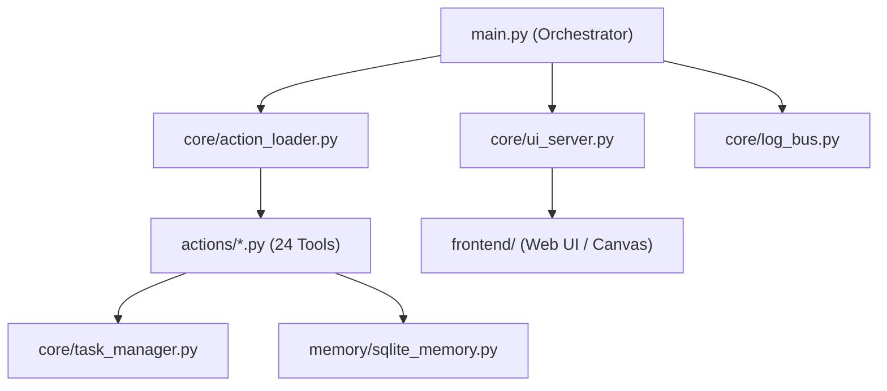

# 🏗️ ZEZO Architecture & Code Graph Report

> **Project:** ZEZO (Autonomous Desktop AI Operating System v2)  
> **Generated Via:** CodeGraphContext (CGC) + KùzuDB Graph Engine  
> **Maintainability Score:** **86.2 / 100**  
> **Total Files Analyzed:** 207  
> **Total Functions:** 3,015 | **Classes:** 2,790 | **Modules:** 308  

---

## 📊 1. Repository Metrics Overview

| Metric | Value | Status |
| :--- | :--- | :--- |
| **Maintainability Index** | `86.2 / 100` | 🟢 Excellent |
| **Circular Dependencies** | `0` | 🟢 Zero Circular Imports |
| **Total Scanned Files** | `207` | 🟢 Clean Modular Structure |
| **Total Function Nodes** | `3,015` | — |
| **Total Class Nodes** | `2,790` | — |

---

## 🔥 2. Top High-Complexity Functions (Refactoring Candidates)

Cyclomatic complexity above 50 indicates high branch density, nesting, or multi-role responsibility.

| Rank | Function Name | Location | Complexity | Suggested Action |
| :---: | :--- | :--- | :---: | :--- |
| **1** | `extract_design_system_from_html` | `core/design_extractor.py:192` | **159** | Split parser stages (colors, typography, tokens). |
| **2** | `computer_control` | `actions/computer_control.py:293` | **126** | Break into sub-handlers (mouse, keyboard, window). |
| **3** | `_run_worker` | `actions/antigravity_agent.py:369` | **101** | Modularize subprocess execution and log streaming. |
| **4** | `_renderAvatar` | `frontend/js/canvas_avatar.js:82` | **70** | Decompose canvas rasterizer stages. |
| **5** | `_receive_audio` | `main.py:1639` | **70** | Separate audio chunk decoding from session handlers. |
| **6** | `resolve_design` | `core/design_resolver.py:206` | **67** | Decompose preset injection and token validation. |
| **7** | `_build_app` | `dashboard/server.py:559` | **65** | Modularize FastAPI router mounting. |
| **8** | `extract_design_action` | `actions/design_extractor.py:158` | **64** | Separate action dispatch from token formatting. |
| **9** | `localize_and_download_assets` | `actions/website_cloner.py:696` | **64** | Isolate asset downloader worker from URL rewrite loop. |
| **10** | `_handle_client_message` | `core/ui_server.py:599` | **63** | Use command pattern / message map dictionary. |
| **11** | `run` | `main.py:2452` | **57** | Core orchestrator loop. |
| **12** | `_run_task_completion_watcher` | `main.py:2144` | **51** | Isolate event polling from UI bus dispatch. |

---

## 🛡️ 3. Core Inter-Dependency Architecture

---

## 🎯 4. Architectural Strengths & Recommendations

### Strengths:
1. **Zero Circular Dependencies:** Clean unidirectional dependency tree between `main.py`, `core/`, and `actions/`.
2. **High Maintainability Score (86.2):** Well-structured modular monolith pattern.

### Recommended Next Steps:
1. **Refactor Rank 1 & 2 Functions:** Break down `extract_design_system_from_html` and `computer_control` into subroutines to drop complexity under 30.
2. **Dynamic Action Dispatch:** Keep using dynamic dictionary dispatch to avoid bloated if-else chains.
