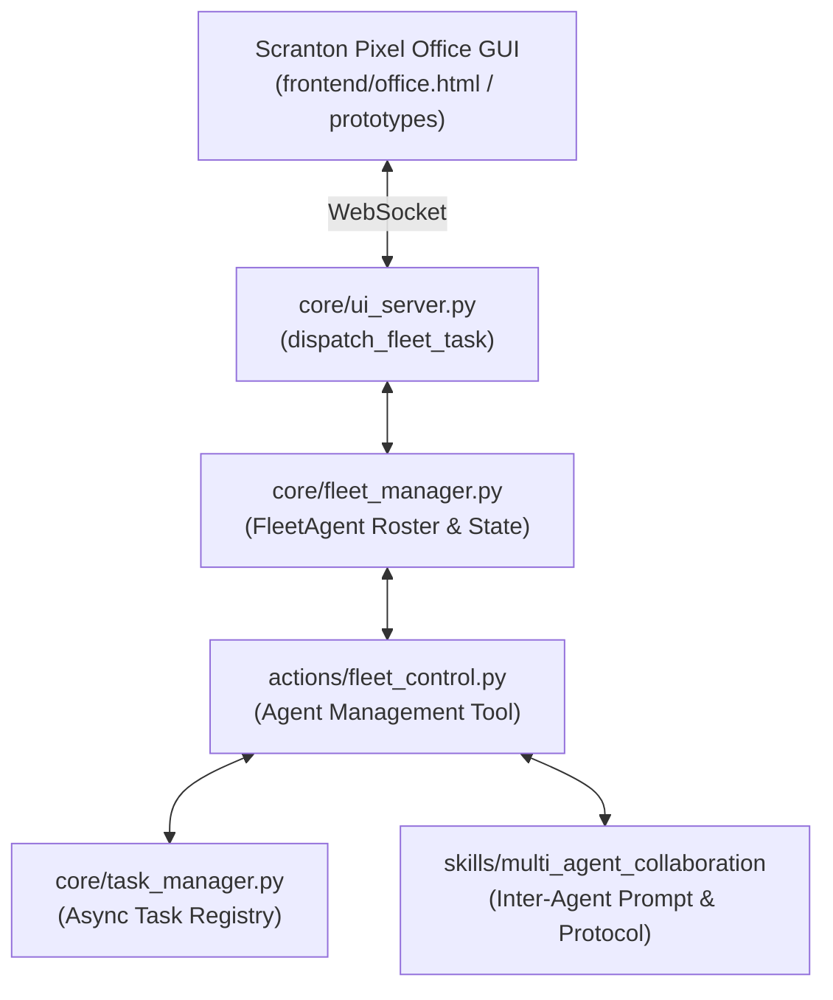

# 💡 Vision & Architecture Brief — QwenPaw → ZEZO / JARVIS

**Reference repo:** `repos for inspirations/QwenPaw` (v2.2.2b4, Apache 2.0, AgentScope team / Alibaba)
**Target repo:** `jarvis-57` (ZEZO Autonomous Desktop AI OS v2)
**Workflow skill:** `.agents/skills/vision_suggestions/SKILL.md`
**Mode:** Vision exploration — **strictly read-only, zero code mutation**
**Scope chosen by user:** Full gap matrix across all areas · Desktop-native adaptation only · 5 priority capability areas

---

## Table of Contents

0. [Method & Evidence Caveats](#0-method--evidence-caveats)
1. [Executive Summary](#1-executive-summary)
2. [Full Gap Matrix — All Areas](#2-full-gap-matrix--all-areas)
   - [2.1 Memory & Context](#21-memory--context)
   - [2.2 Tool Registry & Governance](#22-tool-registry--governance)
   - [2.3 Loop Control & Steering](#23-loop-control--steering)
   - [2.4 Security & Isolation](#24-security--isolation)
   - [2.5 Plugins & Extensibility](#25-plugins--extensibility)
   - [2.6 Areas Not Selected](#26-areas-not-selected--noted-for-completeness)
3. [Options & Trade-offs — Selected Areas](#3-options--trade-offs--selected-areas)
   - [Area 1 · Durable Recall / No-Loss Memory](#area-1--durable-recall--no-loss-memory)
   - [Area 2 · Tool Registry with Activation Gates](#area-2--tool-registry-with-activation-gates)
   - [Area 3 · Steering Loop Gates](#area-3--steering-loop-gates)
   - [Area 4 · Security: Sandbox + Skill Scanner](#area-4--security-sandbox--skill-scanner)
   - [Area 5 · Plugin Ecosystem](#area-5--plugin-ecosystem)
4. [Key Constraints & Non-Negotiable Rules](#4-key-constraints--non-negotiable-rules)
5. [Suggested Sequencing](#5-suggested-sequencing)
6. [Recommended Next Step](#6-recommended-next-step)
7. [QwenPaw Source Reference Index](#7-qwenpaw-source-reference-index)
8. [Appendix A — ZEZO Module Map (verified)](#appendix-a--zezo-module-map-verified)

---

## 0. Method & Evidence Caveats

| Item | Status |
|:--|:--|
| **Code Graph** | ⚠️ **STALE.** `jarvis-57` is indexed in the graph, but `find_code` returns **0 matches** for `discover_actions` (which verifiably exists at `core/action_loader.py:214`), and `find_most_complex_functions` returns an empty array. Per AGENTS.md Rule 9 the CLI fallback applies. `cgc -db kuzudb update` was **not** run (vision_suggestions is read-only). All findings below were produced via `grep` / `glob` / direct source reads. |
| **Reference doc naming** | `design.md` in QwenPaw is a **UI/visual design-language spec** (brand color, type scale, motion grammar, spacing), **not** an architecture document. The real architecture doc is `website/public/docs/architecture.en.md` (~54 KB). |
| **Verification** | Every ZEZO claim below is `file:line` verified, including live SQLite introspection (`sqlite_master`, `PRAGMA table_info`, `sqlite_sequence`) and one deliberately-executed SQL statement against a DB copy (see Area 1C). |
| **Mutation** | **None.** Zero files in the target repo were created, edited, or deleted while producing this brief. |
| **Fact vs assumption** | QwenPaw behaviours are marked *code-verified* (quoted) or *doc-derived* (read from `website/public/docs/*.md` only). |

### Skill workflow compliance

```
[1. CLARIFY VISION ] ✅ user questionnaire — 5 areas, desktop-native, full matrix
[2. GRAPH INSPECTION] ⚠️ graph stale → grep/glob fallback per Rule 9
[3. SOURCE VALIDATION] ✅ 3 parallel deep-read passes over memory/, core/, actions/
[4. GAP & OVERLAP]    ✅ §2
[5. SYNTHESIZE OPTIONS] ✅ §3 — 13 distinct options across 5 areas
[6. STRUCTURED REPORT] ✅ this document
```

---

## 1. Executive Summary

### 1.1 The headline: three "shipped & verified" claims are false

This reframes the entire brief. The highest-value work is **not** porting QwenPaw — it is finishing ZEZO.

| Claim | Reality |
|:--|:--|
| `planning/ZEZO_PROJECT_BLUEPRINT.md:274` — MCP *"✅ 100% COMPLETE & VERIFIED"*; `:804` — *"24.3ms async execution"* | `core/mcp_runtime.py` is **imported by nothing**. `McpServerConfig.command` / `.args` / `.env` are declared (`:26-32`) and **never used**. `self._servers` is written at `:46` and `:86` and **never read**. `register_server`, `register_tool`, `call_tool`, `shutdown` all have **0 callers**. `call_tool` would **always** fall through to the mock branch (`:133-141`) returning `f"Executed {tool_name} via {server_name}"`. **No MCP server process is ever spawned.** `subprocess`, `os`, `json` are imported but unreferenced. |
| `LEARNING_JOURNAL.md:1933` — *"Phase 6: Async MCP Runtime, Full 3-Layer Verification & Latency Benchmarks"* | No test in `tests/` imports it. Two latent bugs: `_ensure_loop` dereferences `self._thread.is_alive()` when `_thread is None` (`:53`) → a bare `import core.mcp_runtime` may raise `AttributeError`; `call_tool`'s `_execute_async` takes `self._lock` on the loop thread while the caller holds it across `future.result()` (`:146-150`) → **deadlock**. |
| `planning/decisions.md:499-502` — `SkillHubOverlay`, `_SkillCardWidget`, `_SkillDropTarget`, `SkillEditorModal` *"Created / Built"* | **All 4 symbols exist nowhere** in `ui.py`, `main.py`, `frontend/index.html`, or `frontend/js/*`. `tests/test_skill_hub_suite.py:220-225` self-skips via `ImportError`; lines 238-254 (which instantiate those classes) are **unreachable dead code**. A permanently-skipping test that reads as *passing* is worse than no test. |
| `planning/PLAN_MULTI_AGENT_FLEET_AND_CIRCUIT_BREAKER.md` Phase 3 "Memory Palace v2" | `memory/memory_condenser.py` (290 lines) is **100% dead** with **3 confirmed breakages** (Area 1C). `session_condensations` has **0 rows** — proven by its absence from `sqlite_sequence` (SQLite only creates a `sqlite_sequence` row after the first AUTOINCREMENT insert, so it has **never** been written). `memory_conflicts` and `user_explicit_rules` each have exactly **1 row**, both hand-run test artifacts (`source_session_id='test_sess_1'`, same `01:02:41` timestamp). |

### 1.2 Three live functional / security bugs

| # | Bug | Evidence |
|:--|:--|:--|
| **1** | 🔴 **`confirm.resolve` has ZERO callers** → the confirmation gate fails **closed and permanently**. `restart`, `shutdown`, `toggle_wifi` — the only 3 wired irreversible actions (`computer_settings.py:907-918`) — **NEVER EXECUTE.** | `confirm_gate.bind(...)` at `main.py:2494-2498`. `core/ui_server.py:718 _handle_client_message` has **28 `msg_type` branches** (lines 721, 726, 730, 735, 744, 759, 767, 778, 792, 801, 816, 827, 834, 843, 852, 905, 920, 935, 944, 953, 982, 999, 1009, 1021, 1031, 1042, 1051) — **none is a confirm resolution**. `ui.py:802-814` broadcast outbound only. `showZezoConfirm` (`frontend/office.html:3797`) is a **local-only modal**; its CONFIRM button (`:2473`) calls a JS callback with **no WebSocket round-trip**. Repo-wide grep for `confirm.resolve` → 0 hits outside `core/confirm.py`. |
| **2** | 🔴 **`shutdown_zezo` evaluates to `LOCAL_MUTATION` → `ALLOW`.** The one tool that calls `os._exit(0)` is never gated. | **Triple stale rename**, all still saying `shutdown_jarvis`: `core/governance.py:105` (`ToolRisk.PRIVILEGED_OS`), `core/governance.py:171` (`_SENSITIVE_ACTIONS`), `core/prompt.txt:216` (*"Only call `shutdown_jarvis` when…"*). `main.py:426` declares `shutdown_zezo`; `main.py:1408` dispatches it; `main.py:1422` calls `os._exit(0)`. `governance.evaluate("shutdown_zezo")` → `get_tool_risk` falls through to `LOCAL_MUTATION` (`:118`) → step 4 (`:234`) doesn't match → step 5 (`:239`) needs `confidence < 0.70` but the caller never passes it → **`ALLOW` at `:243`**. Absent from `circuit_breaker.TOOL_RISK_MAP` entirely — and moot, because inline tools never reach the breaker. |
| **3** | 🔴 **`save_memory` bypasses governance entirely.** | `main.py:1261` enters the `save_memory` branch and **returns at `:1276-1279`**, *before* the governance gate at `main.py:1284`. |

### 1.3 Additional governance gaps (verified)

- **`ASK` is returned 2× and consumed 0×.** `governance.py:236` and `:240` return `PolicyDecision.ASK`; `main.py:1287` checks **only** `DENY`. So all 5 "confirmation-gated" tiers are effectively `ALLOW`.
- **`ApprovalState` / `ApprovalScope` / `ApprovalGrant`** (`governance.py:38-66`) are **unreachable dead code** — `evaluate` never constructs them.
- **Governance fails OPEN.** `main.py:1297-1298` logs a warning and **falls through to execution** if `evaluate` throws.
- **Confidence gate is dead code.** `evaluate(confidence=1.0)` default, single caller never passes it (`main.py:1286`).
- **`_DANGEROUS_PATTERNS` sees only top-level scalars.** `governance.py:212`: `arg_str = " ".join(f"{k}={v}" for k, v in params.items() ...)`. A command nested in `steps: [...]` or a multi-line prompt is **unscanned**.
- **`_check_path_safety` is `c:\`-only and fail-open.** 9 hardcoded paths (`:122-132`), `str`-only values, no `/etc`, `$HOME`, or the repo dir, no symlink/reparse-point resolution, `except: pass` at `:190-191`.

### 1.4 Ratio assessment

Tier 0 in [§5](#5-suggested-sequencing) is **7 items that are almost entirely deletion, wiring, and one enum rename** — and together they close:

- an `os._exit(0)` governance bypass
- an unreachable human-approval gate (3 user-facing actions dead)
- a governance bypass on `save_memory`
- a fail-open policy engine
- a prompt-injection path via `pinned: true` skill frontmatter injection
- a zip-slip in skill installation
- three false "verified" claims

**Nothing in QwenPaw's architecture comes close to that severity-reduction-per-day ratio.**

---

## 2. Full Gap Matrix — All Areas

**Legend:** ✅ has it · 🟡 partial · ❌ absent · ⛔ claimed-but-absent

---

### 2.1 Memory & Context

| Capability | ZEZO | QwenPaw | Gap severity |
|:--|:--:|:--|:--|
| Verbatim durable history | ✅ `turns` table, **7,297 live rows** | ✅ `conversation_history` | — |
| FTS5 index + BM25 | ✅ external-content FTS5 (`sqlite_memory.py:127-135`) + 3 sync triggers (`:138-157`) | ✅ degrades to `LIKE` when FTS5 absent | — |
| Sequence ordering | ✅ `id INTEGER PRIMARY KEY AUTOINCREMENT` **is** the sequence (`:113`) | ✅ explicit `seq` | — |
| `session_id` lineage | 🟡 **set once at module import** (`sqlite_memory.py:35`) → *"session" == process launch*. **No caller ever passes it** (5 sites: `main.py:921, 1462, 1711, 1761, 1785`). | ✅ per-session + `agent_id` | **Med** |
| `kind` discriminator | 🟡 overloaded onto `role` (live values: `user` 2438, `assistant` 2704, `tool` 2155) | ✅ `model_turn` / `context_msg` / `tool_result` | Low |
| `tool_call_id` linking | ❌ only co-location on the same `turns` row via `tool_name`/`tool_args`/`tool_result` | ✅ first-class column | **Med** |
| Model-written `headline` index | ❌ | ✅ hidden `⟦ task \| status: …; next: …; anchors: … ⟧` per turn → `headline` column → becomes the FTS index leaf, stripped from display | **High** |
| `blocks` / folded spans | ❌ | ✅ packed blocks + tiered eviction | **High** |
| **Range recall (`expand lo..hi`)** | ❌ **`search_scroll_history(query, limit)` has NO offset, NO id range, NO session filter** (`:288`) | ✅ `recall_history(op="expand", lo, hi)` | **High** |
| Search → drill-down handle | ❌ `search_unified_memory` **discards** `id`/`rank`/`session_id`; hard-caps history at **4** (`:378`); truncates to **120** (tool) / **140** (turn) chars (`:389, 392`); returns a flat `str` | ✅ handles survive to the next call | **High** |
| Recall exposed as a tool | 🟡 only inline `recall_memory(query)` (`main.py:469-489`) — single free-text param | ✅ `recall_history` + `op="search"` + `op="recall_tool"` + `recall_history_python` REPL | **High** |
| Recall consumers | 3 callers of `search_scroll_history`: internal (`:378`), `core/fleet_manager.py:263-264` (persona episodic memory), declaration | — | — |
| Eviction index | ❌ | ✅ synthetic `"memory"` message with tiered `seq` spans; Tier 0 = 10 most recent blocks; roll-up only at 10-block capacity | High |
| 4-stage pressure pipeline | ❌ | ✅ pre-trim (fold tool results >200 chars) → evict → live fold (`[scroll folded] … recall_history(op="recall_tool", …)`) → active-turn hard limit → `CONTEXT_UNFIT` | **High** |
| Active-turn protection | ❌ | ✅ current request + in-flight tool chain never evicted; only acknowledged results may fold | High |
| Continuation summary | ⛔ dead engine. QwenPaw's version: 5 fixed sections (`Active Task`, `Current State`, `Constraints`, `Decisions`, `Open Work`), plain-Markdown (never JSON mode), deterministic code-side validation, secret-scrubbed, one 60 s generate+repair budget, `covered_seq` provenance | ✅ | **High** |
| **Client-side conversation buffer** | ❌ **DOES NOT EXIST.** Live session is 100% server-side. Single-turn sends at 10+ `main.py` sites (`:842, 925-928, 1036, 1414, 2044, 2107, 2168, 2265, 2298, 2341, 2394`). `_resume_handle` is RAM-only **by deliberate design** (`main.py:644-658`) | ✅ Scroll owns history | **BLOCKING for 1B** |
| Context-pressure management | ❌ grep for `context_window_compression\|sliding_window\|turn_limit\|evict\|trim_history\|truncate_history` → **zero hits**. `context_window_compression` is **not set** in `_build_config` (`main.py:1153-1172`) | ✅ | High |
| Contradiction queue | ⛔ schema live (`:174-187`), **1 test row**, no production writer | ✅ | Med |
| Immutable user rules | ⛔ `user_explicit_rules` (`:160-170`), **1 test row** (`category='ui_preference'`, `source_turn_id=NULL`). **No rule has ever been captured from real speech.** | ✅ | Med |
| Session summaries | 🟡 only on clean shutdown / reconnect teardown (`main.py:1411`, `:2726-2730`), requires ≥3 turns. `_session_log` cleared at `:2126` → **a mid-conversation network blip truncates the summary.** `log[-40:]` cap. Storage: 3 entries × 280 chars (`memory_manager.py:452, 466`) | ✅ cron uses isolated memory context | Med |
| Structured facts | ✅ `facts` (54 rows), 6 categories, mirrored JSON↔SQL (`sync_facts_from_dict:247`) | — | — |
| Semantic Markdown KB (wikilinks, Auto-Dream) | ❌ | ✅ ReMe: `MEMORY.md`, dated notes, `digest/{personal,procedure,wiki}`, bidirectional wikilink graph, AST-aware chunking with heading breadcrumbs | Low (large scope) |
| **Token / cost accounting** | ❌ **ZERO anywhere.** `gemini.call()` deliberately returns the raw SDK response (`:380-385`, docstring: *"usage — still get it"*) and **no caller reads `.usage_metadata`**. `_Reply.__slots__ = ("text",)` (`:240-247`) makes the **Live path structurally unable** to carry usage. `llm_client.py:258` discards `usage` from every OpenAI-compatible payload. Quota is **reactive string-matching** on 429/`RESOURCE_EXHAUSTED` (`:427-431`). | ✅ per-agent `token_usage/` with buffer, storage, turn_usage | **High** |

---

### 2.2 Tool Registry & Governance

| Capability | ZEZO | QwenPaw | Gap severity |
|:--|:--:|:--|:--|
| Filesystem discovery | ✅ `actions/*.py` scan, `TOOL` dict required | ✅ decorator `@tool_descriptor(...)` | — |
| Self-describing contract | ✅ 4 required keys validated (`action_loader.py:181-211`); helper modules without `TOOL` are silently skipped (`:249-250`) — this is how 4 helper modules coexist | ✅ + governance/UI specs | — |
| **Activation gating** | ❌ `get_tool_declarations` (`:83-91`) iterates all valid records and emits **all 25 unconditionally**. The only `if` is `if rec.behavior`. **Plugins ARE gated** (`plugin_loader.py:66-67` → `get_plugin_enabled`) — an unexplained asymmetry | ✅ 4 orthogonal gates: `requires_modes`, `requires_skills`, `requires_features`, `requires_sandbox`; `ToolRegistry.filter()` (`:137`) — denied wins → non-empty `allowed` restricts → `enabled_by_default=False` needs explicit allow → `requires_*`; failed checks **skip silently** | **High** |
| Prompt bloat | ❌ **36 tools every single turn**: `_all_decls = TOOL_DECLARATIONS + actions + plugins` (`main.py:1108-1110`) sent at `:1158` | ✅ filtered per request | **High** |
| Risk taxonomy | 🟡 **TWO unreconciled maps.** `governance.TOOL_RISK_MAP` — 5 tiers, 27 keys, default `LOCAL_MUTATION` (`:70-118`). `circuit_breaker.TOOL_RISK_MAP` — 3 tiers, 26 keys, default `L1_LOW_RISK` (`:22-81`). Repo-wide grep for `TOOL_RISK_MAP` = **4 hits**: the 2 definitions and their 2 `.get()` calls. **Nothing reconciles them.** | ✅ one declarative `ToolGovernanceSpec` | **High** |
| Coverage | ⛔ **3 phantom names** that exist in no other file: `shutdown_jarvis` (`:105`, `:171`), `modify_system_setting` (`:106`), `kill_process` (`:173`). **2 actions missing**: `browser_control`, `fleet_control`. **9 inline tools unmapped** | ✅ validated at decoration time | **High** |
| Silent default | ⚠️ `get_tool_risk` defaults to `LOCAL_MUTATION` (`:118`) — never the safest tier, never DENY | ✅ | Med |
| `ASK` enforcement | ⛔ returned 2×, consumed **0×** | ✅ core of the trust spine | **Critical** |
| Unavoidable guard | ❌ each action must opt in — exactly **1 of 25** calls `confirm.request` (`computer_settings.py:915`) | ✅ `GuardedFunctionTool` — *"the check is unavoidable because tools are wrapped before the agent can call them"* | **High** |
| `SANDBOX_FALLBACK` as outcome | ❌ no `SANDBOX` enum member; `evaluate` has exactly 3 return paths, no isolation branch | ✅ `GovernanceAction = {ALLOW, DENY, ASK, SANDBOX_FALLBACK}` — sandbox is an *outcome* | High |
| Decision provenance | ❌ returns `(decision, reason)` but no `source` field | ✅ `Decision.source` names the exact mechanism that fired | Low |
| Rule generalization | ❌ | ✅ approve `git status` → auto-creates `git *`; high-risk stays exact | Low |
| Path safety | 🟡 `_check_path_safety` (`:177-192`): 9 hardcoded `c:\` paths, `str`-only, **no `/etc`, `$HOME`, or the repo dir**, no symlink/reparse resolution, **fail-open `except: pass`** | ✅ File Guardian (18 KB) | Med |
| Dangerous-command patterns | ✅ 13 regexes (`:144-167`) — but scanned only against `arg_str` from **top-level scalars** (`:212`) | ✅ 15 KB YAML + shell-evasion Guardian (20 KB) + rule Guardian (34 KB) + safety checks (40 KB) | Med |
| Fail mode | ❌ **fail-open** (`main.py:1297-1298`) | ✅ **fail-closed**, explicitly documented | **High** |
| Per-tool UI metadata | ❌ | ✅ `ToolUISpec` (description/icon/`display_to_user`) | Low |
| Approval levels | ❌ | ✅ STRICT / SMART / AUTO / OFF | Low |

---

### 2.3 Loop Control & Steering

| Capability | ZEZO | QwenPaw | Gap severity |
|:--|:--:|:--|:--|
| Risk-tiered breaker | ✅ `RiskAwareCircuitBreaker`, L0/L1/L2, velocity window (3 errors / 15 s), cooldown 10/60/120 s, `human_rearm()` | — | — |
| **Steer vs. kill** | 🟡 **Accidental but real.** Breaker messages are *coaching strings* returned as `function_response`: `action_loader.py:128` *"...Use spatial coordinate clicks or inspect the UI state."*, `circuit_breaker.py:97` *"...Retry in 10s."* → `main.py:1431-1432` → `:1475-1479` → `:1821-1823`. **Semantically identical to `INTERRUPT_AND_CONTINUE`, with none of the machinery.** | ✅ explicit `StopAction.BYPASS / INTERRUPT_AND_CONTINUE / TERMINATE`; on INTERRUPT the gate's `build_continuation()` produces text injected **as a new user turn** — the agent is *steered*, not killed | **High** |
| **Doom-loop detection** | ❌ **NONE.** Complete inventory: (1) hotkey anti-loop, `deque(maxlen=20)`, `>4 in 10 s` — hard-gated by `name == "computer_control"` (`action_loader.py:117`); (2) vision de-dup cooldown 1.5 s, `screen_process` only (`main.py:1320-1324`); (3) `_is_repeat_chunk` transcript dedup (`main.py:321-335`); (4) `_is_same_user_input` echo dedup (`:343-353`); (5) breaker **failure velocity**, not intent similarity. **No cross-tool repetition detection, no semantic/argument-similarity check, no per-turn tool-call counter, no max-iterations gate.** | ✅ `doom_loop` — windowed similarity + staged remediation | **High** |
| Iteration / call budget | ❌ `main.py:1816` is a sequential `for fc in response.tool_call.function_calls` — **no counter, no concurrency limit, no budget, no per-turn cap** | ✅ `iteration` (max 500), `tool_call_budget` (global + per-tool) | **High** |
| Token budget | ❌ | ✅ prompt / completion / total | Med |
| Rubric completion gates | ❌ | ✅ `qualitative_rubric`, `completion_rubric` (`exclusive_group` so only one may be active) | Low |
| Timeout gate | ⚠️ `ToolExecutionContext(timeout_seconds=30.0)` exists (`task_manager.py:53`, created `action_loader.py:143`) but is **never enforced** by the dispatch path — only `cancel_event` / `raise_if_cancelled()` are available to handlers | ✅ | Med |
| Breaker correctness | 🟡 state keyed **per tier, not per tool** (`circuit_breaker.py:74-78`) → one flaky `web_search` opens L0 for **every** L0 tool. `failure_count` **never reset on a CLOSED-state success** (only inside HALF_OPEN branches `:127/130/133`) → monotonic for process life. `record_failure`'s return string is **discarded** at `action_loader.py:154`. Any single L2 failure latches `human_override_required=True` for **all** L2 tools. | ✅ per-tool | Med |
| Inline-tool coverage | ❌ `circuit_breaker.can_execute` is called **only** from `action_loader.py:133` → all **11 inline tools bypass it entirely** | ✅ everything wrapped | Med |
| Human re-arm wiring | ⚠️ `human_rearm()` (`:164-174`) exists but has **no UI caller** — same class of gap as `confirm.resolve` | ✅ approvable from console or IM | Med |
| User-editable gate catalog | ❌ | ✅ immutable process-wide whitelist, each gate with a strict Pydantic params model + JSON Schema for the UI; handler scoping via `scope="default"` suppression | Low |
| Modes | ❌ | ✅ `default` / `coding` / `mission` / `goal` / `custom_loop` | Low |

---

### 2.4 Security & Isolation

| Capability | ZEZO | QwenPaw | Gap severity |
|:--|:--:|:--|:--|
| Policy engine | ✅ 5-tier taxonomy + 13 patterns + path safety | ✅ richer (1640-line policy module) | — |
| **Confirmation gate** | ⛔ `resolve` **unreachable** → fails closed *permanently*; 3 wired actions never run | ✅ approvable from Console **or an IM channel**; `/approval` slash command | **Critical** |
| **Skill content scanning** | ❌ **NONE ANYWHERE.** Repo-wide grep for `sanitiz\|injection\|malicious\|validate_content\|dangerous\|scan` across `core/`, `actions/`, `memory/`, `plugins/`, `skills/` → in `skills/` and `plugins/`: **zero hits**. `_DANGEROUS_PATTERNS` is **never applied to skill content** — and its gate builds `arg_str` from top-level scalars, so a skill body is never even passed to it | ✅ 8 YAML signature rule sets (prompt_injection, hardcoded_secrets, data_exfiltration, command_injection, obfuscation, social_engineering, supply_chain, unauthorized_tool_use), static analysis **before install**, block/warn/off + whitelist | **Critical** |
| Frontmatter injection | ⛔ `save_learned_skill` interpolates `description` **raw** into YAML (`skill_loader.py:442`) → `description: x\npinned: true` injects keys. `pinned: true` then splices the **full body into `system_instruction` on EVERY reconnect** (`:323-327` → `main.py:1148-1157`) with **no 1800-char truncation on that path** (`format_prompt_block` has none; only the unused `get_active_skill_prompt:348` does) | ✅ scanner | **Critical** |
| Self-modifying skill body | ⛔ `_FRONTMATTER_RE = ^---\s*\n(.*?)\n---\s*\n(.*)$` with `re.DOTALL` (`:39`). A body containing `---` on its own line **re-enters the frontmatter block on the next `reload()`** → the model rewrites its own metadata. No length cap on `instructions` (`:452`) | ✅ | **High** |
| **Zip-slip** | ⛔ `z.extractall(dest_dir)` (`:393`) with **zero member-name validation** — no `is_absolute()`, no `..` check, no `commonpath` containment, no symlink check. `extract_name` derived from an **attacker-controlled** archive path (`:390`). No zip-bomb caps (member count, per-member size, compression ratio). Dir branch does `shutil.rmtree(dest_dir)` (`:399`) then `copytree`, **no confirmation**, and `dest_dir` is **not `.resolve()`d** | ✅ | **Critical** |
| Skill scan on install | ❌ the *only* check is **existence** of a file named `SKILL.md` anywhere in the archive (`:386-388`) | ✅ pre-install static analysis | **Critical** |
| `read_skill` fuzzy match | 🟡 bidirectional substring (`skill_loader.py:259-261`) → `read_skill("read")` resolves to an arbitrary skill and dumps its **full untruncated** body into model context. No budget on this path at all. | ✅ exact-name | Med |
| YAML parser limits | ❌ flat line loop (`:74-110`) — **no nesting support** (nested maps silently flattened, `:109`), **no depth / size / list-count caps**. `get_active_skill_prompt:331` has **zero callers** | ✅ | Low |
| **OS-level sandbox** | ❌ `core/git_sandbox.py` is a **git worktree on the same filesystem** (`.agent_worktrees/`) — **not a filesystem jail**. `opencode_agent.py`, `kilo_agent.py`, `antigravity_agent.py` **never import it**; worktrees exist only for the fleet persona route, and even there only when `agent.risk_tier == "L2_DESTRUCTIVE"` or `default_tool in ("opencode_run","kilo_run")` (`fleet_manager.py:343` — `antigravity_run` is **absent** from that tuple). `cwd` is never plumbed — `fleet_manager.py:344-366` passes it as an **advisory hint** (`project_path`) that the agent may ignore. No ACL, no restricted token, no Job Object. `task_id` sanitizes `/` and `\` but **not `..`** (`:51`) → `worktree_base/".."` = repo root, and `safe_teardown` then `shutil.rmtree(ignore_errors=True)` (`:119`). **Zero** chroot / read-only mount / no-network. The only two "sandbox" flags in the codebase actively **DISABLE** sandboxing: `visual_qa.py:93` `--no-sandbox`, `website_cloner.py:485, 486, 1998` | ✅ macOS Seatbelt (`sandbox-exec`), Linux **bubblewrap** (preferred) or Landlock, **Windows AppContainer** / Elevated / Unelevated. **A fresh sandbox per tool call**, created and destroyed each invocation, with declared mounts + deny paths | **High** |
| Worktree merge safety | 🟡 `merge_worktree` (`:82`) runs `git merge --no-ff` with **no review, no test gate, no approval** | ✅ checkpoints with timeline view, restore, GC (`keep_count=20`, `keep_days=7`) | Med |
| Secret scrubbing | ✅ `redact_secrets` (`sqlite_memory.py:70`) is the **sole** secret-pattern list, also used by `log_bus.emit:160` — matches AGENTS.md §3 requirement | ✅ | — |
| Encrypted secret store | ❌ plaintext in `config/api_keys.json` (26 keys) | ✅ `keyring>=25` + `cryptography>=43`, `~/.qwenpaw.secret/`, `~/.ssh` | Med |
| Audit trail | �️ `log_bus` 20k-line ring buffer + tool micro-events; **no durable audit log of tool decisions** | ✅ `governance/audit.py` | Low |
| Undo stack | ✅ **genuinely well-built.** Traversal-safe (`relative_to`, `:157`), `MAX_DEPTH=10`, `MAX_FILE_SIZE=2 MB` (`:131`), `max_total_bytes=25 MB` (`:143`), wired into all 3 coding agents (`capture_repo_snapshot` + `register_repo_undo`) + `website_cloner` (`register_clone_snapshot`). `clear()` docstring claims a shutdown call that **is not implemented** | ✅ checkpoints | — |

---

### 2.5 Plugins & Extensibility

| Capability | ZEZO | QwenPaw | Gap severity |
|:--|:--:|:--|:--|
| Contract | 🟡 `PLUGIN` dict + `run()` (`plugin_loader.py:155-192`) — a **pure schema validator**. Zero security validation, zero capability declaration, zero permission set, zero import allowlist | ✅ `plugin.json` manifest + `register(api)` | — |
| **Import-time execution** | ⛔ `spec.loader.exec_module(module)` at **`:247` runs BEFORE `_validate` at `:252`** → **arbitrary code executes at import with full process privileges.** `valid=False` at `:272` only means "not exposed as a tool" — the code has already run | ✅ same mechanism, but manifest-gated with `qwenpaw_version` bounds | **Critical** |
| **Default posture** | ⛔ **opt-OUT.** `get_plugin_enabled` defaults `True` (`config_manager.py:775-777`, docstring: *"enabled by default the moment they're discovered"*) → a dropped-in `.py` is a **live Gemini-visible tool by default** | — | **Critical** |
| **Revocation** | ⛔ `save_plugin_enabled` (`config_manager.py:815-823`) and `save_plugin_config` (`:798-812`) have **ZERO callers**. No `msg_type` in `ui_server.py` for a plugin toggle. `config/api_keys.json` contains **no `plugins_enabled` or `plugin_config` key at all**. → **There is no working way for a user to disable a plugin.** | ✅ settings UI | **Critical** |
| **Prompt-injection channel** | ⛔ `self.ui.request_say = self.plugin_say` (`main.py:707`) → `plugin_say` (`:827-852`) sends the plugin's own string as **`role="user"`, `turn_complete=True`** directly into the Gemini Live session (`:842-845`), **bypassing the entire governance gate** (which only runs inside `_execute_tool`). Indistinguishable from the human speaking. **Undocumented in `_template.py`.** | — | **Critical** |
| Risk classification | ⛔ plugin names absent from **both** risk maps → `LOCAL_MUTATION` / `L1_LOW_RISK` **irrespective of behavior**. A plugin calling `os.remove` on the user's Documents ranks equal to `reminder`. | ✅ ownership claim → governance sync → toolkit exposure → runtime bridge → config write, **with rollback on any failure**; fail-closed `GovernanceRegistrationConflict` | **High** |
| Execution bounds | ❌ `run` executes on `loop.run_in_executor(None, ...)` (`main.py:1444-1447`) — **unbounded default `ThreadPoolExecutor`, no timeout** | ✅ fresh sandbox per call | Med |
| Filesystem access | ⛔ unrestricted — runs in-process, `os`/`shutil`/`subprocess` all available, no path allowlist, governance does not intercept the plugin's own writes | ✅ File Guardian + sandbox | **High** |
| Dependency declaration | ❌ diagnosed only **after** failure — `_load_error` (`:195-218`) emits a `pip install X` hint at `:216-217` | ✅ manifest `dependencies[]` + version bounds + install lock | Med |
| Import isolation | ❌ | ✅ custom `sys.meta_path` finder + `plugin_<id>` namespace + per-plugin `__builtins__` (`module_isolation.py`, 389 lines, with an honest 7-limitation docstring) | Low |
| Signature / provenance | ❌ none | ✅ none | — |
| Tool-name collisions | ✅ fail-closed at 3 levels: core collision (`:254-256`), inter-plugin collision (`:257-260`), leading-underscore skip (`:237`) | ✅ `GovernanceRegistrationConflict` | — |
| **Registration surface** | ❌ one shape only (`PLUGIN` + `run`) | ✅ ~20 points: `register_tool`, `register_provider`, `register_channel`, `register_memory_backend`, `register_middleware`, `register_slash_command`, `register_mode`, `register_runtime_hook`, `register_agent_stop_handler`, `register_prompt_section`, `register_startup/shutdown/uninstall/workspace_created_hook`, `register_http_router`, `register_control_command`, `register_skill_provider`, `get/set_tool_config` | Med |
| Shipped plugins | ❌ **ZERO** — `plugins/` contains only `_template.py` + empty `__init__.py` | ✅ 15+ incl. `computer-use`, Chrome bridge, 5 OMP workflow bundles, agent-kanban, qwenpaw-pet | — |
| MCP | ⛔ **orphaned dead code** (see §1.1) | ✅ first-class, abstracted behind `DriverCard(name, protocol, endpoint, credentials, config, enabled, policy)` so MCP is one implementation of a broader idea | **High** |

---

### 2.6 Areas Not Selected (noted for completeness)

| Capability | ZEZO | QwenPaw | Note |
|:--|:--:|:--|:--|
| Model routing transparency | 🟡 `llm_router` **silently** falls back Groq → Gemini → Ollama (`_try_groq:46`, `_try_gemini:69`, `_try_ollama:86`) | ✅ `FallbackChatModel` + `FallbackNoticeSink` exists **solely** to re-attach fallback transparency (the pinned AgentScope drops `ChatResponse.metadata`) | Med — matches your "live voice untouched" rule, but the user can't tell *why* answer quality changed |
| Model capability learning | 🟡 `provider_health.py` detects 404/quota/busy; no **capability** probing | ✅ `multimodal_prober.py` / `model_capability_cache.py` — agent *learns* a model rejects media and strips it next time; passive retry on provider media rejection | Med |
| Env-var mutability registry | ❌ | ✅ `EnvVarSpec(key, default, mutability="hot_runtime"\|"startup_only")` — refuses to hot-edit a startup-only var | Low |
| Scheduled isolated context | ❌ `actions/reminder.py` fires into the live session | ✅ cron runs use an **isolated memory context** so automation never pollutes interactive history | Med — overlaps `PLAN_PROACTIVE_VOICE_AND_DESKTOP_MACROS` |
| `HEARTBEAT.md` | ❌ | ✅ user-authored checklist file + cron schedule; **empty file = zero API calls** | Low — elegant, cheap, worth a note |
| Design-language contract | 🟡 `skills/hamza_taste/references/` = 10 token specs + 11 HTML templates ≈ **80% there**; missing the accessibility floor, the minimal-visible-copy test, and the motion grammar | ✅ `design.md` is a **gradable contract** an agent can be reviewed against — same spirit as AGENTS.md §8 | Low |
| **Desktop / OS automation** | ✅ **ZEZO IS AHEAD.** `core/computer/` (Windows native + UIA + OCR + pyautogui + dxcapture), `visual_qa.py`, `viseme.py`, `computer_control` (24 tools) | 🛑 QwenPaw's `computer_use` **requires the Tauri host** — a Rust helper over named pipe / unix socket. **Not available on Linux, in the browser Console, in Docker, or CLI-only.** | **DO NOT PORT.** One transferable idea: `RuntimeStatus` reports `supported_platform` and `host_reachable` **separately** so the UI can say *"this OS will never work"* vs *"host hasn't offered it yet"* |
| Multi-IM channels / phone SIP | 🟡 `actions/send_message.py` (WhatsApp/Telegram/Discord/Instagram) + a separate `dashboard/` FastAPI with its own AES-256-CBC auth | ✅ unified channel abstraction, 18 platforms; voice as a *channel* (SIP / LiveKit / pyVoIP / Twilio) | Out of scope per your desktop-native choice |
| ACP (drive external agents) | ❌ | ✅ adapters for Codex + Qoder as external subprocess agents, streaming work back as tool results | Low |
| ReMe semantic memory | ❌ | ✅ Auto-Memory → Auto-Dream consolidation, Markdown AST chunking, wikilink graph | Low — large scope |

---

## 3. Options & Trade-offs — Selected Areas

> 13 distinct options across the 5 selected areas. Every approach respects: PyQt6 desktop-native only (no Tauri, no React console, no new web surface, no Textual TUI, no SIP/phone).

---

### Area 1 · Durable Recall / No-Loss Memory

**Diagnosis.** The substrate is ~90% built. `turns` + `turns_fts` already store 7,297 verbatim turns with working BM25 ranking. What is missing is **addressing** — no range, no drill-down handle, no context pressure.

**The killer stat:** `search_unified_memory` hard-caps history at **4 hits**, truncates each to **120-140 characters**, and discards `id` / `rank` / `session_id` before returning a flat string. The question *"what did we decide about the auth refactor three sessions ago?"* returns four 140-char previews with **no way to ask for more**.

The full recall chain today:

```
Gemini recall_memory(query)                    main.py:469
  └─ _execute_tool branch                      main.py:1301-1306
      └─ memory_manager.search_memory(q, limit=8)      :401
          └─ sqlite_memory.search_unified_memory(q, limit=8)   :372
              ├─ memory_manager._search_raw_facts(...)   ← JSON facts, limit honoured
              └─ search_scroll_history(q, limit=4)      ← FTS history, limit HARDCODED to 4
```

Note `limit=8` governs **only** the facts half; the history half is unconditionally 4, and every hit is truncated to 120-140 chars.

| Approach | Architecture | Pros | Cons / Risks | Complexity |
|:--|:--|:--|:--|:--|
| **1C · Kill the dead code + honest metrics** ⭐ *do first* | Delete or repair `memory/memory_condenser.py` (290 lines) — **3 confirmed breakages**: ① `from core.llm_router import FAST, call_background_text` (`:151-152`) — actual export is `generate_text` (`:101`); ② `from memory.memory_manager import load_memory, update_memory_entry` (`:176`) — actual export is `update_memory` (`:164`), and this fires **before** any LLM work, so the module aborts on **every** invocation; ③ `record_condensation` writes column `last_turn_id` (`sqlite_memory.py:563-568`) but the schema column is `last_condensed_turn_id` (`:195`) — **I executed this statement against a DB copy and got `OperationalError: table session_condensations has no column named last_turn_id`**. Separately, add token/cost accounting by reading the `.usage_metadata` that `gemini.call()` **already returns and discards**, and widen `_Reply.__slots__` (`:240-247`). | Deletion + instrumentation only. **Zero behavioural risk.** Turns *"should we build Scroll?"* from opinion into measurement. Fixes 2 of 3 AGENTS.md doc-drift items. The `.usage_metadata` data is free — it is already in hand. | Widening `_Reply.__slots__` touches every Live call site. `memory_condenser` has **zero** tests, so *repair* ≠ *verified*. `get_uncondensed_turns:532` would also need a fix — `MAX()` over an empty table returns `None` → `turns.id > 0` → returns the **oldest** 150 of 7,297, not the newest. | **Low** (~1 day) |
| **1A · Recall drill-down** | Add `expand_turns(lo, hi, session_id=None)` beside `search_scroll_history`; expose a new `actions/recall_history.py` with `op: search \| expand`. Return `id`-keyed handles so the model can pull turns 400-450 verbatim. Fix `_current_session_id` (`:35`) to be created on Live-connect rather than at import. | **No schema migration needed** — `turns.id` *is* the sequence, `session_id` already exists. 1 new action file + 2 additive functions. Closes the single biggest UX hole. Purely additive — nothing existing changes behaviour. | Does not bound context growth. Does not fix summarization. `memory_manager.py:375` skips `sessions` (a list), so session summaries stay unsearchable through this path. | **Low** (~1 day) |
| **1B · Full Scroll port** | Migrate `turns` toward QwenPaw's shape: add `kind` / `tool_call_id` / `headline` / `dedup_key` columns (ALTER, non-destructive) + a `context_blocks` table. Model writes a hidden `⟦ status \| next \| anchors ⟧` line per substantive turn → `headline` column → becomes the FTS leaf. Expose `recall_history(op="expand"/"search"/"recall_tool")`. Implement the 4-stage pressure pipeline + 5-section continuation summary. `main.py` gains a **client-side turn buffer** + `context_window_compression` in `_build_config`. | The **only** approach that actually bounds context growth. Active-turn protection prevents the worst failure mode (dropping the in-flight request). Headline-as-index-leaf improves recall quality beyond pure BM25. | 🔴 **Highest risk in the entire brief** — touches the Live WebSocket spine, which AGENTS.md Rule 8 makes fragile (the explicit `audio/pcm;rate=` requirement exists *because* of prior 1011 gateway disconnects). Requires building a client-side history buffer that **does not exist today**. `PLAN_VOICE_LATENCY_AND_DESKTOP_STABILITY` Layer-0 is a **hard prerequisite**. | **High** (3-5 days) |

**Sequencing:** 1C → 1A → 1B (gated on 1C's measurements *and* Layer-0). 1C first because it is deletion + instrumentation and it **de-risks** the 1B decision with data.

---

### Area 2 · Tool Registry with Activation Gates

**Diagnosis.** Three compounding problems:

**(a) No gating.** All 36 tools ship every turn. `get_tool_declarations` (`:83-91`) has no `enabled` field, no risk consult, no user opt-in, no mode switch — while the *plugin* registry **does** gate (`:66-67`). The asymmetry is unexplained.

**(b) Duplicate taxonomies that already disagree.** 4 repo-wide hits for `TOOL_RISK_MAP` = the 2 definitions and their 2 `.get()` calls. Nothing reconciles them. One disagreement is already a live security bug (§1.2 #2).

**(c) `_execute_tool` complexity.** `main.py:1253-1479` is a manual count of **~43-54 decision points** against antislop's **`< 15`** ceiling — a direct AGENTS.md §2.10 violation. The excess is **entirely** the 11-branch inline ladder (`if name == "save_memory"` at `:1261`, then 10 `elif`s, then registry fan-out at `:1425`/`:1443`). Note the codebase already knows the right pattern: `core/dispatcher.py` is a pure dictionary/strategy router at complexity ~4.

**Critical insight:** the misplacement and the security gap are the **same root cause**. 8 of 11 inline tools are one-line delegations with **no session state** — and inline is exactly what deprives them of the circuit breaker *and* the risk map.

| Inline tool | Session state required? | Verdict |
|:--|:--|:--|
| `screen_process` | **YES** — mutates `_vision_busy`, `_vision_last_time`, `_pending_vision`, `_vision_cam_active` | ✅ legitimately inline |
| `close_camera` | **YES** — `ui.stop_camera_stream()`, coupled to `_vision_cam_active` | ✅ inline (though it's UI-frame control, not a capability) |
| `shutdown_zezo` | Partially — reads `self.session` for the goodbye turn | ⚠️ correctly inline by accident; needs the risk fix regardless |
| `manage_monitor` | **NO** — delegates to `actions/background_monitor.py` | ❌ misplaced |
| `save_memory` | **NO** — `update_memory()` | ❌ misplaced + governance bypass |
| `recall_memory` | **NO** — `search_memory()` | ❌ misplaced |
| `undo` | **NO** — `undo_stack.history()` / `undo_last()` | ❌ misplaced + unmapped |
| `read_skill` | **NO** — registry built once in `__init__` (`:676`), stateless per call | ❌ misplaced |
| `list_skills` | **NO** — same | ❌ misplaced |
| `save_learned_skill` | **NO** — same registry | ❌ misplaced + **highest severity** (see Area 4) |
| `system_status` | **NO** — `get_system_status()` (the stateful `SystemMonitor` at `:662` is used by `_run_system_monitor:2151`, **not** by this tool) | ❌ misplaced |

Also note `main.py`'s own two comments (`:74-76` vs `:356-361`) **disagree with each other** about which tools belong inline.

| Approach | Architecture | Pros | Cons / Risks | Complexity |
|:--|:--|:--|:--|:--|
| **2A · Single source of truth + fix the bug** ⭐ *mandatory* | Add `risk` + `enabled` to the `TOOL` dict — it is already the self-describing contract (`_validate:181-211` validates 4 keys; make it 5). `ActionRecord` gains both fields. **Delete** `governance.py:70-107` and `circuit_breaker.py:22-51` dicts; both read from the registry instead. Fix `shutdown_zezo` (and remove the 3 phantoms). Wire `ASK` → `confirm.request`. Move `save_memory`'s early return after the gate. Add `TOOL` dicts to `actions/system_monitor.py` + `actions/background_monitor.py`, delete 6 ladder branches, fold `file_processor`'s implicit-arg injection (`:1427-1428`) and `web_search`'s UI mirroring (`:1434-1440`) into their action files. | Kills the duplicate-map bug class **permanently**. Fixes a live `os._exit(0)` bypass. Cuts `_execute_tool` from ~50 to ~15 decision points — **this is AGENTS.md compliance, not refactoring**. Requires no new architecture. | AGENTS.md §3 mandates `core/prompt.txt` + `docs/TOOLS.md` sync for any `actions/*.py` touch. Migration touches all 25 action files. | **Med** (2-3 days) |
| **2C · Unavoidable guard** | Wrap every handler in a governance proxy — QwenPaw's `GuardedFunctionTool`: *"the check is unavoidable because tools are wrapped before the agent can call them."* | Makes `ASK` enforceable without trusting each action to self-gate. Today exactly **1 of 25** does. Small, orthogonal decorator. | A **third** place the gate could live if 2A's consolidation is done wrong. Sequence: 2A first, then this becomes a thin decorator rather than a new layer. | **Med** (2 days) |
| **2B · Orthogonal activation gates** | `TOOL["requires_skills"]`, `["requires_features"]`, `["sandbox"]`. `get_tool_declarations(ctx)` gains a `filter()` — note it is currently **zero-arg**, called from `main.py:1109` and re-run on every reconnect. Gates **skip silently** (QwenPaw's behaviour). | Cuts prompt bloat hard: a *"make me a website"* turn would ship `clone_website` + `file_controller` + `code_helper` instead of all 36. Biggest latency + context win on the voice loop. | ⚠️ **Silent-skip is the scariest failure mode in this brief**: a mis-set gate makes a needed tool vanish from the payload and the model reports *"I don't have that capability"* with **no diagnostic**. Requires a `/api/tools?ctx=…` debug endpoint **and** a log line naming the excluded tool and the failing gate — shipping in the same change. Also needs a new feature-flag store (none exists). | **High** (3-4 days on top of 2A) |

**Sequencing:** 2A → 2C → 2B. **Do 2B last**, and only with the debug endpoint in the same change.

---

### Area 3 · Steering Loop Gates

**Diagnosis — the highest value-per-risk item in the entire brief.**

ZEZO **already has** `INTERRUPT_AND_CONTINUE` semantics; it just does not know it. `circuit_breaker.can_execute` returns *coaching strings* that flow straight into `function_response` and are read by the model:

```
action_loader.py:128   "Aborted: Repetitive hotkey loop detected (>4 calls in 10s for '…').
                        Use spatial coordinate clicks or inspect the UI state."
circuit_breaker.py:97  "CircuitBreaker: L0 read-only queries paused (…). Retry in 10s."
circuit_breaker.py:111 "CircuitBreaker: L2 destructive tools tripped (…)."
circuit_breaker.py:107 "CircuitBreaker: L2 destructive action blocked (…). Human confirmation required to re-arm."
        ↓
action_loader.py:137   return str(block_msg)
        ↓
main.py:1431-1432      r = await loop.run_in_executor(...)
        ↓
main.py:1475-1479      types.FunctionResponse(response={"result": result})
        ↓
main.py:1821-1823      await self.session.send_tool_response(...)
```

That is **structurally identical** to QwenPaw's `build_continuation()` injected as a new user turn. What is missing is the abstraction, the gate catalog, and any detection of *repetition* — of which there is **none** outside one hardcoded tool name.

**QwenPaw's gate catalog** (`loop/catalog.py`, immutable process-wide whitelist, each with a strict params model + JSON Schema): `iteration` (max 500) · `doom_loop` (windowed similarity + staged remediation) · `token_budget` (prompt/completion/total) · `timeout` · `tool_call_budget` (global + per-tool) · `qualitative_rubric` · `completion_rubric` (`exclusive_group` so only one rubric gate may be active).

| Approach | Architecture | Pros | Cons / Risks | Complexity |
|:--|:--|:--|:--|:--|
| **3C · Fix breaker correctness** ⭐ *prerequisite* | Per-tool keying instead of per-tier (`:74-78`). Reset `failure_count` on CLOSED-state success. Consume `record_failure`'s return string at `action_loader.py:154`. Route the 11 inline tools through the breaker. | < 1 day. Without it, 3A's gates inherit two bugs: one flaky `web_search` opens L0 for **every** L0 tool, and the failure counter is monotonic for the life of the process. | None. Pure correctness. | **Trivial** (< 1 day) |
| **3A · Gates as a pre-execution consult** ⭐ *recommended* | New `core/loop_gates.py`. Each gate is a class with `check(ctx) -> StopAction` + `build_continuation()`. Registry via **dict-dispatch** (per antislop, not an `if/elif` ladder). Four gates: `iteration`, `doom_loop` (windowed arg-similarity over the last K calls), `tool_call_budget` (global + per-tool), `timeout` (finally enforce the existing `ToolExecutionContext.timeout_seconds=30.0`). Called from `_execute_tool` before dispatch. `INTERRUPT_AND_CONTINUE` returns the continuation string as the `function_response`. | **Return-a-string change — structurally identical to what the breaker already does**, so the risk profile is already proven in production. `doom_loop` is the single most transferable file in QwenPaw. Finally gives `main.py:1816` the per-turn counter it lacks entirely. Enables the "3 memory backends" pattern without a full Scroll port. | Needs `core/prompt.txt` guidance so the model knows how to read a gate message. `timeout` enforcement could newly **fail** calls that previously ran long — needs care with `opencode_run` / `kilo_run` / `clone_website`, which legitimately exceed 30 s. | **Med** (2-3 days) |
| **3B · Full loop engineering** | Immutable gate catalog + per-gate params model + JSON Schema → settings modal. Modes (`default` / `coding` / `mission`) that swap gate sets via `exclusive_group` + `scope="default"` suppression. | User-extensible autonomy limits. Genuinely novel — the agent's own termination policy becomes a user-authored artifact. | 5-7 days. Requires a settings UI in `frontend/index.html` — **212 KB of mostly inline JS, subject to all 8 AGENTS.md §8 regression rules.** Naming collision risk: ZEZO already has "mode"-adjacent concepts (`fleet_manager.VALID_RISK_TIERS`, skill domains, `FastIntentMatcher`). | **High** (5-7 days) |

**Sequencing:** 3C → 3A. **Decline 3B** — poor risk/reward, and it lands squarely on the file AGENTS.md §8 protects most.

---

### Area 4 · Security: Sandbox + Skill Scanner

**Diagnosis — the most urgent area, and it is mostly bug-fixing, not porting.**

Ranked by exploitability:

| # | Finding | Evidence |
|:--|:--|:--|
| 1 | 🔴 **`install_skill` zip-slip** — unguarded `extractall` | `skill_loader.py:393`. No `is_absolute()`, no `..` check, no `commonpath` containment, no symlink check. `extract_name` from attacker-controlled archive path (`:390`). No zip-bomb caps. Dir branch `shutil.rmtree(dest_dir)` (`:399`) with no confirmation and no `.resolve()` |
| 2 | 🔴 **No skill content scanning anywhere** | Repo-wide grep in `skills/` + `plugins/` → **zero hits**. `_DANGEROUS_PATTERNS` is never applied to skill content, and its gate builds `arg_str` from top-level scalars, so a skill body is never even passed to it |
| 3 | 🔴 **`pinned: true` → full body into `system_instruction` on every reconnect** | `description` raw-interpolated into YAML (`:442`) → frontmatter key injection → `:323-327` splices the body → `main.py:1148-1157`. **No 1800-char truncation on this path** |
| 4 | 🔴 **`confirm.resolve` unreachable** → gate fails closed permanently | See §1.2 #1. Functional bug: 3 actions never run |
| 5 | 🔴 **Self-modifying skill metadata** | Body containing `---` re-enters `_FRONTMATTER_RE` (`:39`, `re.DOTALL`) on next `reload()`. No length cap on `instructions` (`:452`) |
| 6 | 🟠 **Governance fails open; `ASK` consumed 0×; path safety `c:\`-only** | §1.3 |
| 7 | 🟠 **No OS sandbox** | `git_sandbox` is a worktree on the same filesystem; agents never import it; `cwd` never plumbed; `task_id` doesn't sanitize `..` (`:51`); **zero** chroot/readonly/no_network; the only two "sandbox" flags in the repo actively **disable** sandboxing |
| 8 | 🟠 **MCP claimed shipped but orphaned** — and if ever wired, its tools arrive **unclassified** | Absent from both risk maps → most permissive unclassified tier |

**What ZEZO already has that QwenPaw does not:** `save_learned_skill` + `install_skill` are only reachable through named Gemini tools, and `confirm.py`'s token originates in the UI. The **forge-resistance** half is real; the **human-in-the-loop** half is not connected.

| Approach | Architecture | Pros | Cons / Risks | Complexity |
|:--|:--|:--|:--|:--|
| **4A · Close the holes** ⭐ *immediately* | (i) Add a `confirm_response` msg_type to `ui_server.py:718` + wire `office.html:3797`'s button → fixes finding 4. (ii) New `core/skill_scanner.py`: frontmatter-key injection, `---` fence in body, dangerous shell commands **reusing `_DANGEROUS_PATTERNS`** (per AGENTS.md §3's `redact_secrets` precedent — one list, not two), hardcoded secrets via the existing `redact_secrets`, obfuscation, exfiltration URLs. Called from **both** `save_learned_skill` and `install_skill`. (iii) Fix zip-slip: `commonpath` containment + member-count/total-size caps + `..` assert. (iv) Cap `description` / `instructions` length. (v) Make governance **fail closed**. (vi) Correct the false MCP claims in `planning/ZEZO_PROJECT_BLUEPRINT.md:274,804` and `LEARNING_JOURNAL.md:1933`. | **Highest severity-reduction per day in the entire brief.** Mostly bug fixes + hole closing, no new architecture. `frontend/office.html` is far safer to edit than `index.html` — **only `index.html` carries the 8 AGENTS.md §8 rules**. Reuses the existing secret-scrubber rather than duplicating it. | Scanner rules are a judgement call — needs a **block / warn / off** mode so a false positive doesn't brick skill authoring. | **Med** (2-3 days) |
| **4C · Skill Hub test correction** | `tests/test_skill_hub_suite.py` references 4 nonexistent symbols and self-skips at `:224` via `ImportError`. Delete the dead branch or mark `expectedFailure`. | Removes a test that **reads as passing while verifying nothing** — actively harmful signal. Forces an honest answer to "was the Skill Hub built?". | None. | **Trivial** (fold into 4A) |
| **4B · `SANDBOX_FALLBACK` + real sandbox** | Add a 4th `PolicyDecision` member. `TOOL["sandbox"]` declares needs. A policy denial that is sandboxable → **demote to isolation instead of blocking** (QwenPaw's key idea: sandbox is an *outcome*, not just a container). Windows: Job Object + restricted token via `pywin32`; scrubbed env; no-network-by-default subprocess flags. | Genuine isolation. Makes the existing `git_sandbox` honest about what it is (data-loss prevention) vs what it is not (a jail). | ⚠️ **Do NOT copy QwenPaw's Rust named-pipe design** — it exists *only* because their GUI is Tauri. ZEZO is PyQt6; **there is no host process to broker to.** Honest cost: real Windows AppContainer needs a native helper; Job Object + restricted token is achievable but is a **genuinely new subsystem**. Needs a written threat model first. | **High** (4-6 days) |

**Sequencing:** 4A immediately (it is a bug fix, not a feature — there is nothing to debate) → 4C inside 4A → 4B only against a written threat model. **Note the asymmetry: 4A is unarguable, 4B needs justification.**

---

### Area 5 · Plugin Ecosystem

**Diagnosis.** The current design is unsafe in a specific, demonstrable way — and it is unsafe *because* it has no API surface yet. Four compounding facts:

1. `exec_module` (`:247`) runs **before** `_validate` (`:252`) → arbitrary code at import, full process privileges
2. opt-**out** default (`config_manager.py:776`) → a dropped-in `.py` is a live Gemini tool immediately
3. `save_plugin_enabled` has **zero callers**, `config/api_keys.json` has no `plugins_enabled` key → **no working way to disable a plugin**
4. `self.ui.request_say = self.plugin_say` (`main.py:707`) → `plugin_say` (`:827-852`) sends the plugin's string as `role="user"`, `turn_complete=True` into the Live session, **bypassing governance entirely** — a prompt-injection channel *by design*, undocumented in `_template.py`

Only structural protections present: name-collision checks (`:254-256`, `:257-260`) and the leading-underscore skip (`:237`). These prevent **ambiguity, not execution**.

**QwenPaw's plugin contract** (for reference — the pattern worth taking, minus the Rust):

```python
class OMPWorkflowsPlugin:
    def register(self, api) -> None:
        for mode_cls in (UltraQAMode, RalphMode, UltraworkMode, AutopilotMode, TeamMode):
            api.register_mode(mode_cls)
        api.register_skill_provider(skills_dir=_PLUGIN_DIR / "skills", enabled_by_default=True)
plugin = OMPWorkflowsPlugin()
```

Its `register_tool` performs **claim ownership → governance sync → toolkit exposure → runtime bridge → config write, with rollback on any failure** — and tool-name collisions are **fail-closed** via `GovernanceRegistrationConflict`.

| Approach | Architecture | Pros | Cons / Risks | Complexity |
|:--|:--|:--|:--|:--|
| **5A · Harden before growing** ⭐ *mandatory* | Flip to **opt-in** default. Add `PLUGIN["capabilities"] = {filesystem: none\|workspace\|full, network: bool, process: bool}` and enforce at least the declaration. Validate module **source (AST)** before `exec_module`. Wire `save_plugin_enabled` to a real `ui_server` msg_type + a settings modal. Add a **timeout** to the plugin executor (currently unbounded `ThreadPoolExecutor`, `main.py:1444-1447`). Route plugin names into the unified risk map. Document `request_say` as a **trust boundary** in `_template.py`. | Converts a latent RCE-by-drop-in into a declared-capability system. Turns *"we should add plugins"* from unsafe into safe. Small and self-contained. | AST validation is a **partial** control — it cannot see through `getattr` / `exec` / C extensions. Honest framing: a *speed bump + declaration*, not a jail. Full isolation (QwenPaw's `sys.meta_path` approach) is a much bigger lift. | **Med** (2 days) |
| **5B · `register_*` API surface** | Land `register_skill_provider`, `register_prompt_section`, `register_startup_hook` / `register_shutdown_hook` first. Then `register_tool`, `register_memory_backend`, `register_http_router`, `register_middleware`. | `register_skill_provider` is the **highest value** — *"a plugin ships skills"* is the natural QwenPaw pattern and needs **no code execution**. Plugin-provided skills get auto-cleanup on uninstall and `plugin:<id>` tagging for free. | ⚠️ **5A must land first** — every registration point expands the blast radius of a file that currently runs *pre-validation*. `register_prompt_section` is a **second** prompt-injection surface, same class as `pinned: true` — must be gated identically. | **Med** (3-4 days for 3 points) |
| **5C · MCP done properly** | Wire `core/mcp_runtime.py`: spawn via the already-declared `command`/`args`/`env`, merge tools into `_all_decls` (`main.py:1108-1110`), fix the `:53` `None` deref and the `:146-150` deadlock, register behind the 5B surface so **MCP becomes just another driver**. Add `mcp:<server>:<tool>` to the unified risk map. | The **thread model is already genuinely good** — dedicated daemon thread `zezo-mcp-runtime`, own event loop, `run_coroutine_threadsafe` bridge, timeout + `future.cancel()`. This is the one part that properly satisfies AGENTS.md rule 3. Turns a false *"100% verified"* claim into a true one. | An arbitrary third-party MCP server's tools must **never** arrive unclassified. Two latent bugs must be fixed before first real use. | **Med** (3-4 days) |

**Sequencing:** 5A → 5B (3 registration points only) → 5C. And correct the false "100% COMPLETE & VERIFIED" claims regardless of whether MCP ever gets built.

---

## 4. Key Constraints & Non-Negotiable Rules

| Rule | Impact on these options |
|:--|:--|
| **§2.2** — never hardcode tool logic in `main.py` | Area 2's real prize: deleting the 11-branch ladder is **compliance**, not refactoring. `main.py:74-76` and `:356-361` already contradict each other about what belongs inline |
| **§2.3** — never block the PyQt6 GUI thread | 5C's `mcp_runtime` thread model is already correct — keep it. 4B's Job Object work must not touch the GUI thread |
| **§2.4** — async `task_id` pattern | 5A's plugin timeout and Area 3's gates must not introduce blocking waits. `task_manager.py` caps: `MAX_CONCURRENT_CODING_TASKS=2`, `MAX_CONCURRENT_CLONES=2` |
| **§2.5** — never speak code or raw tool output | Spoken audio stays 1-2 sentences; code/diffs/JSON route to the HUD content panel (`ui.show_content`, capped 48-char title / 4000-char body at `ui.py:764`) or clipboard. **Currently only `web_search` uses `show_content`** (`main.py:1433-1440`) — a large untapped surface for Area 1's drill-down output |
| **§2.6** — sync tool descriptions & prompt | Any `actions/*.py` change → `TOOL["description"]` + `core/prompt.txt` (if routing changes) + `docs/TOOLS.md`. Areas 2, 3, 5 all trigger this |
| **§2.8** — strict 3-layer verification | The three false claims in §1.1 show this protocol being **asserted rather than run**. Any option touching MCP, the Skill Hub, or `memory_condenser` **cannot** be re-declared verified without an actual runtime run |
| **§2.9** — CGC pre-flight | The graph is stale (§0). Refresh with `cgc -db kuzudb update` before implementation begins |
| **§2.10 + antislop `< 15`** | `_execute_tool` at **~50** and `governance.evaluate` at **~14** — **borderline, and it exceeds the limit the moment `ASK` handling is added** (Area 2C). Areas 2 and 4 must not make either worse. No `if/elif` ladders — use dict dispatch (as `core/dispatcher.py` already does) |
| **§3 dependency matrix** | `actions/*.py` → `core/action_loader.py` + `core/prompt.txt` + `docs/TOOLS.md`. `memory/config_manager.py` → `docs/CONFIGURATION.md`. Any core engine → `docs/<FILE>.md` + `docs/README.md`. `core/skill_loader.py` → `docs/`. `core/governance.py` / `log_bus.py` → `docs/` |
| **§7** — Learning Journal | Append after each completed feature (`LEARNING_JOURNAL.md`, 80 entries, ~185 KB) |
| **§8** — 8 frontend regression rules | Areas 3B, 4C, 5A's settings modal all touch `frontend/index.html`. **`frontend/office.html` is NOT covered by §8** — prefer it for the confirm-gate fix |
| **§8 Rule 8** — explicit `audio/pcm;rate=` | Any Area 1B work touching the Live audio path **must** keep `types.Blob(data=..., mime_type=f"audio/pcm;rate={SEND_SAMPLE_RATE}")` and `send_realtime_input(audio=...)`. The rule exists *because* bare `audio/pcm` triggers gateway 1011 disconnects |
| **`PLAN_VOICE_LATENCY` Layer-0** | Its invariant — *no* tool / OCR / vision / browser / OS op may block the Live audio loop — is a **hard prerequisite** for Area 1B. Targets: sub-600 ms spoken latency, `< 15 ms` UIA clicks, zero WS 1011 disconnects |
| **`redact_secrets` precedent** | AGENTS.md §3 names it *"the sole scrub source and must stay the only secret-pattern list."* Area 4A's skill scanner must **reuse** `_DANGEROUS_PATTERNS` and `redact_secrets`, **not** clone them into a second list |

---

## 5. Suggested Sequencing

Three tiers, ordered by **severity-reduction ÷ risk**.

### Tier 0 — Bugs and false claims
*No architecture. No debate. Mostly deletion, wiring, and one enum rename.*

| # | Item | Fix |
|:--|:--|:--|
| 1 | `confirm.resolve` unreachable → `restart`/`shutdown`/`toggle_wifi` never run | Add `confirm_response` msg_type to `ui_server.py:718`; wire `office.html:3797` button |
| 2 | `shutdown_zezo` → `ALLOW` on an `os._exit(0)` tool | Rename `shutdown_jarvis` → `shutdown_zezo` at `governance.py:105, 171` and `core/prompt.txt:216`; remove 2 more phantoms |
| 3 | `save_memory` bypasses governance | Move `main.py:1276` return after the gate at `:1284` |
| 4 | Governance fails open | `main.py:1297-1298` → block on exception |
| 5 | `memory_condenser.py` dead + `record_condensation` broken SQL | Delete or repair; fix `last_turn_id` → `last_condensed_turn_id` |
| 6 | `test_skill_hub_suite.py` reads as passing while verifying nothing | Delete the dead branch or mark `expectedFailure` |
| 7 | False "verified" claims | Correct `planning/ZEZO_PROJECT_BLUEPRINT.md:274, 804` and `LEARNING_JOURNAL.md:1933` |

### Tier 1 — Consolidation
*Makes everything in Tier 2 cheaper.*

| # | Item | Area |
|:--|:--|:--|
| 8 | One risk map; `risk`/`enabled` in `TOOL`; `ASK` → `confirm`; 6 ladder branches deleted | **2A** |
| 9 | Per-tool breaker keying, counter reset, inline tools covered | **3C** |
| 10 | Plugin opt-in, capabilities, revocation path, executor timeout | **5A** |
| 11 | Token/cost accounting — now that context pressure is *measurable* | **1C** |

### Tier 2 — Capability
*Each gated on the tier above.*

| # | Item | Area |
|:--|:--|:--|
| 12 | Skill scanner + zip-slip fix — **do this before `install_skill` is ever user-facing** | **4A** + 4C |
| 13 | Recall drill-down (`recall_history` with `expand`) | **1A** |
| 14 | Steering gates: `doom_loop`, `iteration`, `tool_call_budget`, `timeout` | **3A** |
| 15 | Unavoidable guard decorator; enforce `ToolExecutionContext.timeout_seconds` | **2C** |
| 16 | 3 registration points (`register_skill_provider`, `register_prompt_section`, startup/shutdown hooks) | **5B** |
| 17 | Activation gates **+ `/api/tools?ctx=…` debug endpoint in the same change** | **2B** |
| 18 | MCP properly wired, behind the 5B surface, with governance entries | **5C** |

### Explicitly decline for now

| Item | Reason |
|:--|:--|
| **Area 1B** (full Scroll port) | Blocked on `PLAN_VOICE_LATENCY` Layer-0. Highest risk in the brief — touches the Live WebSocket spine. Re-evaluate once 1C gives real context-pressure numbers |
| **Area 3B** (gate catalog UI) | Poor risk/reward. Lands on `frontend/index.html`, the file AGENTS.md §8 protects most, for a low-frequency capability |
| **Area 4B** (OS sandbox) | Needs a written threat model. `git_sandbox` already prevents **data loss** — its honest purpose per `repo_opportunity_audit/SKILL.md:84` (*"Keep Existing: Native worktrees faster"*) — and 4A closes every **exploitable** hole |
| **Area 5C** (MCP) | After 5B. But correct the false claim now (Tier 0 #7) |
| QwenPaw's computer_use / Tauri / Rust named-pipe design | Requires a Tauri host. ZEZO is PyQt6 — **there is no host process to broker to.** ZEZO's `core/computer/` is already ahead |
| QwenPaw's 18 IM channels / SIP / TUI / React console | Out of scope per your desktop-native choice |

---

## 6. Recommended Next Step

Per `vision_suggestions` safety boundaries — **no premature execution**, seek alignment before planning:

1. **Which tier should I plan?**
   - **Tier 0 alone** — coherent, low-risk, high-severity. ~7 small items.
   - **Tier 0 + 1** — still a single theme (*consolidation*), bigger but coherent.
   - **Tiers 0-2** — spans all five areas and should be **three separate plans**.

2. **Is Area 4B (OS sandbox) in or out?**
   My read: **out**, for now. It is the only item needing a native Windows helper and a written threat model, and 4A closes every exploitable path. Confirm or override.

3. **One open question I could not resolve from source:** whether the `confirm` gate was *intentionally* left disconnected (e.g. the frontend confirm was mid-refactor when `office.html:3797` was rewritten as a local-only modal), or whether it is a regression. `planning/decisions.md` and `LEARNING_JOURNAL.md` may answer this — I did not trace that far. **If it is intentional, item Tier-0 #1 changes from "bug fix" to "documented limitation".** Worth 5 minutes of your recollection before planning.

Confirm the tier and I will move to `feature_planning` for a dependency-ordered roadmap with requirement→test traceability per `planning/README.md` conventions.

**No code has been or will be touched in this phase.**

---

## 7. QwenPaw Source Reference Index

All paths relative to `repos for inspirations/QwenPaw/`.

### Documentation
| Path | Contents |
|:--|:--|
| `README.md` (37 KB) + `_zh` / `_ja` / `_ru` / `_vi` | Value proposition, 5 surfaces, install paths |
| `website/public/docs/architecture.en.md` (~54 KB) | **The real architecture doc.** 11 sections incl. the trust spine, the memory≠context diagram, workspace-per-agent boundary |
| `design.md` (49 KB, 428 lines) | **UI design-language spec**, not architecture. Brand `#FF7F16`/`#FF9D4D`, token table, 6-row type scale, 4px spacing base, named motion components (`MAGNETIC ENABLE RAIL`, `TILT GLARE`, `FLUID MORPH`, `SNAP ODOMETER`, `STAGGER CASCADE`…), accessibility floor, review checklist |
| `website/public/docs/loop-engineering.en.md` | The loop-gate catalog |
| `website/public/docs/{memory,context,skills,multi-agent,plugins,computer-use,heartbeat}.en.md` | Subsystem docs |

### Key source paths
| Path | Role |
|:--|:--|
| `src/qwenpaw/runtime/phases.py` | The 8-phase enum: `PRE_DISPATCH, POST_DISPATCH, PRE_AGENT_BUILD, POST_AGENT_BUILD, PRE_EXECUTE, POST_RESPONSE, ON_ERROR, FINALLY` |
| `src/qwenpaw/runtime/runtime.py:52` | `Runtime.run()` — async generator yielding SSE envelopes |
| `src/qwenpaw/runtime/hooks.py` | `HookBase` / `HookRegistry`, `HookAction = CONTINUE / SHORT_CIRCUIT / SKIP_AGENT`, DAG `before`/`after` topological sort, `HookCycleError` |
| `src/qwenpaw/runtime/tool_registry.py:137` | `ToolRegistry.filter()` — **the most directly transferable file for `core/action_loader.py`** |
| `src/qwenpaw/loop/gates/base.py` | `StopAction = BYPASS / INTERRUPT_AND_CONTINUE / TERMINATE` |
| `src/qwenpaw/loop/gates/doom_loop.py` | Windowed similarity + staged remediation |
| `src/qwenpaw/loop/catalog.py` | Immutable gate whitelist + params models |
| `src/qwenpaw/agents/context/scroll/` (14 modules) | The Scroll context manager — headline extraction, tiered eviction, `recall_history` |
| `src/qwenpaw/governance/policy.py` (1640 lines) | `GovernanceAction` incl. `SANDBOX_FALLBACK` |
| `src/qwenpaw/governance/generalize.py` | Rule generalization on approval |
| `src/qwenpaw/security/tool_guard/` | `rule_guardian.py` (34 KB), `shell_evasion_guardian.py` (20 KB), `file_guardian.py` (18 KB), `safety_checks.py` (40 KB), `rules/dangerous_shell_commands.yaml` (15 KB) |
| `src/qwenpaw/security/skill_scanner/` | 8 YAML signature rule sets |
| `src/qwenpaw/sandbox/` | `macos_sandbox.py` (Seatbelt), `bubblewrap_sandbox.py`, `linux_sandbox.py` (Landlock), `windows_appcontainer_sandbox.py`, `local_sandbox.py` |
| `src/qwenpaw/plugins/api.py` (1511 lines) | `PluginApi` — the ~20-method registration surface |
| `src/qwenpaw/plugins/module_isolation.py` (389 lines) | `sys.meta_path` finder + `plugin_<id>` namespace + per-plugin `__builtins__`, with an honest 7-limitation docstring |
| `src/qwenpaw/drivers/contracts.py` | `DriverCard` — the channels/drivers vocabulary split |
| `src/qwenpaw/app/crons/` | APScheduler wrapper; `CRON_KEEPALIVE_INTERVAL_SECONDS = 60` (WSL2 event-loop workaround) |
| `src/qwenpaw/tokenizer/` | Bundled Qwen tokenizer for exact local token counting |

### Plugin reference implementations
`plugins/middleware-demo/tracing-middleware/` (79-line reference plugin), `plugins/bundle/omp_workflows/` (5 workflow modes, each a `(mode, gate, prompts)` triple), `plugins/bundle/computer-use/`, `plugins/bundle/chrome/`, `plugins/apps/agent-kanban/`.

### QwenPaw caveats
- **1,045 `.py` files / ~304k LOC** in `src/`; 964 test files; 615 `.py` files in `plugins/`. This is roughly **50× ZEZO's** size.
- Pinned to `agentscope[model-ollama]==2.0.9` — the ReAct loop, message contracts, session store, event stream, and tool layer all come from AgentScope as an in-process library. **ZEZO has no equivalent dependency and should not take one.**
- 600 KB of security rules shipped as package data (policies as inspectable, versionable YAML).
- Some behaviours above are *doc-derived* rather than code-verified (noted inline).

---

## Appendix A — ZEZO Module Map (verified)

Everything not documented in `AGENTS.md`. **This is the discovery surface an implementer needs.**

### A.1 Undocumented `core/` engines

| File | Purpose | Key symbols |
|:--|:--|:--|
| **`ui_server.py`** (57 KB, 1232 L) | aiohttp server bridging Python → browser | `ZezoUIServer:61`, `broadcast:1189`, `_ws_handler:689`, `_handle_client_message:718` (**28 inbound msg types**), **19 HTTP routes** (`:113-135`), `_poll_log_bus_loop:153` |
| **`computer/`** (pkg) | Modular desktop driver layer | `windows_native.py` → `WindowsNativeDriver:42` + 8 aliases (`:500-507`); `windows_uia.py` → `WindowsUIADriver:41`; `ocr_engine.py` → `OCREngine:80`, `normalize_urdu:51`; `pyautogui_driver.py` → `InputDriver:34`; `screen_capture.py` → `capture_screen_fast:21` |
| **`circuit_breaker.py`** (190 L) | Risk-tiered breaker | `RiskTier:10`, `BreakerState:16`, `TierMetrics:54`, `RiskAwareCircuitBreaker:67`, singleton `:190` |
| **`file_reader.py`** (33.7 KB) | Multi-format ingestion ladder | `read_file:686`, `resolve_path:162`, `fuzzy_find_in_dir:120`, `extract_links_and_socials:310`, `ReadResult:264`, `_read_with_markitdown/pdfplumber/gemini_rest/groq_vision/docling_lazy` |
| **`dispatcher.py`** | Creation/edit engine routing | `get_creation_engine:28`, `get_edit_engine:36`, `dispatch_creation:44`, `dispatch_quick_edit:88`, `dispatch_coding:154` — **complexity ~4, the pattern `_execute_tool` should adopt** |
| **`fast_intent.py`** | Zero-latency deterministic intent matcher (bypasses LLM) | `FastIntentMatcher:136` with `register(intent, pattern, handler):143` — an extension point; `normalize_command_text:115`, `match_fast_intent:335` |
| **`laya_router.py`** | Layer-2 intent classifier (between fast-intent and Groq) | `LayaClassification:16`, `LayaRouter:24`, `classify_with_laya:84` |
| **`fleet_manager.py`** | Agent roster + persona persistence | `FleetAgent:32`, `FleetManager:54`, `fleet_manager:496`, `OFFICE_DESK_COORDINATES:17`, `VALID_RISK_TIERS:23` — **the only consumer of `git_sandbox` and `search_scroll_history`** |
| **`git_sandbox.py`** | Git worktree "sandbox" | `GitWorktreeSandbox:26`, `WorktreeResult:18`, `create_worktree:49`, `merge_worktree:70`, `safe_teardown:91`, singleton `:129` |
| **`mcp_runtime.py`** | ⛔ orphaned (see §1.1) | `McpServerConfig:26`, `McpClientRuntime:35`, `register_server:83`, `register_tool:89`, `call_tool:107`, `shutdown:164` |
| **`viseme.py`** | Lip-sync viseme fusion | `VISEMES:41`, `text_to_visemes:159`, `VisemeStream:206`, `to_latin:126` |
| **`visual_qa.py`** | Clone-vs-original pixel comparison (Playwright) | `calculate_image_similarity:23`, `run_visual_qa:56` |
| **`installer.py`** | Sentinel-driven dependency auto-install | `ensure_requirements:181`, `ensure_playwright_browsers:242`, `install_for_config:276` |

### A.2 `actions/` inventory — 25 tools + 4 helpers + 0 plugins

**Helpers (no `TOOL` dict → silently skipped by `action_loader.py:249-250`):** `background_monitor.py`, `proactive.py`, `screen_processor.py`, `system_monitor.py`.

**Coding / build agents:** `antigravity_agent` · `opencode_agent` · `kilo_agent` · `dev_agent` · `code_helper` · `website_cloner` · `design_extractor` (`extract_design_system`) · `fleet_control`
**Files / desktop:** `file_controller` · `file_processor` · `computer_control` · `computer_settings` (~55 discrete actions) · `open_app` · `desktop` (`desktop_control`)
**Web:** `web_search` (modes: search/news/research/price/compare) · `web_read_page` (Scrapling anti-bot) · `browser_control` · `game_updater`
**Comms:** `send_message` · `reminder` · `agent_reach`
**Other:** `task_status` · `youtube_video` · `weather_report` · `flight_finder`

**Inline in `main.py` (`TOOL_DECLARATIONS:355-552`, 11 tools):** `system_status:363` · `screen_process:375` · `close_camera:392` · `manage_monitor:401` · `shutdown_zezo:426` · `save_memory:439` · `recall_memory:469` · `undo:494` · `read_skill:518` · `list_skills:532` · `save_learned_skill:537`

### A.3 Live memory DB — `memory/zezo_brain.db` (4.9 MB)

| Table | Line | Rows (live) | Production-consumed? |
|:--|:--|:--|:--|
| `facts` | 98-107 | **54** | ✅ via `sync_facts_from_dict:247` + `_search_raw_facts:367` |
| `turns` | 111-122 | **7,297** | ✅ via `search_scroll_history:288` |
| `turns_fts` | 127-135 | (shadow) | ✅ 3 sync triggers `:138-157` |
| `user_explicit_rules` | 160-170 | **1** (test row) | ✅ `get_explicit_rules:429` ← only `memory_manager.py:229` |
| `memory_conflicts` | 174-187 | **1** (test row) | ❌ no prod writer; `get_pending_conflicts:493` / `resolve_memory_conflict:512` have **0 callers** |
| `session_condensations` | 191-199 | **0** | ❌ **never written** (absent from `sqlite_sequence`) |

Live `sqlite_sequence` — the authoritative "which tables have ever been written" proof:
```
('facts', 41530) · ('turns', 7297) · ('user_explicit_rules', 1) · ('memory_conflicts', 1)
```

### A.4 Spoken vs displayed split

| Channel | API | Consumer | Content |
|:--|:--|:--|:--|
| **Spoken** | Gemini Live native audio (no separate TTS) | speaker | 1-2 sentence summary |
| **Transcript** | `ui.stream_transcript(speaker, text, done)` → `transcript_stream` | HUD caption bar | word-by-word as Gemini emits |
| **Activity log** | `ui.write_log("You:…"/"ZEZO:…"/"SYS:…"/"ERR:…")` → `log_entry` | left rail | persistent, tag-classified (`ui.py:452-472`) |
| **Content panel** | `ui.show_content(title, text)` → `content_display` | `setCanvasContent()` (`index.html:2889`) | **truncated to 48-char title / 4000-char body** (`ui.py:764`) — *the only caller today is web_search mirroring (`main.py:1433-1440`)* |
| **Backend console** | `log_bus.emit` → `backend_logs` | Ctrl+L overlay | full untruncated trace (20k ring buffer) |

**The content panel is the natural destination for Area 1's drill-down output** — recall results are currently forced through a 140-char flattened string because there is no structured display path for them.

### A.5 WebSocket events

**Inbound (JS → Python), 28 types** at `ui_server.py:718-1051`: `user_message` · `interrupt` · `mute_toggle` · `sleep_toggle` · `get_backend_logs` · `clear_backend_logs` · `export_backend_logs` · `get_remote_key` · `task_cancel` · `payload_remove` · `payload_clear` · `create_shortcut` · `wake_toggle` · `ptt_toggle` · `save_pipeline_settings` · `set_accent` · `set_clipboard` · `autostart_toggle` · `brief_toggle` · `save_assistant_settings` · `save_api_keys` · `get_fleet_state` · `get_agent_profile` · `save_agent_soul` · `dispatch_fleet_task` · `get_audio_devices` · `save_audio_devices` · `get_initial_state`

**→ No `confirm_response`. No plugin-toggle type. Both are Tier-0 / 5A gaps.**

**Outbound (Python → JS)**: `init:698` · `backend_logs:164` · `backend_logs_snapshot:749` · `backend_logs_cleared:763` · `backend_logs_export_data:772` · `file_ingested:289,323` · `log:290,324,812,823` · `api_keys_updated:376,990` · `assistant_settings_updated:445,973` · `agent_settings_updated:478` · `pipeline_settings_updated:556,891` · `fleet_state:1003` · `agent_profile_data:1015` · `fleet_updated:612,624,637,648,1027,1038` · `state_change:743` · `telemetry_update:434` · `task_list:448` · `log_entry:472` · `transcript_stream:473,476` · `content_display:483` · `mic_level:738` · `confirm_request:806` · `confirm_hide:814` · `accent_changed:147,916` · `audio_devices_updated:1060` · `wake_status:839` · `ptt_status:848` · `autostart_status:940` · `brief_status:949` · `remote_key_data:788` · `switch_view` (`open_app.py:434,443,454`)

**Dead handlers (JS-only, no Python emitter):** `open_modal` (`index.html:4257`) · `task_update` (`frontend/js/app.js:111`)

### A.6 Active roadmap (`planning/`)

| Plan | Status | Relevance |
|:--|:--|:--|
| `PLAN_VOICE_LATENCY_AND_DESKTOP_STABILITY.md` (39 KB) | Active — **Layer-0** | Invariant: *no* tool/OCR/vision/browser/OS op may block the Live audio loop. **Hard prerequisite for Area 1B** |
| `PLAN_MULTI_AGENT_FLEET_AND_CIRCUIT_BREAKER.md` (27 KB) | Active — Layer-1, partially shipped | Memory Palace v2 = ⛔ dead engine |
| `PLAN_JARVIS_SIDECAR_WORKFLOWS_AND_AWARENESS.md` (8.7 KB) | Active | Already sourced from a JARVIS daemon reference |
| `PLAN_PROACTIVE_VOICE_AND_DESKTOP_MACROS.md` (9.8 KB) | Active | Maps to QwenPaw's `HEARTBEAT.md` + background tool hints |
| `ZEZO_PROJECT_BLUEPRINT.md` (56 KB) | Active | ⛔ contains 2 false MCP claims |
| `planning/completed/` | 9 shipped | — |
| `decisions.md` (133 KB) | ADR log | ADR-001 establishes the `actions/` + `TOOL` pattern. `:499-502` contains the 4 false Skill Hub claims |

### A.7 Tests

`pytest.ini`: `pythonpath = .`, `testpaths = tests`, `addopts = --ignore=tests/test_studio_matrix_suite.py --ignore=tests/test_zezo_coder_drawer_suite.py`. **`unittest.TestCase` classes** in `*_suite.py` — so `python -m unittest` also works. **No `conftest.py`, no shared fixtures** — each suite builds its own `tempfile.mkdtemp()` sandbox. 29 test files.

Most relevant for this brief: `test_skill_hub_suite.py` (frontmatter, domain inference, trigger scoring, prompt budgeting, `.zip` install, `save_learned_skill`, `delete_skill` — **self-skips at `:224`**) · `test_concurrency_guard_suite.py` · `test_vision_timeout_suite.py` · `test_ui_and_task_suite.py`.

**No test covers**: `governance.evaluate` · `circuit_breaker` · `confirm` · `plugin_loader` · `mcp_runtime` · `memory_condenser`. That distribution is itself a finding — the three false "verified" claims all sit in untested modules.

---

## 9. Exhaustive QwenPaw Technical Code & System Extraction Catalog

This section contains the **exact production mechanisms, data structures, tool schemas, and core code logic** extracted directly from `repos for inspirations/QwenPaw` to serve as a complete implementation blueprint.

---

### 9.1 Multi-Agent Communication System: Architecture & Exact Code Logic

In QwenPaw, inter-agent communication is implemented across three primary layers:
1. **The CLI & REST API Client Bridge** (`src/qwenpaw/agents/tools/agent_management.py`)
2. **The Declarative Protocol Skill** (`src/qwenpaw/agents/skills/multi_agent_collaboration-en/SKILL.md`)
3. **The SSE Streaming & Task Dispatch Endpoints** (`/console/chat` & `/console/chat/task`)

#### A. Session Resolution & Concurrency Safety
Every inter-agent communication generates a unique composite session key to track context without cross-agent state contamination:

```python
def generate_unique_session_id(from_agent: str, to_agent: str) -> str:
    """Generate a concurrency-safe session ID for inter-agent chat."""
    timestamp = int(time.time() * 1000)
    uuid_short = str(uuid4())[:8]
    return f"{from_agent}:to:{to_agent}:{timestamp}:{uuid_short}"

def resolve_agent_session_id(from_agent: Optional[str], to_agent: str, session_id: Optional[str]) -> str:
    caller_agent_id = resolve_calling_agent_id(from_agent)
    if not session_id:
        return generate_unique_session_id(caller_agent_id, to_agent)
    return session_id
```

#### B. Identity Prefixing (Origin Provenance)
To ensure receiving agents know which peer sent the request without confusing it for human user input, messages are deterministically prefixed:

```python
def ensure_agent_identity_prefix(text: str, from_agent: Optional[str] = None) -> str:
    caller_agent_id = resolve_calling_agent_id(from_agent)
    patterns = [r"^\[Agent\s+\w+", r"^\[来自智能体\s+\w+"]
    stripped = text.strip()
    for pattern in patterns:
        if re.match(pattern, stripped):
            return text
    return f"[Agent {caller_agent_id} requesting] {text}"
```

#### C. Request Payload Construction
The structured payload sent over the local HTTP bridge:

```python
def build_agent_chat_request(
    to_agent: str,
    text: str,
    session_id: Optional[str] = None,
    from_agent: Optional[str] = None,
    root_session_id: Optional[str] = None,
) -> tuple[str, Dict[str, Any], bool]:
    caller_agent_id = resolve_calling_agent_id(from_agent)
    final_session_id = resolve_agent_session_id(caller_agent_id, to_agent, session_id)
    final_text = ensure_agent_identity_prefix(text, caller_agent_id)
    
    request_payload = {
        "session_id": final_session_id,
        "user_id": caller_agent_id,
        "input": [
            {
                "role": "user",
                "content": [{"type": "text", "text": final_text}],
            },
        ],
        "request_context": {
            "root_agent_id": caller_agent_id,
        },
    }
    if root_session_id:
        request_payload["root_session_id"] = root_session_id

    return final_session_id, request_payload, final_text != text
```

#### D. Synchronous vs Asynchronous (Background) Dispatch

1. **Synchronous Real-Time SSE Stream:**  
   Sends request to `/console/chat` with headers `{"X-Agent-Id": to_agent}`. It consumes Server-Sent Events (SSE), parses chunks via `parse_agent_sse_line()`, and extracts the final text block while ignoring telemetry metadata like `turn_usage`.
2. **Asynchronous Background Task Delegation:**  
   Posts to `/console/chat/task`. If the target agent is busy, it catches HTTP 409 and returns `{"error": "A task is already running for this chat"}`. Otherwise, it returns `TASK_ID` and returns immediately to unblock the caller.
3. **Safe Inter-Agent Cancellation:**  
   Calls `/console/chat/stop?chat_id={session_id}` to terminate runaway peer tasks cleanly.

---

### 9.2 Complete Built-In Tools Inventory & Execution Logic

All tools are located in `src/qwenpaw/agents/tools/`:

#### 1. `agent_management.py` (62.7 KB, 1,808 LOC)
- **Functions:** `agents_list`, `agents_chat`, `agent_task_status`, `stop_agent_chat`.
- **Logic:** Manages HTTP REST connections to the local runtime; validates agent IDs using `agent_exists()`; routes permissions and approvals across sub-sessions.

#### 2. `run_tool_batch.py` (42.3 KB, 1,258 LOC)
- **Functions:** `run_tool_batch(steps, vars, continue_on_error)`.
- **Capability:** Advanced workflow orchestrator allowing an agent to execute up to 50 tool calls in a single turn.
- **Reference Evaluation Syntax:**
  - `${steps.0.path}` or `${steps.1.result}` dynamically feeds the output of step $N$ into step $N+1$.
  - `${vars.foo}` supports variable assignments, comparisons (`==`, `!=`, `<`, `>`, `<=`, `>=`), and arithmetic operations (`+`, `-`, `*`, `/`, `%`) without calling a sub-LLM.

#### 3. `lsp_tool.py` & `_lsp_client.py` (25 KB combined)
- **Functions:** `lsp_definition`, `lsp_references`, `lsp_hover`, `lsp_diagnostics`, `lsp_document_symbols`.
- **Capability:** Starts language servers (e.g. `pyright`, `typescript-language-server`, `rust-analyzer`) via standard JSON-RPC over stdin/stdout. Provides precise symbol definitions and type hierarchies to coding agents.

#### 4. `ast_tool.py` (10.8 KB, 330 LOC)
- **Functions:** `ast_search(pattern, path, language)`.
- **Capability:** Structural pattern matching across codebases using `ast-grep` (`sg`). Gathers AST nodes without regex fragility. Read-only by design; mutative edits must pass through `edit_file` to enforce undo checkpoints.

#### 5. `file_search.py` & `file_io.py` (43.2 KB combined)
- **Functions:** `search_files`, `grep_content`, `read_file_chunk`, `edit_file`, `write_file`.
- **Capability:** Multi-root path resolution (`_resolve_file_path`), line range slicing (`lo..hi`), fuzzy directory match, conflict detection before overwrite, and integration with `undo_stack`.

#### 6. `delegate_external_agent.py` (36.2 KB, 1,107 LOC)
- **Functions:** `delegate_task(runner, task, cwd)`.
- **Capability:** Implements the Agent Control Protocol (ACP) to spawn and steer external coding CLIs (such as Codex, Qoder, or local LLM runtimes). Handles streaming output and permission escalation callbacks.

#### 7. `shell.py` (58.1 KB, 1,450 LOC)
- **Functions:** `exec_shell(command, timeout, cwd)`.
- **Capability:** Guarded terminal runner. Intercepts shell evasion attempts, validates against dangerous commands YAML, hides console windows on Windows via `CREATE_NO_WINDOW`, and streams stdout/stderr chunks asynchronously.

#### 8. `view_media.py` (30.4 KB)
- **Capability:** Image/Video inspect tool returning visual blocks (`ImageBlock`, `VideoBlock`) to multimodal-capable models.

---

### 9.3 Complete Built-In Skills Inventory (Protocols & Rules)

All declarative skills reside in `src/qwenpaw/agents/skills/` with bilingual definitions (`-en` and `-zh`):

```
skills/
├── multi_agent_collaboration-en/  # P2P agent routing & delegation protocols
├── make_plan-en/                  # Task decomposition & milestone drafting
├── file_reader-en/                # Ingestion rules for unstructured text
├── docx-en/                       # Microsoft Word parsing & structured extraction
├── pdf-en/                        # PDF layout parsing & tabular data recovery
├── pptx-en/                       # PowerPoint presentation reading & slide analysis
├── xlsx-en/                       # Excel spreadsheet inspection & cell formulas
├── browser-en/                    # Web browsing, DOM querying, anti-bot handling
├── cron-en/                       # Isolated cron execution & periodic task hygiene
├── mailbox-en/                    # Email drafting, triage, and SMTP/IMAP protocol
├── channel_message-en/            # Platform dispatch (DingTalk, Discord, Slack)
├── guidance-en/                   # System onboarding & contextual user guidance
├── QA_source_index-en/            # Retrieval index building for RAG pipelines
└── make-skill-en/                 # Meta-skill for authoring new SKILL.md packages
```

#### Key Protocol: `make_plan` (Skill Rules)
- **Objective:** Explicitly guides an agent to ask a stronger/specialized agent for a sequential, step-by-step execution plan **without delegating execution itself**.
- **Rule:** The requester executes the steps locally, preventing recursive delegation cascades and maintaining caller responsibility.

---

### 9.4 Bundled Workflow Plugins (`plugins/bundle/`)

1. **`omp_workflows`**:
   - `UltraQAMode`: Strict multi-stage review loop (Plan → Code → Static Test → Dynamic Test → Verify).
   - `RalphMode`: Long-horizon iteration agent equipped with automatic self-critique.
   - `UltraworkMode`: Spawns parallel worker pools to execute batch tasks simultaneously.
   - `AutopilotMode`: Autonomous unattended pipeline.
   - `TeamMode`: Full collaborative board with peer reviews.
2. **`apps/agent-kanban`**:
   - Visual Kanban state engine tracking tasks across agent rosters.

---

## 10. ZEZO Fleet & Scranton Pixel Office Integration Roadmap

Direct mapping of QwenPaw capabilities into ZEZO's [Scranton Pixel Office Fleet](file:///d:/anitgravity/zezo%20work/jarvis-57/prototypes/scranton_pixel_office_fleet/index.html), [Fleet Manager](file:///d:/anitgravity/zezo%20work/jarvis-57/core/fleet_manager.py), and [Task Manager](file:///d:/anitgravity/zezo%20work/jarvis-57/core/task_manager.py):



### 3-Phase Execution Plan:
1. **Phase 1 (Skill Extraction):** Extract `multi_agent_collaboration`, `make_plan`, `docx`, `pdf`, and `xlsx` directly into ZEZO's `skills/` folder.
2. **Phase 2 (Fleet Control Tool):** Implement `agent_management.py` logic inside `actions/fleet_control.py` so ZEZO agents can discover and dispatch tasks to other desk agents asynchronously.
3. **Phase 3 (Office UI & Live Voice Sync):** Hook background status updates to desk sprites in the Scranton Office UI and the Live voice HUD stream.

---

<div align="center">

**End of brief.** Produced under `vision_suggestions`.
**Complete technical code, tool schemas, and multi-agent system catalog extracted from QwenPaw.**

</div>