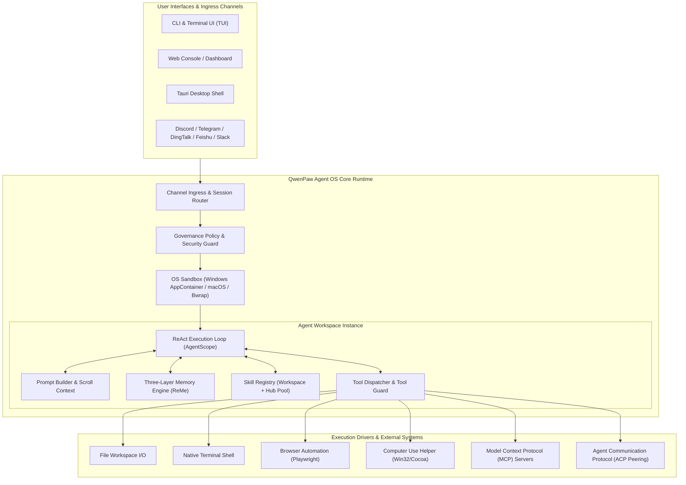

# 00 - QwenPaw System Architecture Overview

**Status:** ARCHITECTURAL REFERENCE KNOWLEDGE BASE  
**Target Repository:** [QwenPaw (GitHub: agentscope-ai/QwenPaw)](https://github.com/agentscope-ai/QwenPaw)  
**Inspection Mode:** Verified from Source (`src/qwenpaw/`, `plugins/`, `packages/`, `pyproject.toml`, `README.md`)  
**Version Examined:** 2.2.0 (Agent OS Ground-Up Architecture on AgentScope 2.0)

---

## 1. Executive Summary & What the System Does

QwenPaw is an open-source, enterprise-grade **Agent Operating System (Agent OS)** designed for local or cloud autonomous AI execution. Unlike conversational assistants that simply return text responses, QwenPaw creates an isolated, governed runtime environment where agents autonomously read and write files, execute terminal commands, control web browsers, interact with desktop GUI applications, schedule recurring workflows, and delegate sub-tasks across multi-agent swarms.

Key capabilities verified in code:
- **Agent OS Workspace Model:** Every agent possesses an isolated on-disk workspace directory containing its own resources, state, memory, and governance policies.
- **Dynamic Skill & Plugin Ecosystem:** A two-tier capability model separating declarative agent instructions (Skills) from native executable tools (Plugins/Tools).
- **Three-Layer Memory Architecture:** Live working context buffer + verbatim SQLite/Scroll history + self-evolving Markdown knowledge base powered by ReMe.
- **Deep Governance & Multi-Platform Sandboxing:** Granular permission gates (allow / deny / ask / sandbox) with native Windows AppContainer, macOS Sandbox, and Linux Bubblewrap isolation.
- **Autonomous Computer & Browser Control:** Native GUI automation protocol (`computer_use`) and Playwright-driven headless/headed browser execution.
- **Protocol-Neutral Drivers:** Built-in Model Context Protocol (MCP) and Agent Communication Protocol (ACP) support for cross-agent collaboration.

---

## 2. Source Code Topology & Grounding Matrix

| System Component | Public Repository Path | Grounding Classification | Verification Notes |
| :--- | :--- | :--- | :--- |
| **Agent Runtime & Loop** | `src/qwenpaw/agents/react_agent.py`, `loop/` | **VERIFIED FROM SOURCE** | ReAct execution engine, loop engineering templates (Coding / Mission modes). |
| **Skill System & Hub** | `src/qwenpaw/agents/skill_system/` | **VERIFIED FROM SOURCE** | Dynamic discovery, manifest models (`SkillInfo`), workspace vs hub resolution. |
| **Tool Registry & Execution** | `src/qwenpaw/agents/tools/`, `tool_calls/` | **VERIFIED FROM SOURCE** | File I/O, shell execution, AST code parsing, search, batch execution. |
| **Computer Use Plugin** | `plugins/bundle/computer-use/` | **VERIFIED FROM SOURCE** | Native protocol v2 (`protocol.py`), window-bound capture, clicks, key injection. |
| **Browser Tooling** | `src/qwenpaw/browser/`, `agents/tools/browser.py` | **VERIFIED FROM SOURCE** | Playwright automation, DOM inspection, element action targeting. |
| **Memory & ReMe Engine** | `src/qwenpaw/agents/memory/`, `reme_*.py` | **VERIFIED FROM SOURCE** | Light memory manager, embedding integration, vector reranking, markdown sync. |
| **ACP Multi-Agent Protocol** | `src/qwenpaw/agents/acp/` | **VERIFIED FROM SOURCE** | Inter-agent communication protocol, permissions, remote tool adapters. |
| **Security & Tool Guard** | `src/qwenpaw/security/`, `governance/` | **VERIFIED FROM SOURCE** | Tool call guards, dangerous command blockers, skill static scanner. |
| **Sandboxing Engine** | `src/qwenpaw/sandbox/` | **VERIFIED FROM SOURCE** | Windows AppContainer, elevated/unelevated sandboxes, Bubblewrap on Linux. |
| **Cron & Scheduling** | `agents/skills/cron-en/`, `services/` | **VERIFIED FROM SOURCE** | Recurrent task daemon, ISO8601 calendar recurrence, silent agent runs. |

---

## 3. High-Level Architecture Pattern

---

## 4. Strengths & Architectural Advantages
- **True Agent OS Paradigm:** Treats agents as processes with filesystem workspaces, capability permissions, and sandbox constraints.
- **Exceptional Security Depth:** Multi-tiered defense (Skill Scanner $\rightarrow$ Governance Policy $\rightarrow$ Tool Guard $\rightarrow$ Kernel Sandbox).
- **Extensible Skill & Plugin Architecture:** Markdown-based Skills instruct the LLM on tool usage; code-based Plugins provide the underlying execution mechanics.
- **Scroll Context Memory:** Retains verbatim conversation histories on disk with on-demand retrieval, avoiding token-truncation context loss.

---

## 5. Architectural Weaknesses & Tradeoffs
- **Not Optimized for Real-Time Voice:** Built primarily around turn-based text/tool loops (request $\rightarrow$ think $\rightarrow$ tool $\rightarrow$ observe $\rightarrow$ respond). Turn turnaround typically ranges from 1.5s to 6.0s.
- **Python Runtime Footprint:** Requires Python 3.11+ environment with numerous heavy dependencies (Playwright, Pydantic, AgentScope, SQLite, Torch/embedding libraries).
- **High Architectural Complexity:** The separation across ACP, MCP, plugins, bundles, and governance layers involves substantial abstraction overhead.

---

## 6. What Zezo Can Learn
1. **The Skill vs. Tool Distinction:** Keep tools as simple, atomic executable primitives (e.g. `read_file`, `exec_command`, `click_element`) and represent workflows as Markdown Skills.
2. **The Governance Gate (Allow/Deny/Ask):** Provide granular user permissions for every tool call before it touches the OS.
3. **Scroll Context Memory Pattern:** Never summarize and discard older conversation turns; persist them verbatim to SQLite/Markdown and retrieve on demand.

---

## 7. What Zezo Must Avoid Copying Blindly
- **Do not introduce a heavy Python runtime into Zezo:** Zezo is a lightweight native Windows assistant built with Tauri v2 (Rust + TypeScript). Packaging Python runtimes balloons the installer by 300MB+ and damages cold-start time.
- **Do not adopt complex multi-agent ACP orchestration prematurely:** For a single-user desktop assistant, a well-orchestrated single agent with modular skills is far more reliable and faster.
