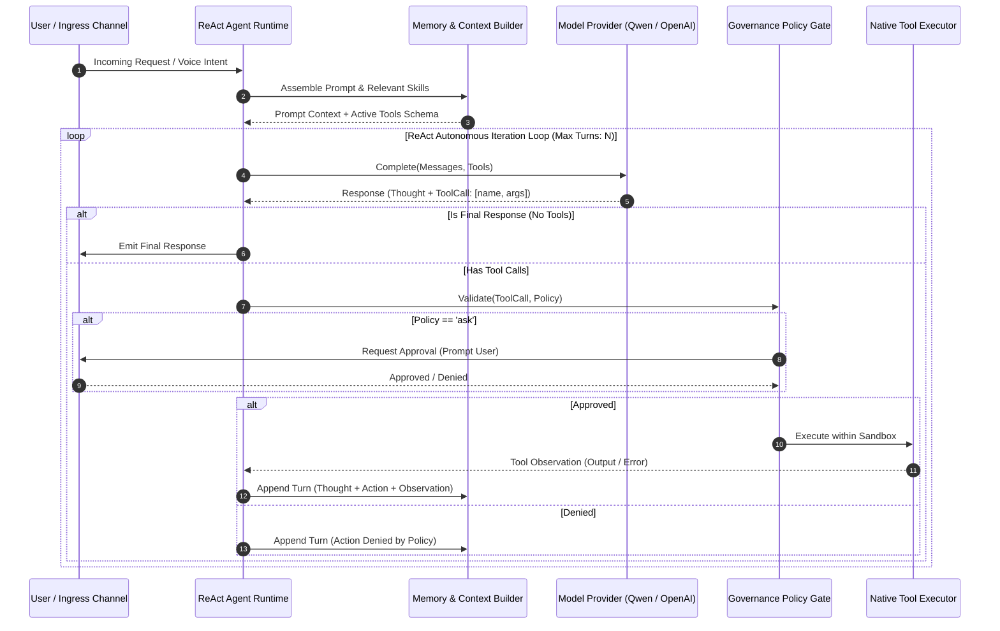

# 01 - Agent Runtime & Execution Loop

**Status:** ARCHITECTURAL REFERENCE KNOWLEDGE BASE  
**Target Repository:** [QwenPaw (GitHub: agentscope-ai/QwenPaw)](https://github.com/agentscope-ai/QwenPaw)  
**Inspection Mode:** Verified from Source (`src/qwenpaw/agents/react_agent.py`, `loop/`, `prompt_builder.py`)

---

## 1. Runtime Architecture & The ReAct Engine

QwenPaw implements an advanced, iterative **ReAct (Reasoning + Acting)** execution loop built upon the AgentScope framework.

The runtime processes user requests through cyclic turns composed of:
1. **Context Assembly:** Combining system instructions, active skills, short-term message history, retrieved long-term memory, and tool definitions.
2. **Model Inference:** Invoking the LLM to generate either a final user response or one or more structured tool calls.
3. **Tool Dispatch & Observation:** Executing approved tool calls through the governance sandbox and appending observations back into the context.
4. **Evaluation & Termination:** Continuing iterations until the model outputs a final answer, reaches the maximum turn threshold, or requests user clarification.

---

## 2. The Execution Loop Topology



---

## 3. Loop Engineering: Modes & Execution Templates

QwenPaw introduces **Loop Engineering** (`src/qwenpaw/loop/`) to specialize the agent's behavior according to the task domain:

- **Coding Mode:** Configures high maximum turn counts (e.g., 50 turns), strict file diff verification, AST analysis, and test execution loops. Tool calls default to automated approvals for read operations, with approval gates for file writes.
- **Mission Mode:** Tailored for complex research and multi-step external tasks (crawling, document parsing, report generation) with checkpointing and state rollback.
- **Interactive / Chat Mode:** Optimized for minimal latency and frequent user check-ins.

---

## 4. Retries, Error Recovery & Observation Handling

- **Transient Tool Failures:** When a tool returns a non-zero exit code or network timeout, the runtime wraps the failure in a structured observation rather than crashing the loop:
  ```json
  {
    "status": "error",
    "tool": "shell",
    "exit_code": 127,
    "error": "command not found: docker",
    "recommendation": "Verify executable exists in system PATH."
  }
  ```
- The model reads this observation in the subsequent turn and self-corrects (e.g., choosing an alternative command or asking the user).
- **Infinite Loop Protection:** The runtime tracks tool repetition signatures. If the model invokes the identical failing command 3 times consecutively, the loop halts and requests steering from the user.

---

## 5. Architectural Recommendations for Zezo

1. **Lightweight TypeScript/Rust ReAct Engine:** Zezo does not need the heavy AgentScope Python framework. A robust ReAct loop can be implemented in ~300 lines of clean TypeScript in the backend worker or natively in Rust.
2. **Structured Error Wrapping:** Ensure all Windows tool failures (e.g., file locked, access denied, process not found) return clear JSON observations to the AI rather than uncaught exceptions.
3. **Loop Turn Caps for Voice:** In a voice assistant, the ReAct loop should cap autonomous iterations at **3–5 turns** per spoken command. Long autonomous loops should yield immediate voice progress updates.
