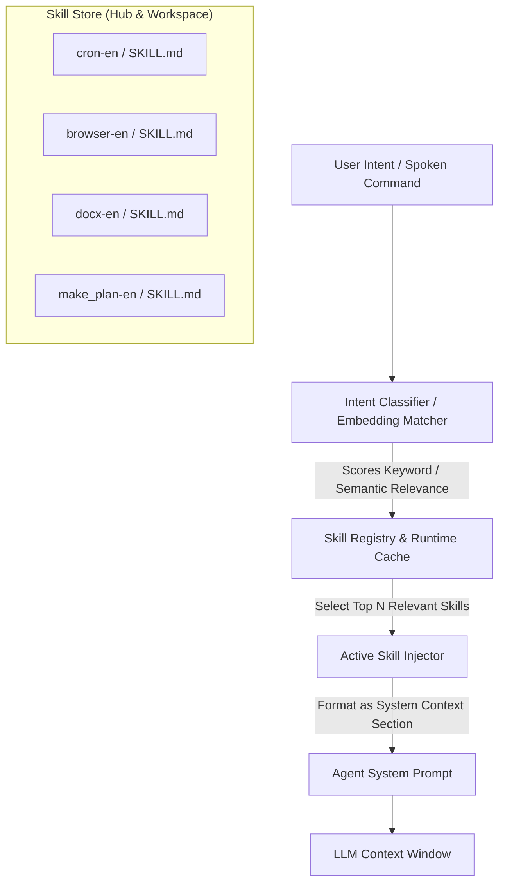

# 02 - The Skills Subsystem

**Status:** ARCHITECTURAL REFERENCE KNOWLEDGE BASE  
**Target Repository:** [QwenPaw (GitHub: agentscope-ai/QwenPaw)](https://github.com/agentscope-ai/QwenPaw)  
**Inspection Mode:** Verified from Source (`src/qwenpaw/agents/skill_system/`, `agents/skills/`)

---

## 1. Defining the Taxonomy: Skill vs. Tool vs. Agent

A common source of confusion in modern agent frameworks is the boundary between skills, tools, and agents. QwenPaw establishes an exemplary, rigorous distinction:

| Concept | What It Is | Representation | Execution Profile | Analogy |
| :--- | :--- | :--- | :--- | :--- |
| **Tool** | An atomic, executable software function with a strict schema (inputs, outputs, side effects). | Python/Rust function, CLI binary, or MCP tool. | Executed directly by the runtime; returns deterministic output. | The hammer, scalpel, or screwdriver. |
| **Skill** | A structured Markdown document containing domain instructions, best practices, decision rules, and examples guiding the LLM on *when* and *how* to use specific tools. | `SKILL.md` with YAML frontmatter + optional scripts. | Injected dynamically into LLM context; guides reasoning. | The medical protocol or carpentry manual. |
| **Agent** | An autonomous execution instance possessing an identity, memory store, governance policy, active skills, and tool access. | Workspace directory on disk with configuration. | Runs the ReAct loop across user turns. | The carpenter or surgeon. |

---

## 2. Skill Architecture & Discovery

### 1. The Skill Structure (`SKILL.md`)
Every skill is packaged as an isolated directory containing:
```
skills/cron-en/
├── SKILL.md             # Required: Manifest frontmatter + Markdown guide
├── scripts/             # Optional: Helper scripts invoked by the skill
└── references/          # Optional: Detailed API specs or cheat sheets
```

#### Verified Manifest Schema (`models.py`)
```yaml
---
name: cron
description: Use this skill only for scheduled or recurring tasks. Manage jobs with qwenpaw cron list/create/get...
metadata:
  builtin_skill_version: "1.7"
  qwenpaw:
    emoji: "⏰"
---
```

### 2. The Two-Tier Pool: Shared vs. Workspace Skills
- **Shared Hub Pool:** System-provided built-in skills available to all agents (`qwenpaw/agents/skills/`).
- **Workspace-Specific Pool:** Located inside the individual agent's directory (`.qwenpaw/agents/<agent_id>/skills/`). Allows per-agent skill overrides and custom user-authored workflows.
- **Resolution Precedence:** Workspace-specific skills always take precedence over shared hub skills if name collisions occur (`workspace_service.py`).

---

## 3. Dynamic Skill Loading & Context Injection



### Context Budgeting & Token Management
- If every available skill was permanently loaded into the system prompt, context windows would fill up with thousands of irrelevant tokens.
- QwenPaw maintains a lightweight index of skill `name` and `description` headers. Only when user intent matches a skill's activation trigger is the full Markdown body injected into the prompt.

---

## 4. Strengths & Architectural Insights
- **Human-Readable & Modifiable:** Because skills are standard Markdown files, users and developers can adjust agent behavior without recompiling code or restarting servers.
- **Composable:** Complex skills can reference simpler tools (e.g. the `make_plan` skill uses standard file writing and reading tools).
- **Decoupled Evolution:** Skills can be updated, cloned, or downloaded from a marketplace independently of the core application binary.

---

## 5. Architectural Recommendations for Zezo

1. **Adopt QwenPaw's `SKILL.md` Standard Directly:**
   Zezo can adopt this exact Markdown + YAML frontmatter format for defining its desktop capabilities (`skills/voice-control/`, `skills/window-manager/`, `skills/browser-actions/`).
2. **Built-in vs. User Custom Skills:**
   - Zezo Built-in: Stored in application asset bundle.
   - User Custom: Stored in `%APPDATA%\Zezo\skills\`.
3. **Voice-Specific Triggers:** Add a `voice_triggers` array to skill frontmatter so Zezo's intent router can immediately activate relevant skills based on spoken phrases.
