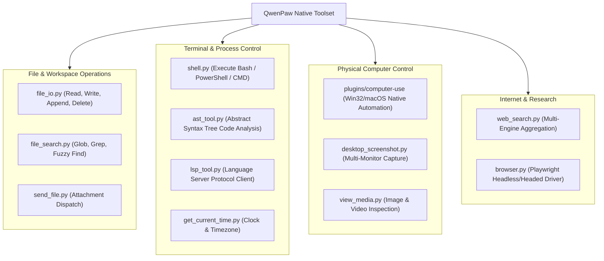

# 03 - Tools & Native OS Capabilities

**Status:** ARCHITECTURAL REFERENCE KNOWLEDGE BASE  
**Target Repository:** [QwenPaw (GitHub: agentscope-ai/QwenPaw)](https://github.com/agentscope-ai/QwenPaw)  
**Inspection Mode:** Verified from Source (`src/qwenpaw/agents/tools/`, `plugins/bundle/computer-use/`)

---

## 1. Tool Taxonomy & Core Modules

QwenPaw implements a comprehensive suite of atomic tools designed for full desktop autonomy:



---

## 2. Verified Implementation: Computer Use Native Protocol v2

The `plugins/bundle/computer-use/` package defines a structured protocol bridging agent reasoning to native operating system window managers:

### 1. The Native Method Vocabulary (`protocol.py`)
```python
# VERIFIED FROM SOURCE: plugins/bundle/computer-use/computer_use/protocol.py
NATIVE_METHODS = frozenset({
    "click",
    "close_window",
    "drag",
    "end_turn",
    "hello",
    "invoke_element",
    "launch_app",
    "list_apps",
    "list_windows",
    "observe_window",
    "press_key",
    "scroll",
    "sequence",
    "set_value",
    "type_text",
})
```

### 2. Window-Bound Execution Model
Unlike generic automation tools that interact with the raw desktop screen, QwenPaw grounds actions in specific **Window Contexts**:
- `list_windows`: Returns all open application windows with HWND, window title, bounds, and focus state.
- `observe_window`: Captures a screenshot and accessibility tree strictly bounded to the target application's window rectangle.
- **Why this is critical:** Background windows do not accidentally receive simulated clicks, and multi-monitor setups do not offset coordinate accuracy.

---

## 3. Tool Calling Protocol & Batch Execution

- **Batch Tool Invocation (`run_tool_batch.py`):**
  When an agent needs to perform multiple related operations (e.g., reading 4 source files), issuing them in a batch eliminates 3 extra LLM round-trips, slashing total execution latency.
- **Schema Format:** Follows standard OpenAI / Qwen function schemas with typed JSON parameters and explicit docstrings.

---

## 4. Strengths & Tradeoffs

| Advantage | Tradeoff / Risk |
| :--- | :--- |
| Window-bound automation prevents clicking wrong apps | Requires native helper hooks for OS accessibility APIs |
| AST and LSP tools allow precise, verified code refactoring | Language server processes consume local memory |
| Batch tool execution dramatically speeds up file operations | One failing item in a batch requires graceful partial error handling |

---

## 5. Architectural Recommendations for Zezo

1. **Adopt Window-Bound Automation:**
   In Windows, Zezo should target specific `HWND` window handles using Win32 `GetWindowRect` and `SetForegroundWindow` before injecting mouse/keyboard events.
2. **Implement Native Rust Tool Handlers:**
   Implement `read_file`, `write_file`, `list_directory`, `execute_command`, and `take_screenshot` as native Tauri Rust commands (`#[tauri::command]`).
3. **Batch Execution Support:**
   Allow Zezo's agent to request multiple tool calls in a single turn for complex multi-file searches or edits.
