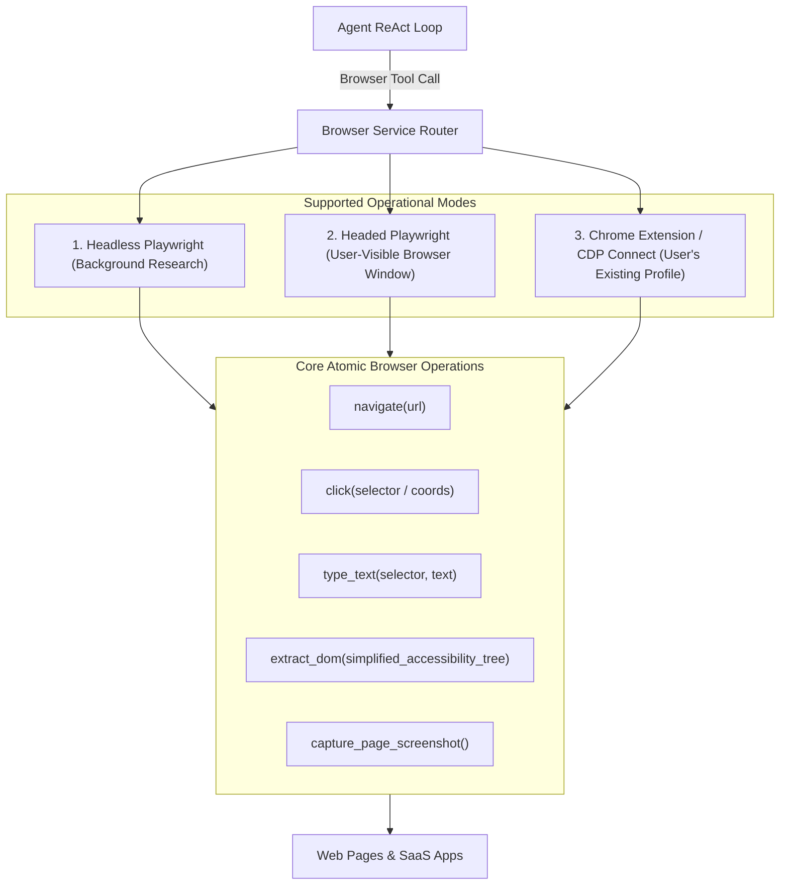

# 04 - Browser Automation Subsystem

**Status:** ARCHITECTURAL REFERENCE KNOWLEDGE BASE  
**Target Repository:** [QwenPaw (GitHub: agentscope-ai/QwenPaw)](https://github.com/agentscope-ai/QwenPaw)  
**Inspection Mode:** Verified from Source (`src/qwenpaw/browser/`, `plugins/bundle/chrome/`)

---

## 1. Browser Subsystem Architecture

QwenPaw treats the web browser not merely as an HTTP scraper, but as a full interactive GUI runtime. The agent can navigate, click links, fill form fields, take screenshots, extract structured DOM elements, download files, and solve dynamic SPA interfaces.

---

## 2. Accessibility Tree vs. Raw HTML

A fundamental innovation in QwenPaw's browser architecture is the elimination of raw HTML injection into LLM prompts:
- **The Raw HTML Problem:** Modern web pages contain 20,000+ lines of minified JavaScript, CSS, SVGs, and tracking scripts, overflowing context windows and degrading reasoning accuracy.
- **The Accessibility Tree Pattern:** QwenPaw strips formatting and extracts the **Accessibility Tree (AXTree)**:
  - Interactive elements (buttons, inputs, links) receive unique numerical indices (e.g. `[12] Button: "Sign In"`).
  - The model commands actions using concise index identifiers (`click(target=12)`) rather than fragile, complex CSS/XPath selectors.

---

## 3. Chrome Integration Bundle (`plugins/bundle/chrome`)
- Enables the agent to connect directly to an existing, authenticated Google Chrome instance via the Chrome DevTools Protocol (CDP) on port 9222.
- **Benefit:** The agent can access user-authenticated sessions (GitHub, Jira, Gmail, AWS Console) without requiring the user to share passwords or handle 2FA logins.

---

## 4. Strengths & Tradeoffs

| Advantage | Tradeoff / Risk |
| :--- | :--- |
| Accessibility tree reduces token consumption by ~85% | Dynamic shadow DOM or non-standard canvas elements may be missed |
| CDP integration leverages existing user cookies/logins | Requires launching Chrome with `--remote-debugging-port` |
| Headless execution runs quietly in background | High memory footprint when multiple browser instances spawn |

---

## 5. Architectural Recommendations for Zezo

1. **Lightweight Headless Engine via Rust:**
   Instead of bundling massive Playwright Python runtimes, Zezo can control Chromium directly via the Chrome DevTools Protocol using lightweight Rust crates (`chromiumoxide` or `headless_chrome`).
2. **Accessibility-First Interaction:**
   Adopt the numerical indexing pattern (`[1]`, `[2]`, `[3]`) for interactive elements when feeding web pages to the LLM.
3. **Voice-Driven Browser Workflows:**
   Allow the user to speak simple commands (*"Go to Amazon and check my order status"*); the agent navigates, extracts status text, and speaks the summary.
