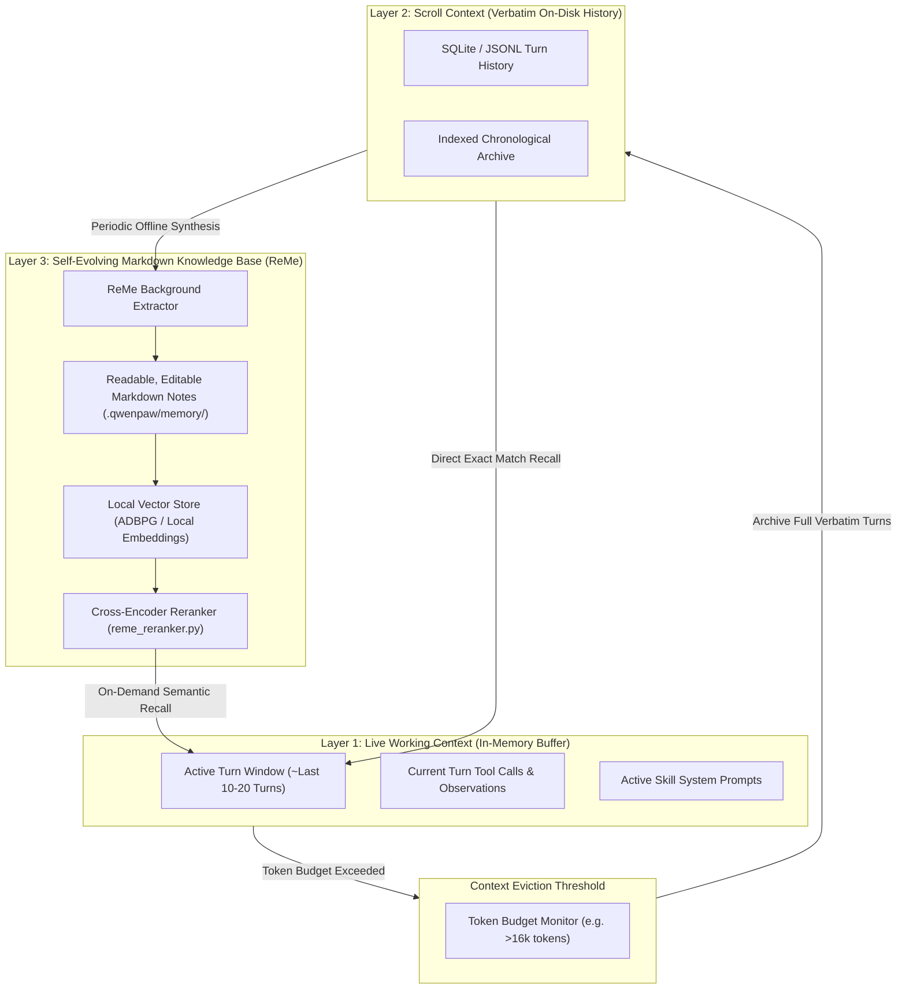

# 05 - Memory & Context Architecture

**Status:** ARCHITECTURAL REFERENCE KNOWLEDGE BASE  
**Target Repository:** [QwenPaw (GitHub: agentscope-ai/QwenPaw)](https://github.com/agentscope-ai/QwenPaw)  
**Inspection Mode:** Verified from Source (`src/qwenpaw/agents/memory/`, `reme_*.py`) & Documentation

---

## 1. The Three-Layer Memory Architecture

QwenPaw rejects the simplistic approach of squeezing entire chat histories into the active LLM context or relying solely on a basic vector store. Instead, it implements a hierarchical, three-layer memory model:

---

## 2. Layer Analysis

### Layer 1: Live Working Context
- Fast, volatile memory held in memory during the active session.
- Provides immediate conversational continuity for the current task.

### Layer 2: Scroll Context
- As turns age out of the active context window, they are **never summarized away or deleted**.
- They are archived verbatim to SQLite/disk.
- If the agent needs to reference an exact command run 3 days ago, it queries the Scroll Context index and retrieves the exact turn payload.

### Layer 3: Self-Evolving Markdown Memory (ReMe v0.4)
- Powered by the ReMe sub-framework.
- In the background, ReMe parses completed conversations and workspace documents to extract structured facts, user preferences, and project guidelines.
- **Critical Human-in-the-Loop Feature:** Extracted memories are stored as plain **Markdown files** on disk. The user can open them in any text editor, correct inaccuracies, or delete obsolete facts.
- **Reranker Pipeline (`reme_reranker.py`):** When querying memory, vector similarity search provides top-20 candidate documents, which are re-ranked through a cross-encoder model to select the top-3 highest-relevance snippets before prompt injection.

---

## 3. Strengths & Tradeoffs

| Advantage | Tradeoff / Risk |
| :--- | :--- |
| Zero loss of history thanks to Scroll Context | Disk storage grows continuously over time |
| User-editable Markdown notes provide 100% transparency | Reranking and embedding generation require local CPU/GPU compute |
| Prevents hallucination of past user preferences | Extraction quality depends on LLM summarization fidelity |

---

## 4. Architectural Recommendations for Zezo

1. **Adopt Plain Markdown for User Preferences:**
   Store Zezo's learned user facts in a clean, human-readable file (`%APPDATA%\Zezo\memory\user_profile.md`). Users love knowing exactly what an AI remembers about them.
2. **SQLite for Conversation Turn Storage:**
   Store all voice turns, user speech transcripts, and tool execution logs in a local SQLite database using Rust `rusqlite`.
3. **Selective Semantic Injection:**
   Never dump the entire database into the system prompt. Query relevant memory snippets only when user speech requires past context (*"What did we discuss yesterday about Tauri?"*).
