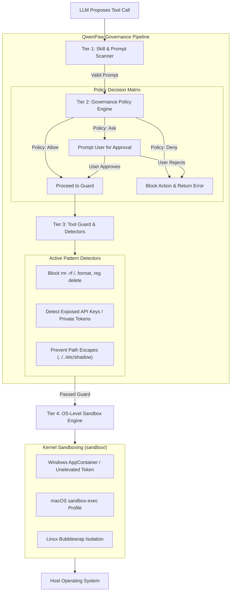

# 07 - Security, Governance & Sandboxing

**Status:** ARCHITECTURAL REFERENCE KNOWLEDGE BASE  
**Target Repository:** [QwenPaw (GitHub: agentscope-ai/QwenPaw)](https://github.com/agentscope-ai/QwenPaw)  
**Inspection Mode:** Verified from Source (`src/qwenpaw/security/`, `governance/`, `sandbox/`)

---

## 1. Multi-Tiered Security Governance Architecture

QwenPaw features one of the most mature security architectures in open-source agent engineering. When an agent possesses tools to run arbitrary shell commands and write to disks, robust defense-in-depth is essential:

---

## 2. The Four Security Tiers

### Tier 1: Skill Scanner (`security/skill_scanner/`)
- Statically scans all incoming `SKILL.md` manifests and associated scripts before registration.
- Flags suspicious regex patterns, obfuscated Python/PowerShell code, unauthorized network egress calls, or attempts to overwrite system files.

### Tier 2: Governance Policy (`governance/policy.py`)
- Defines per-tool execution policies configured per agent or globally:
  - **`allow`**: Silent automated execution (e.g. `get_current_time`, `read_file` in project folder).
  - **`ask`**: Pauses the execution loop, alerts the user, and requires explicit interactive confirmation (e.g. `write_file`, `send_email`).
  - **`deny`**: Completely disabled for that agent instance.

### Tier 3: Tool Guard & Dangerous Command Detectors (`governance/detectors.py`, `tool_guard/`)
- Intercepts shell and filesystem parameters before dispatch.
- Blocks destructive commands (`rm -rf /`, `diskpart`, `del /F /S /Q C:\*`, registry edits).
- Prevents path traversal vulnerabilities attempting to read outside designated workspaces.

### Tier 4: OS-Level Sandboxing (`sandbox/`)
- When commands must be run, QwenPaw executes them inside operating system isolation containers:
  - **Windows (`windows_appcontainer_sandbox.py`):** Leverages Windows AppContainer tokens or restricted security tokens with dropped privileges to prevent malware execution.
  - **Linux (`bubblewrap_sandbox.py`):** Uses Bubblewrap (`bwrap`) to isolate namespaces, mount private temporary filesystems, and disable network access if requested.
  - **macOS (`macos_sandbox.py`):** Generates macOS Seatbelt (`sandbox-exec`) profiles.

---

## 3. Secret Store & Credential Boundaries (`security/secret_store.py`)
- Encrypted storage for channel bot tokens, cloud API keys, and database passwords.
- Keys are decoupled from agent context: agents reference credentials via abstract IDs (e.g., `CREDENTIAL_ID:JIRA_API`), never seeing the raw plaintext secret in prompt history.

---

## 4. Architectural Recommendations for Zezo

1. **Adopt the Four-Tier Permission Model (Allow / Ask / Deny):**
   In Zezo, every tool definition should specify its default governance policy. Harmless actions execute instantly; high-risk actions trigger Zezo's `CONFIRMATION` Dynamic Island state.
2. **Implement Path Whitelisting in Rust:**
   Restrict Zezo's file manipulation tools to approved user directories (e.g. `Documents`, project folders) by default, strictly blocking system root paths (`C:\Windows\System32`).
3. **Drop Privileges for Shell Commands:**
   Never launch spawned child processes with Administrator privileges unless explicitly commanded by the user with elevated UAC confirmation.
