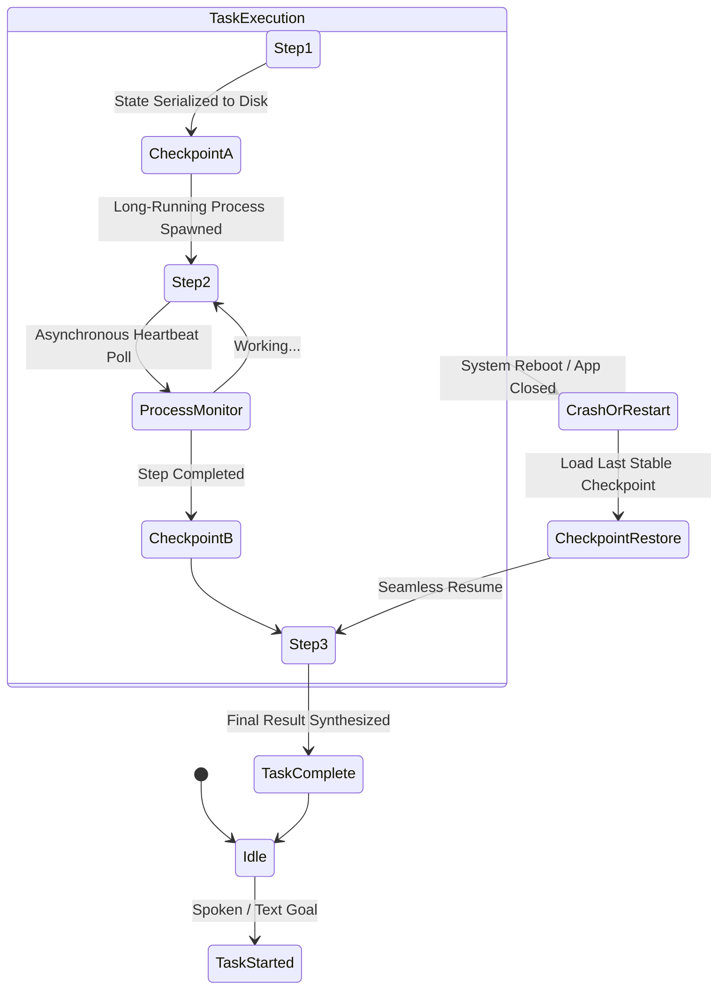

# 08 - Long-Running Tasks & Asynchronous Execution

**Status:** ARCHITECTURAL REFERENCE KNOWLEDGE BASE  
**Target Repository:** [QwenPaw (GitHub: agentscope-ai/QwenPaw)](https://github.com/agentscope-ai/QwenPaw)  
**Inspection Mode:** Verified from Source (`src/qwenpaw/checkpoints/`, `runtime/`, `loop/`)

---

## 1. The Long-Running Task Problem in Agents

Desktop agents often handle operations that span minutes or hours: crawling hundreds of documentation pages, downloading and processing multi-gigabyte datasets, or compiling large codebases.

If an agent architecture is designed around synchronous HTTP request-response patterns:
- Network timeouts sever connections.
- Application restarts cause complete loss of execution progress.
- Users cannot interact with or steer the agent while a task is underway.

---

## 2. QwenPaw's State Persistence & Checkpointing

To guarantee conversation and execution continuity, QwenPaw implements **Workspace Checkpoints** (`src/qwenpaw/checkpoints/`):

### Key Checkpointing Mechanics
- **Turn-by-Turn State Serialization:** After each verified observation, the complete agent state (turn history, variable bindings, modified file hashes, pending queue) is atomically committed to SQLite / disk.
- **Rollback Capability:** If an agent takes an erroneous path (e.g., breaking code dependencies), it can restore state to a previous verified checkpoint.

---

## 3. Background Task Management & Process Detachment

- When tools execute commands that take longer than 5 seconds, the runtime can detach the execution into a background child process.
- The process writes stdout/stderr to a tracked log file in the agent's workspace.
- The agent loop can return an interim status to the user and register a heartbeat listener to be notified upon process termination.

---

## 4. Architectural Recommendations for Zezo

1. **Adopt Non-Blocking Background Tasks:**
   When a user asks Zezo to run a long build or search (*"Build the release bundle and let me know when it's done"*), Zezo should detach the process, immediately announce: *"Starting release build in the background. I'll notify you when it finishes"*, and return to `IDLE` state.
2. **Persistent Task Registry:**
   Maintain a lightweight task registry in Rust or SQLite (`task_id`, `name`, `status`, `pid`, `started_at`).
3. **Notification on Completion:**
   When the background task emits an exit event, Zezo's Dynamic Island can morph to `SUCCESS` and deliver a brief spoken audio notification.
