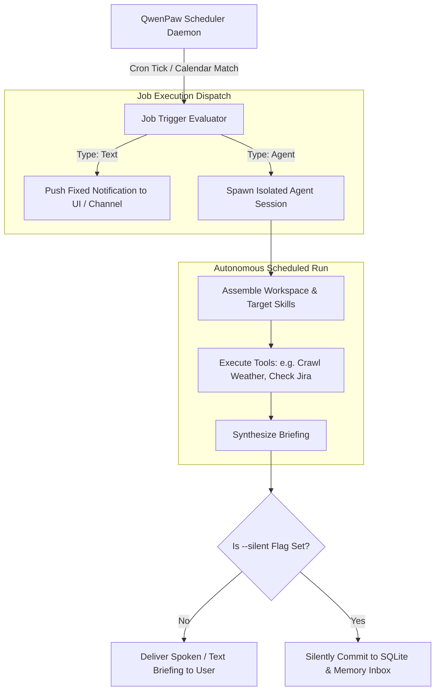

# 10 - Scheduling, Cron & Heartbeat Architecture

**Status:** ARCHITECTURAL REFERENCE KNOWLEDGE BASE  
**Target Repository:** [QwenPaw (GitHub: agentscope-ai/QwenPaw)](https://github.com/agentscope-ai/QwenPaw)  
**Inspection Mode:** Verified from Source (`src/qwenpaw/agents/skills/cron-en/`, `services/`)

---

## 1. The Proactive 24/7 Assistant Paradigm

Most AI assistants are entirely **reactive**: they sit idle until a user clicks a button or types a prompt.

QwenPaw implements a proactive **24/7 Scheduling & Heartbeat Engine** enabling agents to:
- Execute recurring cron routines (daily morning briefings, hourly server health audits, stock alerts).
- Fire calendar-scheduled one-time tasks (*"Remind me tomorrow at 9:00 AM to review pull requests"*).
- Monitor background state via periodic heartbeats and reach out to the user over active channels without prior prompting.

---

## 2. Verified Implementation: The Cron Subsystem

As verified in `src/qwenpaw/agents/skills/cron-en/SKILL.md`:

### 1. Two Task Types
- **`text`**: Sends a deterministic, fixed notification to a target channel or UI at a scheduled timestamp.
- **`agent`**: Triggers a full autonomous agent reasoning run at the scheduled time. The agent queries tools, generates an intelligent summary, and pushes the result to the user.

### 2. Two Recurrence Models
- **Standard Cron (`--schedule-type cron`):** Classic 5-field cron syntax (`0 9 * * 1-5` for weekdays at 9:00 AM).
- **Calendar Scheduled (`--schedule-type scheduled`):** ISO8601 timestamps starting at `--run-at` with repeat options (`--repeat-every-days`, `--repeat-count`, `--repeat-until`).

### 3. The Silent Execution Pattern (`--silent`)
When a recurring background job runs (e.g. hourly disk cache cleanups), broadcasting a notification every hour is annoying. Passing `--silent`:
- Suppresses external channel notifications.
- Continues full logging, trace recording, and updates the agent's internal memory/inbox.

---

## 3. Heartbeat & Proactive Autonomous Triggers

Beyond fixed cron times, QwenPaw supports a **Heartbeat Daemon**:
- Wakes up every $N$ minutes (e.g., every 15 minutes).
- Checks specific system conditions (battery level, pending emails, Git repo status).
- If an urgent anomaly is detected (e.g., CI build failed), the agent initiates an unsolicited interaction with the user.

---

## 4. Architectural Recommendations for Zezo

1. **Lightweight Windows Task Scheduler Integration / Tokio Cron:**
   In Zezo, run a lightweight recurring cron scheduler inside the background Rust Tokio runtime (`tokio-cron-scheduler` crate).
2. **Proactive Dynamic Island Notifications:**
   When a scheduled event triggers (e.g. morning briefing), Zezo's Dynamic Island can expand from its pill shape into an animated notification badge and softly speak: *"Good morning Hamza, here is your daily agenda."*
3. **Dedicated `qwenpaw`-Style CLI/Skill Commands:**
   Implement natural voice parsing for scheduling (*"Zezo, remind me in 20 minutes to take a break"*), creating an entry in the local schedule table.
