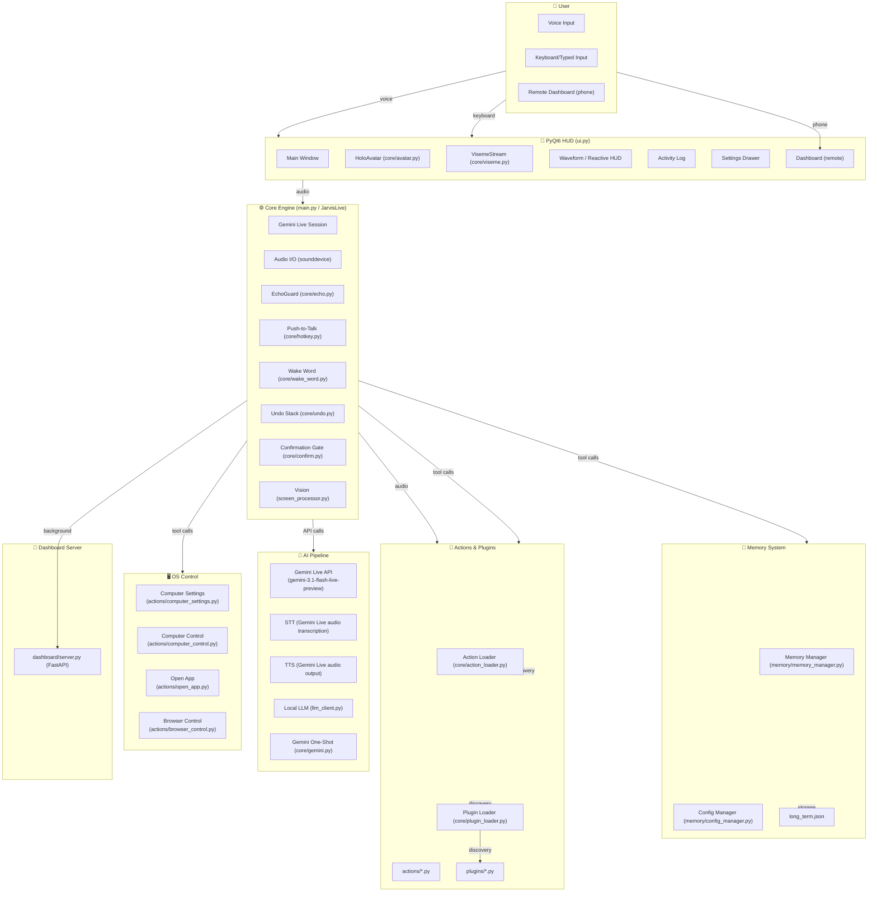

# JARVIS — Architecture Documentation

## Overview

JARVIS is a **modular, event-driven, locally-running desktop application** that provides real-time voice interaction with a holographic avatar HUD. It is **not** a client-server application in the traditional sense — the AI processing happens via Google's Gemini Live API over the internet, but all audio I/O, UI rendering, tool execution, memory management, and wake-word detection run locally on the user's machine.

The architecture is best described as a **single-process, multi-threaded, event-driven modular monolith** with a PyQt6 GUI layer, an asyncio-based Gemini Live communication layer, and a thread pool for tool execution.

## Architecture Type

- **Monolithic** — a single Python process (`main.py`) containing all modules
- **Modular** — clearly separated concerns via `core/`, `actions/`, `plugins/`, `memory/`, `config/`, `dashboard/` directories
- **Event-driven** — PyQt6 signals/slots for UI, asyncio coroutines for Gemini Live, threading for audio callbacks and tool execution
- **Plugin-based** — drop-in `.py` files in `plugins/` are auto-discovered
- **Action-based** — built-in tools in `actions/` are auto-discovered the same way

## Major Components



## Component Responsibilities

### Local Components (run on the user's machine)

| Component | File(s) | Responsibility |
|-----------|---------|---------------|
| `main.py` | `main.py` | Application entry point, JarvisLive class, Gemini Live session management, audio I/O loop, tool dispatch, viseme extraction |
| `ui.py` | `ui.py` | PyQt6 HUD, main window, avatar canvas, waveform, activity log, settings drawer, all Qt widgets |
| `core/avatar.py` | `core/avatar.py` | Renders the holographic head using QPainter, handles facial animation, eye movement, brow tracking |
| `core/avatar_mesh.py` | `core/avatar_mesh.py` | Builds the head geometry from MediaPipe canonical face model (face_model.obj) |
| `core/viseme.py` | `core/viseme.py` | Transcript-to-mouth-shape fusion, phoneme mapping, VisemeStream class |
| `core/echo.py` | `core/echo.py` | Self-echo detection, distinguishing user voice from assistant's own echo |
| `core/hotkey.py` | `core/hotkey.py` | Push-to-talk chord detection (Ctrl+Space), global on Windows |
| `core/wake_word.py` | `core/wake_word.py` | Local "Hey Jarvis" wake-word detection using openwakeword |
| `core/undo.py` | `core/undo.py` | Shared undo stack for reversible actions |
| `core/confirm.py` | `core/confirm.py` | Irreversible-action confirmation gate (UI-issued tokens) |
| `core/audio_devices.py` | `core/audio_devices.py` | Microphone/speaker enumeration, filtering, measurement, resolution by name |
| `core/action_loader.py` | `core/action_loader.py` | Auto-discovers actions/*.py files with TOOL dict |
| `core/plugin_loader.py` | `core/plugin_loader.py` | Auto-discovers plugins/*.py files with PLUGIN dict |
| `core/gemini.py` | `core/gemini.py` | One-shot Gemini calls (non-live), model ladder, quota management |
| `core/llm_client.py` | `core/llm_client.py` | Local LLM client (Ollama/OpenAI-compatible) for planning and agent tasks |
| `core/log_bus.py` | `core/log_bus.py` | Ring buffer log bus (20,000 lines) with zero-leak secret redaction, level filtering, export, and UI console sink |
| `core/task_manager.py` | `core/task_manager.py` | Thread-safe background task registry, watchdog, CPU throttling, process tree termination, and ANSI cleansing |
| `core/design_extractor.py` | `core/design_extractor.py` | On-demand deterministic token extractor for custom HTML files, live URLs, and generating standalone `DESIGN.md` specs |
| `core/design_resolver.py` | `core/design_resolver.py` | Reference-first design resolver, raw HTML blueprint injector (`skills/hamza_taste/references/html/`), redesign override detector, and domain routing matrix |
| `core/repo_context.py` | `core/repo_context.py` | Active workspace resolver and persistence (`memory/repo_context.json`) |
| `memory/sqlite_memory.py` | `memory/sqlite_memory.py` | SQLite FTS5 database (`zezo_brain.db`) with BM25 fast lexical indexing and secret scrubbing |
| `memory/memory_manager.py` | `memory/memory_manager.py` | Long-term memory storage, indexing, search, and session summaries |
| `memory/config_manager.py` | `memory/config_manager.py` | api_keys.json read/write, model configurations, and assistant preferences |

| `actions/*.py` | `actions/` | 23 auto-discovered action modules (antigravity_agent, opencode_agent, kilo_agent, design_extractor, task_status, etc.) |
| `skills/*/` | `skills/` | 10 declarative skill packages (hamza_taste, antigravity_agent, opencode, kilo_code, git_workflow, social_research, etc.) |
| `plugins/*.py` | `plugins/` | Drop-in user plugin files |
| `dashboard/server.py` | `dashboard/server.py` | FastAPI HTTP server for remote phone control |

### External Components (communicate over network)

| Component | Protocol | Purpose |
|-----------|----------|---------|
| Google Gemini Live API | WebSocket over HTTPS | Real-time voice conversation, STT, TTS, LLM reasoning, tool execution |
| Google Gemini REST API | HTTPS REST | One-shot calls (search, classification, code generation) |
| DuckDuckGo | HTTPS REST | Web search fallback |
| Weather APIs | HTTPS REST | Weather reports |
| Flight APIs | HTTPS REST | Flight search |
| Playwright/Chromium | Local | Browser automation |
| Ollama (optional) | HTTP localhost | Local LLM backend |
| Dashboard clients | WebSocket/HTTPS | Remote phone control |

## Communication Patterns

### Synchronous (same thread)
- UI events → Qt signals/slots → JarvisLive methods
- Tool dispatch → `_execute_tool()` → action/plugin handler
- Memory lookups → `search_memory()` (local file scan)

### Asynchronous (asyncio)
- Gemini Live session management (`asyncio` event loop)
- Audio receive → `session.receive()` coroutine
- Tool execution → `loop.run_in_executor()` for blocking I/O
- Proactive engine → background asyncio tasks

### Multi-threaded
- SoundDevice audio callbacks → separate threads
- Push-to-talk polling → dedicated thread (Windows)
- Wake word detection → dedicated thread
- Gemini one-shot calls → dedicated threads
- TTS playback → dedicated thread
- Dashboard server → uvicorn thread

## State Management

| State | Location | Persistence |
|-------|----------|-------------|
| Conversation history | `self._session_log` (in-memory) | Lost on crash; session summary saved to `memory/long_term.json` |
| Resumption handle | `self._resume_handle` (RAM only) | Never persisted (security) |
| User memory | `memory/long_term.json` | Persistent JSON file |
| Configuration | `config/api_keys.json` | Persistent JSON file |
| Undo stack | `core/undo.py` `_stack` (in-memory) | Lost on crash |
| Confirmation | `core/confirm.py` `_pending` (in-memory) | Lost on crash |
| Dashboard keys | `dashboard/server.py` (in-memory) | Lost on crash |

## Audio Pipeline Architecture

```
Microphone (sounddevice.InputStream)
    ↓ callback (1024 frames, 16kHz, int16, mono)
├── Wake word detection (if enabled, sleeping)
│       ↓ openwakeword model (own thread)
│       └── "Hey Jarvis" detected → wake()
├── Echo guard (if assistant speaking)
│       ↓ band energy analysis + subtraction
│       └── echo blocks dropped, user speech passed
├── Push-to-talk gate
│       ↓ Ctrl+Space held?
│       └── not held → audio blocked
└── Audio streaming to Gemini Live
        ↓ session.send_realtime_input()
        └── WebSocket → Google servers
              ↓
        Gemini Live processes audio (STT + LLM + TTS)
              ↓
        session.receive() → audio output + transcripts
              ↓
        TTS audio → sounddevice.OutputStream → speakers
              ↓
        Viseme extraction → avatar mouth animation
```

## Platform-Specific Behavior

- **Windows**: Global push-to-talk via `GetAsyncKeyState`, `comtypes`/`pycaw` for volume, `pywin32` for system controls
- **macOS**: Window-scoped push-to-talk, `osascript` for volume/brightness, `LaunchAgent` for auto-start
- **Linux**: Window-scoped push-to-talk, `pactl` for volume, `brightnessctl` for brightness, `systemd` for auto-start

## Security Model

- No telemetry, no cloud accounts, no MARK server
- API key stored in `config/api_keys.json` (git-ignored, plaintext)
- Dashboard uses AES-256-CBC encryption with session-key-derived keys
- Memory stored locally in `memory/long_term.json`
- Wake word audio never leaves the machine
- Confirmation tokens issued by UI, not model — model cannot forge them
- Session resumption handle stored in RAM only, never on disk

## Key Design Decisions

1. **Gemini Live as the primary API** — draws on a different quota pool than text models, so voice conversation doesn't exhaust text-model quota
2. **Audio-only communication** — `response_modalities=["AUDIO"]` means the Live model only speaks; transcription comes via `output_audio_transcription`
3. **No separate STT model** — Gemini Live handles speech-to-text natively as part of the Live session
4. **Software rendering** — avatar rendered with QPainter (no GPU, no OpenGL)
5. **Auto-discovery** — actions and plugins are discovered at startup via `TOOL`/`PLUGIN` dicts; no hardcoded imports
6. **Proactive audio** — Gemini can detect speech not addressed to it and stay quiet
7. **Sliding-window context compression** — conversation can last hours without context overflow
8. **Dual LLM** — Gemini for voice conversation, local Ollama for planning/agent tasks
9. **No hardcoded language** — prompt adapts to the user's spoken language; Unicode reduction for visemes works across scripts
10. **Graceful degradation** — missing optional packages disable individual features without crashing the app