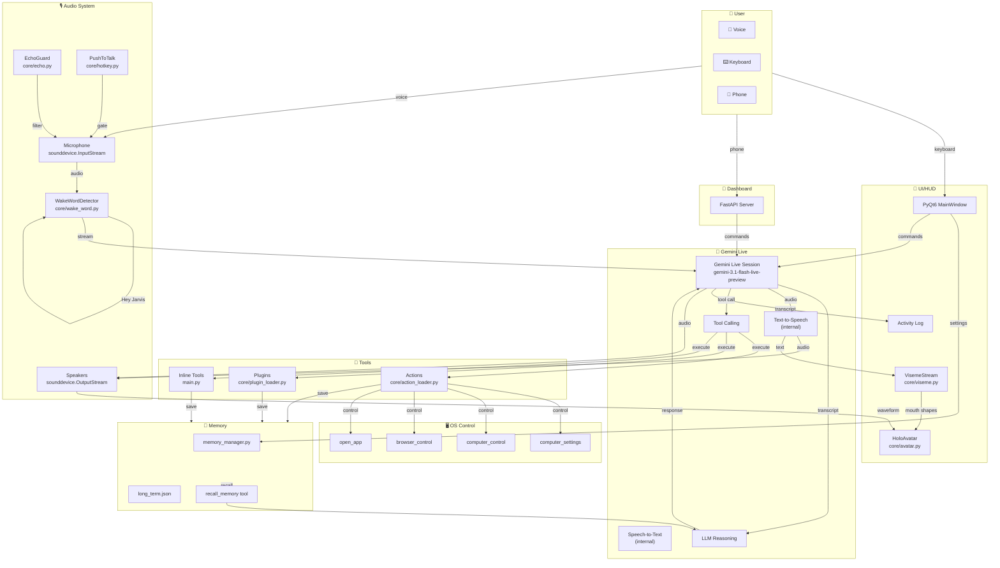
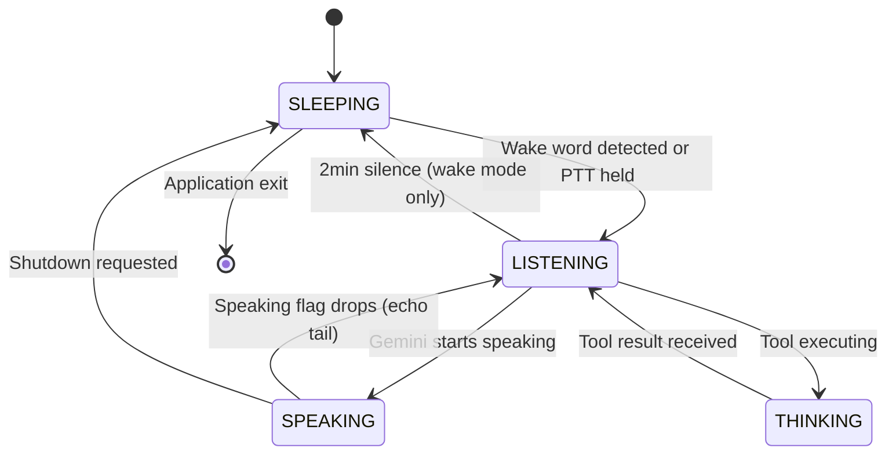

# JARVIS — Complete Data Flow

## High-Level Architecture Diagram



## Detailed Data Flows

### Voice Interaction Flow

```
User speaks
    ↓
sounddevice.InputStream callback (1024 frames, 16kHz, int16, mono)
    ↓
┌─ Wake word gate: sleeping? → feed(openwakeword) → return
├─ Speaking lock: JARVIS speaking? → return (barge-in blocked)
├─ Echo guard: tail active? → EchoGuard.is_user_speech() → drop echo
├─ Push-to-talk: enabled and not held? → return
└─ All gates passed → out_queue.put_nowait({data, mime_type})
    ↓
_send_realtime() coroutine: session.send_realtime_input(audio=Blob(data))
    ↓
WebSocket → Gemini Live API
    ↓
Gemini processes: STT → LLM → Tool calls → TTS
    ↓
session.receive() yields:
    - output_transcription.text → transcript
    - audio bytes → TTS audio
    - tool_calls → function calls
    ↓
Transcript → _clean_transcript() → _is_repeat_chunk() → VisemeStream.feed_text()
    ↓
Audio → _play_audio() → sounddevice.OutputStream → Speakers
    ↓
VisemeStream.frames() → Avatar mouth animation
    ↓
set_speaking(False) → EchoGuard tail guard starts
    ↓
Wait for next user input
```

### Tool Execution Flow

```
Gemini generates function_call
    ↓
main.py:_execute_tool(fc)
    ↓
name = fc.name, args = dict(fc.args or {})
    ↓
if name in inline_tools → direct handler
elif name in action_registry → action_registry.run()
elif name in plugin_registry → plugin_registry.run()
else → "Unknown tool"
    ↓
Handler executes in executor thread (if blocking)
    ↓
Result → FunctionResponse({"result": result})
    ↓
Gemini receives result → generates final response
```

### Memory Flow

```
User reveals fact
    ↓
save_memory tool called
    ↓
update_memory({category: {key: {"value": value}}})
    ↓
load_memory() → JSON from long_term.json
    ↓
_recursive_update() → merge new values
    ↓
save_memory() → _trim_to_limit() → write JSON
    ↓
format_memory_for_prompt() → identity + recent + index
    ↓
Built into system prompt at next session
```

### Dashboard Communication Flow

```
Phone opens dashboard URL
    ↓
QR code scan → session key
    ↓
AES-256-CBC encryption established
    ↓
FastAPI endpoints receive commands
    ↓
Commands → JarvisLive methods (via asyncio.call_soon_threadsafe)
    ↓
Responses → encrypted → phone
```

### Proactive System Flow

```
User silent for a while
    ↓
[PROACTIVE_CHECK] tag in system prompt
    ↓
Gemini reads time + memory context
    ↓
Generates 1-3 short sentences
    ↓
No tool calls
    ↓
TTS → spoken response
```

### Wake Word Flow

```
Mic callback fires (asleep mode)
    ↓
det.feed(indata) → queue push (non-blocking)
    ↓
WakeWordDetector._loop() (background thread)
    ↓
openwakeword Model.predict(np.int16)
    ↓
Score >= 0.5 → detection
    ↓
_drain() → clear queue backlog
    ↓
on_detect() → self.wake(reason="wake word")
    ↓
_awake = True, _last_user_speech = now
    ↓
Mic now streams to Gemini
    ↓
After 120s silence → sleep()
```

### Session Reconnection Flow

```
Network drops
    ↓
Gemini sends resumption handle update
    ↓
self._resume_handle updated in RAM
    ↓
Reconnection requested (device change, voice change, etc.)
    ↓
request_reconnect(keep_context=True/False)
    ↓
loop.call_soon_threadsafe(event.set())
    ↓
ReconnectSignal raised → TaskGroup unwinds
    ↓
_new session with:
    - session_resumption(handle=self._resume_handle)
    - Same system prompt, same tools, same memory
    ↓
Conversation continues
```

## State Machine Diagram



## Summary

```
All audio flows through: Microphone → gates → Gemini Live → Speakers
All tool calls flow through: Gemini → _execute_tool → Action/Plugin handler
All memory flows through: long_term.json ↔ memory_manager.py ↔ system prompt
All UI flows through: PyQt6 signals/slots → JarvisLive methods
All dashboard flows through: FastAPI → asyncio.call_soon_threadsafe → JarvisLive
```