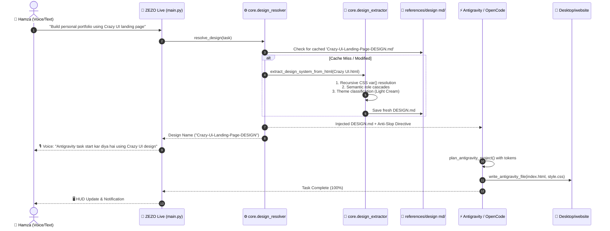

# 🎨 Hamza Taste 3.0 — Design System Architecture

> **Lead Architect & Creator:** Hamza Bukhari  
> **System Component:** Autonomous UI Design System & Anti-Slop Directive  
> **Target Coding Agents:** Google Antigravity Agent, OpenCode Agent, Kilo Code Agent, Code Helper  
> **Target Frameworks:** HTML5, Modern Vanilla CSS, Glassmorphism, TailwindCSS, React  

---

## 📖 Executive Summary

**Hamza Taste 3.0** is ZEZO's deterministic design system and anti-slop engine. It replaces arbitrary AI CSS hallucinations with a strict **Filter vs. Direction** architectural model:

1. **Direction Layer (Pure Raw HTML Blueprint Injection):** 100% supplied by 13 production-grade HTML reference templates in `skills/hamza_taste/references/html/` (colors, typography, hero layouts, card markup, and CSS `@keyframes` animations).
2. **Filter Layer:** 100% enforced by `skills/hamza_taste/SKILL.md` (blocks AI purple blobs, unstyled inputs, fake buzzwords, and loose layouts).
3. **Resolution Engine:** `core/design_resolver.py` provides 0ms deterministic reference resolution, redesign intent override, domain semantic routing across 13 HTML templates, and diverse autonomous agent selection.
4. **On-Demand Inspection:** `actions/design_extractor.py` provides on-demand design extraction from custom user-uploaded files, screenshots, and live URLs to generate standalone `DESIGN.md` specifications.

---

## 🌐 Master Architectural Flow Diagram

```text
 ┌────────────────────────────────────────────────────────────────────────────────────────┐
 │                     👤 USER VOICE / TEXT REQUEST                                       │
 │  Examples:                                                                             │
 │   • "Build a modern Real Estate landing page" (Semantic domain match ➔ Dub template)  │
 │   • "Change the design using Saas-DESIGN reference" (Redesign intent override)         │
 │   • "Add 5 new sections to this existing website" (Active project preservation)        │
 │   • "Ek modern website bana do" (Diverse autonomous choice)                            │
 └─────────────────────────────────────────┬──────────────────────────────────────────────┘
                                           │
                                           ▼
 ┌────────────────────────────────────────────────────────────────────────────────────────┐
 │ 🧠 ZEZO RUNTIME INTERCEPTOR (main.py / Action Handlers)                                │
 │  Detects task type: Is it Web, HTML, CSS, Dashboard, or Landing Page? (is_ui_task)     │
 └─────────────────────────────────────────┬──────────────────────────────────────────────┘
                                           │
                                           ▼
 ┌────────────────────────────────────────────────────────────────────────────────────────┐
 │ ⚙️ CORE ENGINE: core/design_resolver.py                                                 │
 │  Deterministically resolves design templates through 5-tier precedence:                │
 │                                                                                        │
 │  [Priority 1: Explicit Reference Match] ──► Task mentions 'saas', 'dub', 'nexus', etc. │
 │  [Priority 2: Redesign Override / Cache] ──► Redesign intent overrides existing repo    │
 │  [Priority 3: Semantic Domain Routing] ──► 'real estate' ➔ dub | 'agency' ➔ crazy ui   │
 │                                             'ai' ➔ autonomus | 'tech' ➔ nexus          │
 │  [Priority 4: Active Project Style] ──────► Non-redesign additive tasks preserve style │
 │  [Priority 5: Autonomous Choice] ─────────► Generic prompt ➔ Diverse task-hash choice  │
 └─────────────────────────────────────────┬──────────────────────────────────────────────┘
                                           │
                      ┌────────────────────┴────────────────────┐
                      ▼                                         ▼
       [Direct Raw HTML Reference]                 [On-Demand Extractor / Custom]
       Reads skills/.../references/html/*.html     Calls core/design_extractor.py:
       • Sanitizes base64 bloat & inline SVGs      • Custom user files & URLs
       • Injects raw HTML structure + CSS classes  • Token extraction for HUD & speech
       • Preserves hero & @keyframes animations    • Generates standalone DESIGN.md
                      └────────────────────┬────────────────────┘
                                           │
                                           ▼
 ┌────────────────────────────────────────────────────────────────────────────────────────┐
 │ 🎨 MASTER RAW HTML REFERENCE TEMPLATE + 🛑 ANTI-SLOP FILTER                            │
 │                                                                                        │
 │  💎 DIRECTION (From Raw HTML Reference):     🛡️ FILTER (From skills/hamza_taste/SKILL): │
 │   • Full structural HTML markup & hero layout • ❌ No AI purple/indigo gradients        │
 │   • Complete CSS stylesheet & @keyframes      • ❌ No unstyled browser inputs           │
 │   • Glassmorphism card & flex/grid patterns   • ❌ No fake buzzwords ("Next-Gen AI")    │
 │   • Exact font hierarchy & color palettes     • 🔲 max-w-7xl (1280px) responsive layout │
 └─────────────────────────────────────────┬──────────────────────────────────────────────┘
                                           │
                 ┌─────────────────────────┼─────────────────────────┐
                 ▼                         ▼                         ▼
 ┌───────────────────────────────┐ ┌───────────────────────┐ ┌───────────────────────────┐
 │ ⚡ ANTIGRAVITY AGENT          │ │ 🛠️ OPENCODE AGENT     │ │ ⚡ KILO CODE AGENT        │
 │ (actions/antigravity_agent.py)│ │ (actions/opencode_...│ │ (actions/kilo_agent.py)   │
 │                               │ │                       │ │                           │
 │ 1. Raw HTML Blueprint Ingest: │ │ Injects resolved      │ │ Applies exact design      │
 │    100% visual layout layout  │ │ reference into CLI    │ │ tokens during fast multi- │
 │ 2. Adaptive Directives:       │ │ prompt for full multi-│ │ file edits and CSS        │
 │    Redesign vs Preservation   │ │ file autonomous       │ │ refactoring.              │
 │ 3. HTML-First File Ordering:  │ │ feature build.        │ │                           │
 │    index.html then style.css  │ │                       │ │                           │
 └───────────────┬───────────────┘ └───────────┬───────────┘ └─────────────┬─────────────┘

                 │                             │                           │
                 └─────────────────────────┬───┴───────────────────────────┘
                                           │
                                           ▼
 ┌────────────────────────────────────────────────────────────────────────────────────────┐
 │ 🚀 DELIVERED OUTPUT & USER FEEDBACK                                                    │
 │                                                                                        │
 │  📁 File System: C:\Users\Hamza\Desktop\website\ (index.html, css/style.css, js/app.js) │
 │  🖥️ HUD Display: "ANTIGRAVITY AGENT | Design: Crazy-Ui-Landing-Page-DESIGN"            │
 │  🎙️ Voice Output: "Antigravity main task start kar diya hai in 'website'               │
 │                    using 'Crazy-Ui-Landing-Page-DESIGN' design."                       │
 └────────────────────────────────────────────────────────────────────────────────────────┘
```

---

## 🔄 Mermaid Sequence Flow



---

## 🏛️ Directory Structure & Component Map

```
skills/hamza_taste/
├── SKILL.md                          # 🛡️ 3-Tier Anti-Slop Quality Gate (Filter)
└── references/                       # 💎 Master Design Library (Direction)
    ├── html/                         # 🌐 13 Curated Production HTML Reference Templates
    │   ├── Crazy UI landing page.html        # Light Cream Editorial Serif
    │   ├── saas.html                         # Modern Dark SaaS (Plus Jakarta Sans)
    │   ├── dub landing page.html             # High-Converting Marketing Landing Page
    │   ├── autonomus.html                    # Autonomous AI Agent Interface (Dark Void)
    │   ├── Standalone Ecosystem.html         # Admin Platform & Analytics Dashboard
    │   ├── aura frame.html                   # Glowing Spatial Frame & Card Components
    │   ├── froma os .html                    # Operating System & Windowed UI
    │   ├── image gen.html                    # Creative AI Media Generator
    │   ├── nami landing page.html            # Minimal Modern Showcase
    │   ├── nexus.html                        # Technical Hardware & Modern Grid
    │   ├── NEXUS_PRO_X_standalone.html       # Futuristic Cyber Matrix
    │   └── skeumorphic spatial component.html# Spatial 3D Glass Elevation
    └── design md/                    # ⚡ 0ms Pre-Extracted DESIGN.md Specifications
        ├── Crazy-Ui-Landing-Page-DESIGN.md
        ├── Saas-DESIGN.md
        ├── Dub-Landing-Page-DESIGN.md
        └── ...

core/
├── design_resolver.py                # 🧠 Semantic Router, Cache Manager, Prompt Injector
└── design_extractor.py               # 🔬 Deterministic Recursive CSS & Semantic Parser
```

---

## 🔬 Deterministic Semantic Role Cascades (`core/design_extractor.py`)

To guarantee 100% faithful design token extraction without color pollution, `design_extractor.py` implements a strict 6-role semantic cascade:

```mermaid
graph TD
    subgraph BACKGROUND["1. Background Detection"]
        B1[":root semantic vars: --bg, --canvas, --cream, --background"] --> B2["<body> / <html> inline styles (background-color)"]
        B2 --> B3["<body> / <html> Tailwind arbitrary & named classes (bg-[#ececee], bg-zinc-950)"]
        B3 --> B4["Top-level container selectors (filtered: no inner glows, blobs, pills, cards)"]
    end

    subgraph THEME["2. Theme Classification"]
        T1["Luminance Formula: (0.299*R + 0.587*G + 0.114*B) / 255"]
        T1 -->|Lum > 0.5| TL["Light Mode (Cream / Minimal White)"]
        T1 -->|Lum <= 0.5| TD["Dark Mode (Obsidian / Pitch Black)"]
    end

    subgraph TEXT["3. Primary Text Detection"]
        X1[":root vars: --text, --ink, --foreground"] --> X2["<body> / <html> inline styles & Tailwind text classes (text-[#...], text-zinc-800)"]
        X2 --> X3["body / h1 CSS color declarations"]
        X3 --> X4["Computed Theme Default (#0a0a0a light / #ffffff dark)"]
    end

    subgraph ACCENT["4. Primary Accent Detection"]
        A1[":root vars: --accent, --primary, --brand, --cta"] --> A2["Primary CTA button selectors (.btn-primary, .btn)"]
        A2 --> A3["Prominent saturated non-neutral (>2 occurrences, non-badge)"]
        A3 --> A4["Editorial Default (Text Primary / High-Contrast Ink)"]
    end

    subgraph TYPOGRAPHY["5. Typography Hierarchy"]
        F1[":root vars: --ff-serif, --font-heading, --font-display"] --> F2["h1, h2, .serif font-family declarations"]
        F2 --> F3["Google Fonts link tags & body font-family"]
    end
```



---

## 🛑 3-Tier Anti-Slop Directive (`skills/hamza_taste/SKILL.md`)

| Tier | Name | Enforced Constraints |
| :--- | :--- | :--- |
| **Tier 1** | **Absolute Hard Gates** | ❌ **No AI Purple Blobs:** No `bg-gradient-to-r from-purple-600 to-indigo-600`<br>❌ **No Unstyled Inputs:** Form controls must have styled dark/light custom surfaces<br>❌ **No Fake Marketing Copy:** Zero *"Next-Gen AI 2.0 Synergy Engine"*<br>❌ **No Raw 90s RGB:** Pure `#ff0000`/`#00ff00` are banned |
| **Tier 2** | **Rhythm & Geometry** | 📐 **4px/8px Modular Rhythm:** Strict spacing scale (`p-4`, `p-6`, `gap-4`)<br>🔲 **Max Container Width:** Centered container constrained to `1200px` / `1280px`<br>🔘 **Radius Hierarchy:** Button (`8px`), Card (`14px`–`16px`), Pill (`9999px`) |
| **Tier 3** | **Delivery & Interaction** | ⚡ **Micro-Interactions:** Active scale (`active:scale-95`), transition `150ms`<br>🏷️ **High-Contrast Typography:** Pure headers (`#fafafa` / `#0a0a0a`), zinc body |

---

## 🤖 Coding Agent Integration Guide

### 1. Google Antigravity Agent (`actions/antigravity_agent.py`)
```python
from core.design_resolver import is_ui_task, resolve_design, format_design_prompt

# Inside _run_worker:
if is_ui_task(task):
    resolved = resolve_design(task, session_memory=session_memory, repo_path=repo)
    design_prompt = format_design_prompt(resolved)
    
plan = plan_antigravity_project(task, repo, design_context=design_prompt)
code = write_antigravity_file(f_info, task, files, repo, written, design_context=design_prompt)
```
- **HTML-First Pipeline:** Forces `index.html` to be generated before `style.css` so the styling model has 100% visibility into every HTML element, class, and layout.
- **Dedicated CSS Rule Coverage:** Enforces full CSS definitions for all classes, container bounds (`max-width: 1200px`), CSS Grid responsive tiers, and glass elevations.
- **Active Code Preservation:** Seamlessly preserves pre-existing on-disk hero sections and styling without rewriting or deleting them.

### 1. Antigravity Agent (`actions/antigravity_agent.py`)
```python
from core.design_resolver import is_ui_task, resolve_design, format_design_prompt
from core.repo_context import remember_repo

if is_ui_task(task):
    resolved = resolve_design(task, repo_path=repo)
    if resolved and resolved.raw_html:
        # 1. Place master reference template in workspace for local CLI inspection
        (repo / "DESIGN_BLUEPRINT.html").write_text(resolved.raw_html, encoding="utf-8")
        
    # 2. Execute native Antigravity CLI ('agy') with --add-dir and Job Object limits
    # 3. Upon successful code synthesis (index.html, style.css), clean up DESIGN_BLUEPRINT.html
    # 4. Synchronize active project persistence via remember_repo(str(repo))
```

### 2. OpenCode Agent (`actions/opencode_agent.py`)
```python
from core.design_resolver import is_ui_task, resolve_design, format_design_prompt

if is_ui_task(task):
    resolved = resolve_design(task, repo_path=repo)
    if resolved and resolved.is_active():
        task = f"{task}\n\n{format_design_prompt(resolved)}"
```

### 3. Kilo Code Agent (`actions/kilo_agent.py`)
```python
from core.design_resolver import is_ui_task, resolve_design, format_design_prompt

if is_ui_task(task):
    resolved = resolve_design(task, repo_path=repo)
    # Apply resolved color tokens and component recipes during multi-file CSS refactoring
```

---

## 🧪 Verification & Health Check

Run the comprehensive 7-test suite anytime to verify end-to-end design system integrity:

```bash
python tests/test_design_system_suite.py
```

Expected output:
```text
[RUNNING] Hamza Taste 3.0 & Antigravity 7-Test Suite...
============================================================
  [PASS] Test 1: Explicit Match -> Saas-DESIGN (reference_cached)
  [PASS] Test 2: Fuzzy Match -> Dub: dub landing page-DESIGN, Aura: Aura-Frame-DESIGN
  [PASS] Test 3: Session Memory -> Path: Aura-Frame-DESIGN, Name: Saas-DESIGN
  [PASS] Test 4: Semantic Routes -> Dash: Standalone-Ecosystem-DESIGN, AI: Autonomus-DESIGN, Media: Image-Gen-DESIGN, Tech: Nexus-DESIGN
  [PASS] Test 5: Autonomous Agent Choice -> Saas-DESIGN (Autonomous Choice) (reference_autonomous)
  [PASS] Test 6: Prompt & Voice -> Output: Antigravity main task start kar diya hai in 'website' using 'Saas-DESIGN' design...
  [PASS] Test 7: Existing Repo Preservation -> Project (tmp_path) (project_existing)

[SUCCESS] All 7 Design System & Antigravity Verification Tests Passed!
```
