# JARVIS — Diagrams

## 1. High-Level Architecture

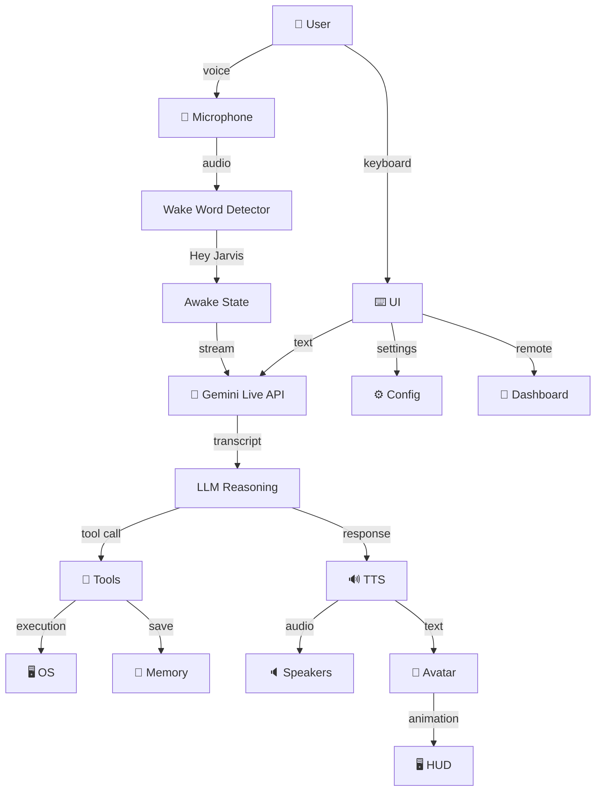

## 2. Startup Sequence

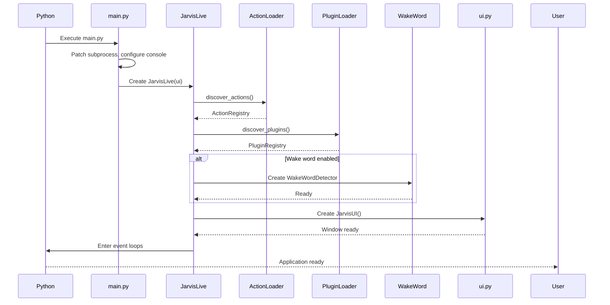

## 3. Voice Pipeline

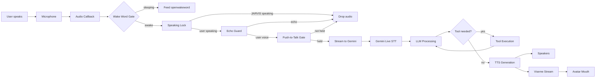

## 4. STT Pipeline

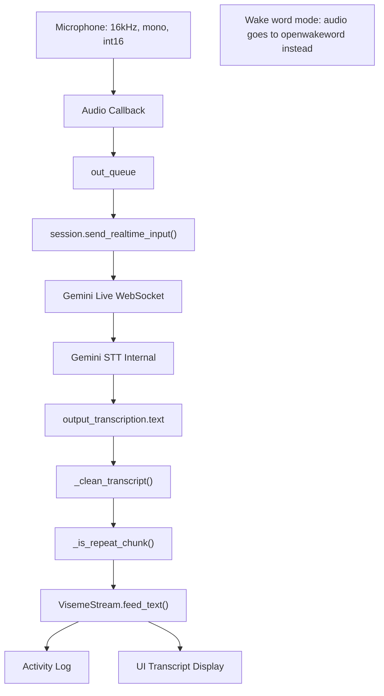

## 5. LLM Pipeline

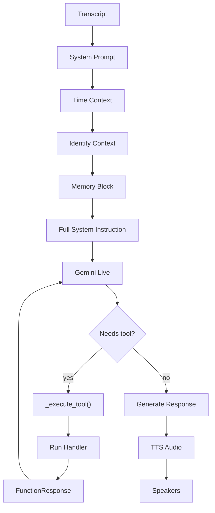

## 6. TTS Pipeline

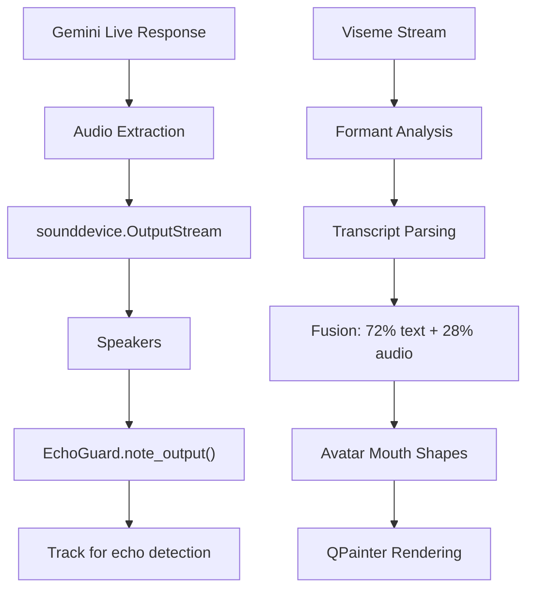

## 7. Tool Calling

```mermaid
sequenceDiagram
    participant Gemini
    participant Main as main.py
    participant Registry as ActionRegistry
    participant Plugin as PluginRegistry
    participant Handler
    
    Gemini->>Main: function_call(name, args)
    Main->>Main: _execute_tool(fc)
    Main->>Main: Identify handler type
    alt Inline tool
        Main->>Main: Direct handler
    elif Action
        Main->>Registry: run(name, args, ctx)
        Registry->>Handler: Call function
    elif Plugin
        Main->>Plugin: run(name, args, player, memory)
        Plugin->>Handler: Call run()
    end
    Handler-->>Main: Result string
    Main-->>Gemini: FunctionResponse
    Gemini->>Gemini: Process result → final response
```

## 8. Plugin System

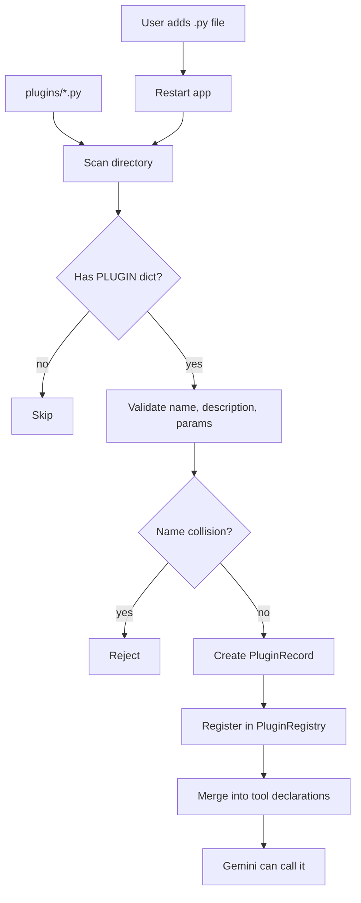

## 9. Memory System

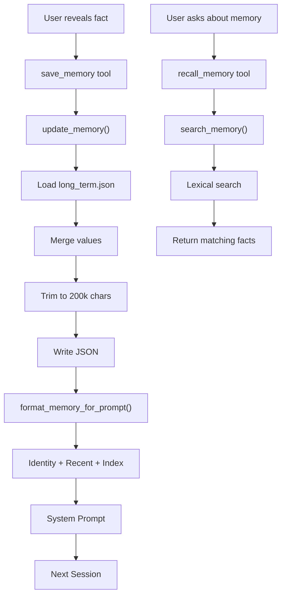

## 10. Vision System

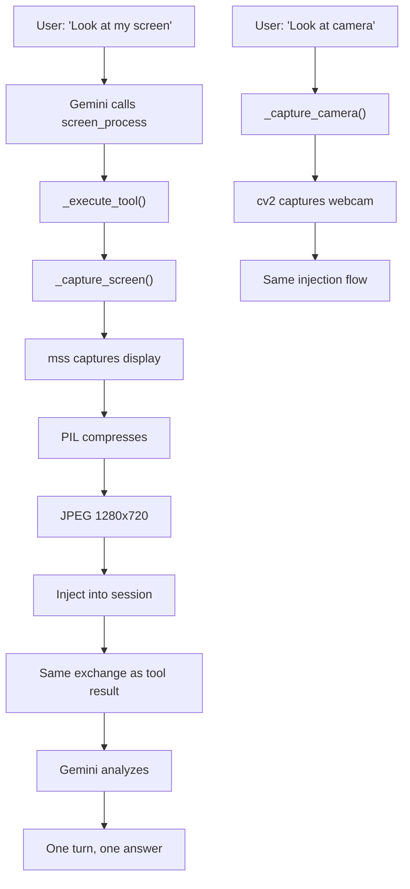

## 11. Dashboard

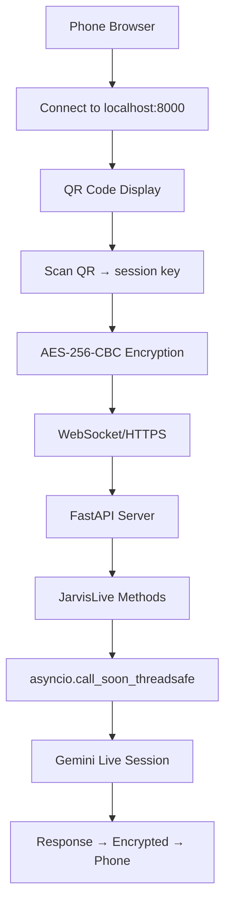

## 12. Session Management

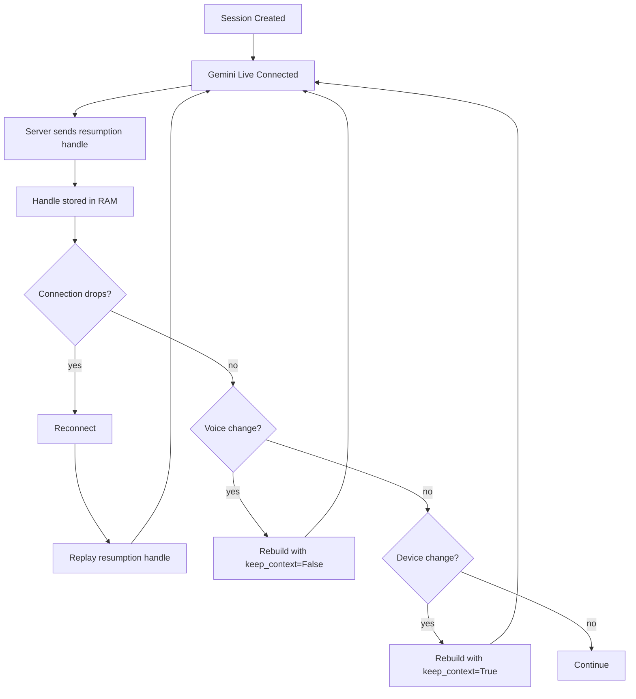

## 13. Confirmation System

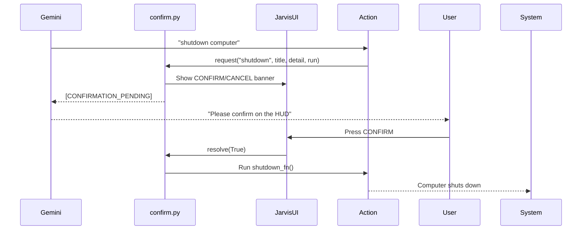

## 14. Undo System

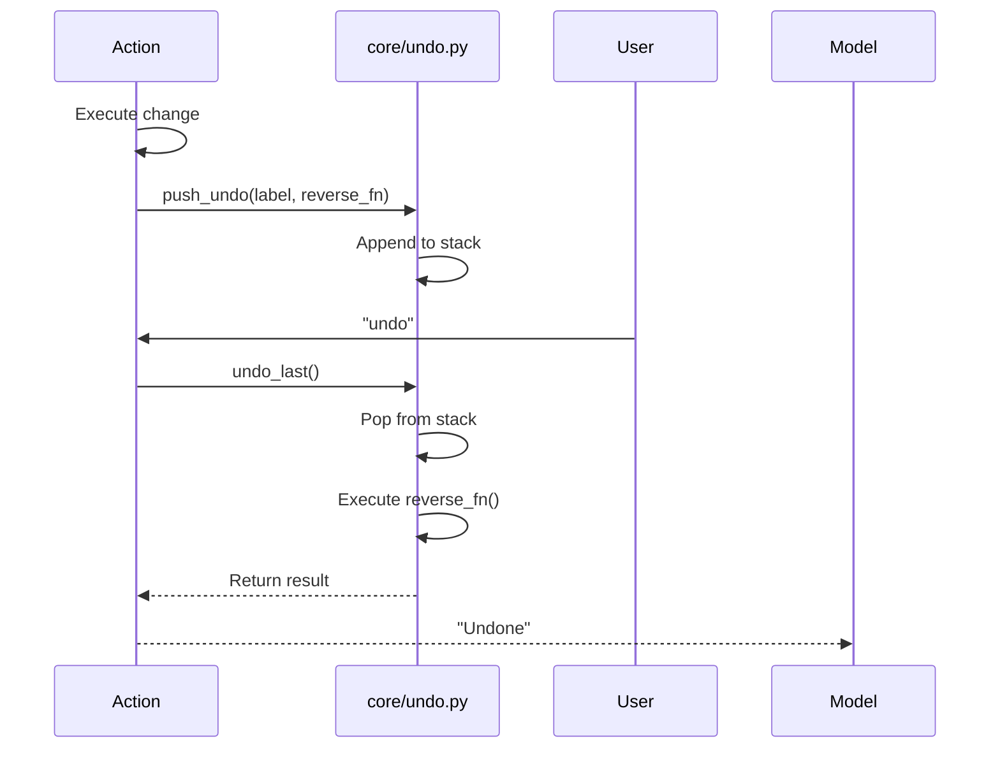

## 15. Data Flow

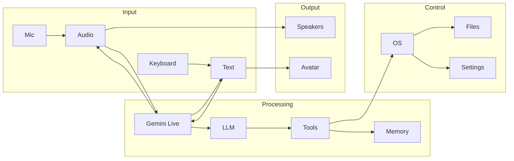

## 16. Platform Architecture

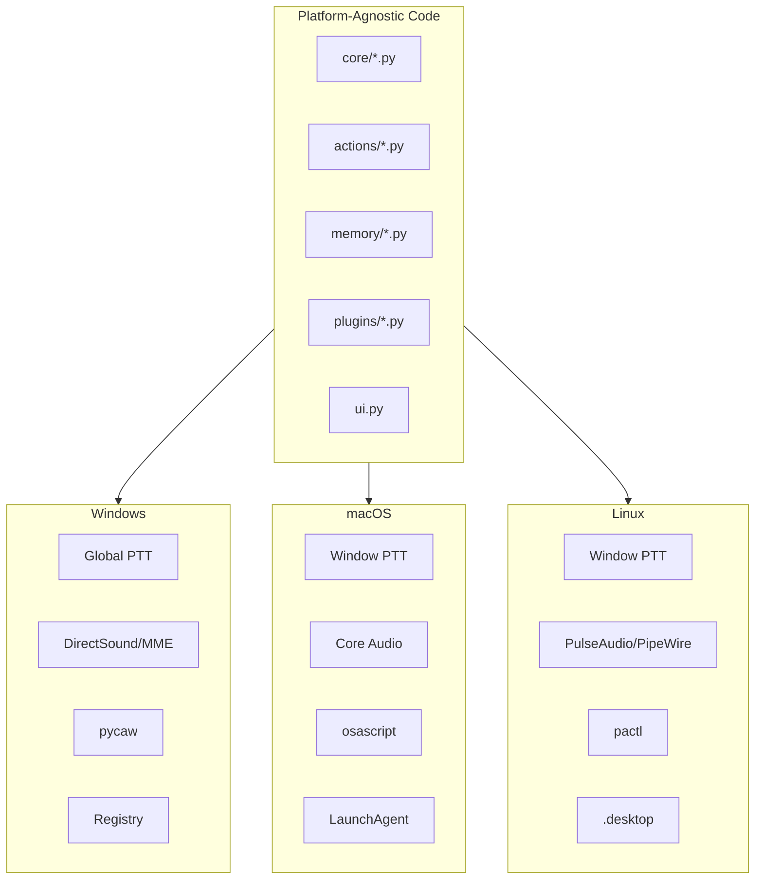

## 17. Audio Device Selection

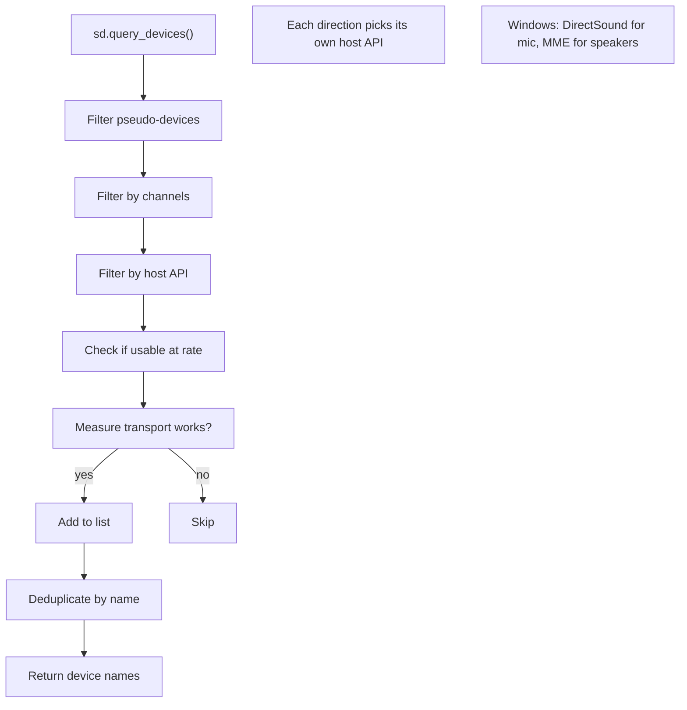

## Summary

```
17 Mermaid diagrams covering all major subsystems
All diagrams based on actual implementation
```