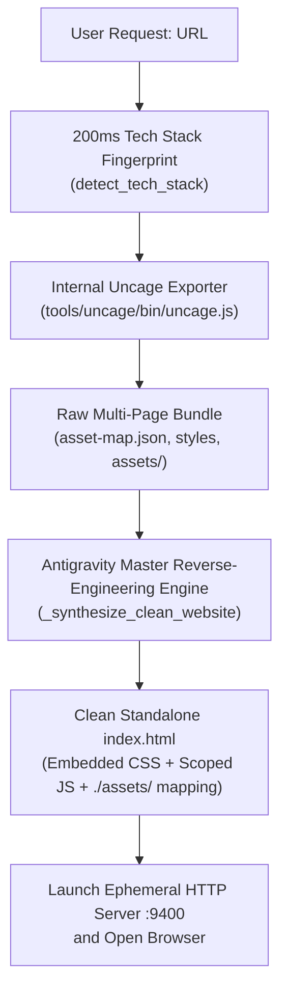

# 🌐 Autonomous Website Cloner & Universal Reverse-Engineering Pipeline (v4)

> **Action:** `actions/website_cloner.py` (`clone_website`)  
> **Self-Contained Engine:** `tools/uncage/bin/uncage.js` (Zero external path dependency)  
> **Chaining Engine:** `core/task_manager.py` (`submit_after`)  
> **Undo Integration:** `core/undo.py` (`register_clone_snapshot`)  
> **Workspace Routing:** `core/repo_context.py` (`get_unique_clone_dir`)  

---

## 📖 Overview

The **Autonomous Website Cloner & Reverse-Engineering Pipeline** is a 100% self-contained, zero-bloat system that:
1. Performs a **<200ms Tech Stack Fingerprint** (`detect_tech_stack`).
2. Dispatches the **Internal Uncage Engine** (`tools/uncage/bin/uncage.js`) to extract the raw multi-page DOM bundle, full stylesheets, fonts, and `asset-map.json`.
3. Synthesizes an immaculate, standalone, single-file `index.html` via the **Antigravity Master Reverse-Engineering Engine** (`_synthesize_clean_website`).
4. Reconstructs full interactive physics & Vanilla JS (draggables, 12-bar audio waveforms, pricing toggles, smooth accordions).
5. Launches an ephemeral HTTP preview server on port `9400` and opens the default browser.
6. Delivers a **Zero-Bloat Output Directory** containing only `index.html` and `assets/`.



---

## 🛠️ TOOL Declaration & Parameters

```python
TOOL = {
    "name": "clone_website",
    "description": (
        "Clone, reverse-engineer, and recreate a website's frontend to a local folder on Desktop as a clean, 100% human-editable single-file HTML document (or React/Next.js project). "
        "Extracts rendered DOM, design tokens (colors, fonts), and media assets, then synthesizes clean semantic HTML5, Flexbox/Grid CSS, and Vanilla JS interactions. "
        "Starts a local preview server and opens the result automatically in your default browser. "
        "Use mode='full_site' only if user explicitly asks for full mirror. "
        "Use output_format='react' or 'nextjs' if user asks for React/Next.js components."
    ),
    "behavior": "NON_BLOCKING",
    "scheduling": "WHEN_IDLE",
    "parameters": {
        "type": "OBJECT",
        "properties": {
            "url": {
                "type": "STRING",
                "description": "Full web URL to clone/reverse-engineer (e.g. 'https://www.heyclicky.com/' or 'https://apple.com').",
            },
            "mode": {
                "type": "STRING",
                "enum": ["single_page", "full_site"],
                "description": "Default: 'single_page' (fast, reverse-engineers target page). Use 'full_site' only if user asks for full multi-page mirror.",
            },
            "output_format": {
                "type": "STRING",
                "enum": ["static", "clean_html", "react", "nextjs", "redesign"],
                "description": "Default: 'static' (clean, editable standalone HTML/CSS/JS). Use 'react' or 'nextjs' if user asks for React/Next.js.",
            },
            "target_dir": {
                "type": "STRING",
                "description": "Optional custom target directory. If omitted, defaults to Desktop/<domain>_clone.",
            },
        },
        "required": ["url"],
    },
    "handler": clone_website_action,
}
```

---

## ⚙️ Core Architecture & Pipeline Components

### 1. 200ms Tech-Stack Fingerprinting (`detect_tech_stack`)
- Lightweight HTTP `<head>` & response header inspection identifying `nextjs`, `framer`, `webflow`, `wordpress`, `shopify`, `wix`, `squarespace`, or `standard_html`.

### 2. Self-Contained Uncage Exporter (`run_uncage_exporter`)
- Located strictly at `tools/uncage/bin/uncage.js` inside the ZEZO repository.
- **Zero External User Directory Dependency:** No longer relies on `C:\Users\Hamza\Documents\uncage`.
- **Auto-Bootstrap on Fresh Machines:** If `tools/uncage` is absent on a new PC, it automatically runs `git clone https://github.com/Nightteye/uncage.git tools/uncage` and `npm install`.
- **Playwright Browser Preflight (`_ensure_uncage_browsers`):** Before the crawl it asks Uncage's own Node `playwright` where its Chromium lives, and if it is missing (the classic `Executable doesn't exist … chromium_headless_shell-<rev>` failure after an npm upgrade) downloads it once via `node node_modules/playwright/cli.js install chromium`.
- **Errors are surfaced, not swallowed:** `run_uncage_exporter` now returns `(ok, detail)`. The last real error line from Uncage (e.g. `browserType.launch: Executable doesn't exist …`) is shown in the task log and the raised `RuntimeError`, instead of the old generic "Uncage extraction failed".

### 3. Antigravity Master Reverse-Engineering Engine (`_synthesize_clean_website`)
- Ingests `asset-map.json`, localized stylesheets, and raw multi-page DOM.
- Executes single-pass AI synthesis via `gemini.text(tier=gemini.SMART, timeout_ms=75_000)` in ~15-20s.
- Reconstructs complete Vanilla JS physics (draggable stickers, 12-bar audio waveforms, pricing switcher, and smooth FAQ accordions).
- Output is a unified, production-grade standalone single-file `index.html`.

### 4. Zero-Bloat Clean Deliverables
- **Strict Clean Workspace:** Final folder on Desktop contains strictly `index.html` and `assets/`.
- Zero intermediate screenshot dumps, zero diffing files, zero `DESIGN.md` or `spec.json`.

### 5. Ephemeral Preview Server (`start_local_preview_server`)
- Launches an ephemeral HTTP daemon on port `9400` with CORS support and opens the user's default browser automatically.


