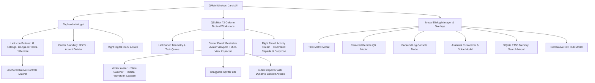

# 📐 ZEZO Desktop PyQt6 UI Modernization Plan (Autonomous Traffic Vectors System)

This document outlines the end-to-end technical implementation plan to bring the production PyQt6 desktop application (`ui.py`) into 100% visual and functional parity with the approved prototype (`prototypes/zezo_desktop_ui_prototype.html`).

---

## 🎯 High-Level Objective

Upgrade the desktop operating system user interface to the **Autonomous Traffic Vectors Design System**:
1. **Engineered Obsidian Aesthetic:** Pitch-black deep surfaces (`#050505`, `#000000`), subtle hairlines (`rgba(255,255,255,0.08)`), crisp 90-degree technical corner bracket framing (`draw_corner_brackets`), and zero rounded clipping on framed windows/modals.
2. **Dynamic UI Accent System:** Instant runtime switching across **Solar Orange** (`#f24e1e`), **Neon Cyan** (`#06b6d4`), **Cyber Emerald** (`#22c55e`), and **Hyper Purple** (`#a855f7`) with all borders, badges, waveforms, and focus glows fully synchronized.
3. **Refined Holographic Core & Organic Audio Waveform:** Enlarged fluid avatar core (`290px–330px`) on pure black space with zero glow halo, accompanied by a low-profile tactical status capsule with a calm, silky-smooth dual-harmonic breathing waveform.
4. **Context-Aware Multi-View Inspector & Drag Splitter:** 6 operational inspection tabs (`Coding Agent`, `Web Research`, `File Extraction`, `Social Intel`, `System Telemetry`, `Live Speech`) with dynamic, tab-specific action buttons and resize controls.
5. **Clean Activity Stream & Command Console:** Distinct cards for User prompts vs ZEZO AI responses with individual/full copy capabilities, excluding repetitive state transition spam.

---

## 🏗️ Architecture & Component Breakdown



---

## 📋 Step-by-Step Implementation Tasks

### Phase 1: Design Tokens & Base Theme Engine (`ui.py`)
- [ ] **Define Exact Design Tokens in `C` class:**
  - Backgrounds: `BG_DEEP = "#050505"`, `BG_SURFACE = "#0a0a0a"`, `BG_ELEVATED = "#111111"`, `AVATAR_BG = "#000000"`.
  - Borders: `BORDER_SUBTLE = "rgba(255,255,255,0.05)"`, `BORDER_DEFAULT = "rgba(255,255,255,0.10)"`, `BORDER_STRONG = "rgba(255,255,255,0.20)"`.
  - Accents: Dynamic palette (`#f24e1e`, `#06b6d4`, `#22c55e`, `#a855f7`).
  - Radii: `RADIUS_NONE = 0`, `RADIUS_SM = 2`, `RADIUS_MD = 4`.
- [ ] **Standardize `TechnicalFrame` / `draw_corner_brackets`:**
  - Render crisp 1px gradient outer framing with 90-degree corner crosshair brackets (`size=6.0`, `width=1.0`).
  - Enforce sharp right-angle corners (`border-radius: 0px`) across all outer frames and modals to eliminate rounded gaps.

---

### Phase 2: Top Navigation Bar & Anchored Controls Drawer
- [ ] **Top Navigation Bar (`HeaderWidget`):**
  - Height: `48px` with dark obsidian glassmorphism (`rgba(10,10,10,0.95)`, blur, hairline border).
  - Left button group: 4 square icon buttons (`Settings`, `Terminal Logs`, `Task Matrix`, `Remote QR`).
  - Center: Bold uppercase `ZEZO` with dynamic accent underline divider.
  - Right: Live JetBrains Mono digital clock (`HH:MM:SS`) and uppercase date (`MON 21 SEP 2026`).
- [ ] **Anchored Controls Drawer (`NativeControlsDrawer`):**
  - Position directly beneath the Settings (`⚙`) button (`top: calc(100% + 8px); left: 0`).
  - Include 16 native desktop control rows (Remote QR, Fullscreen [F11], Desktop Shortcut, Auto-start toggle, Customize Assistant, Morning Brief, Wake Word, Push-to-Talk, HUD Style cycler, Audio Devices, Memory Engine, Plugins, Plugin Settings, Coding Skills, Skill Hub).
  - Include functional 4-dot UI Accent Color Picker (Orange, Cyan, Emerald, Purple) that updates `C` palette tokens and triggers runtime repaints.

---

### Phase 3: Column 1 — Hardware Telemetry & Autonomous Task Queue
- [ ] **Section 01: Hardware Telemetry (`TelemetryWidget`):**
  - CPU Core Load & RAM Usage cards with dynamic accent progress bars.
  - Live Latency / Echo suppression tail indicator (`18ms`, Tail `463ms`).
  - Net Bandwidth & WebSockets status (`205kb/s`, WebSockets: `OK`).
- [ ] **Section 02: Autonomous Task Queue (`TaskQueueWidget`):**
  - Active task cards (e.g., `⚡ ZEZO CODER #ag44b1`) with ETA, model name, and live percentage progress bar.
  - Completed task history cards (File Processor, Social Intel, Web Research) with `DONE` badges.
  - Click-to-inspect binding: Clicking a task card automatically switches the Center Inspector tab.

---

### Phase 4: Column 2 — Center Viewport, Avatar Core & Multi-View Inspector
- [ ] **Center Avatar Viewport (`AvatarViewportWidget`):**
  - Pitch-black backdrop (`#000000`) with zero blur halo.
  - Enlarged fluid vortex core (`QMovie` or rasterizer running at `290px–330px`).
  - Horizontal State Switcher buttons (`STANDBY`, `LISTENING`, `THINKING`, `EXECUTING`, `SPEAKING`, `MUTED`, `HALTED`).
  - **Tactical Obsidian Status Capsule (`StateCapsuleWidget`):**
    - Dynamic Beacon Dot (color matched to active state).
    - Short uppercase state label in JetBrains Mono.
    - Subtle 1px hairline divider.
    - **Organic Live Waveform Canvas (`AudioWaveformCanvas`):**
      - Slow, calm, fluid speed (`waveSpeed = 0.0010`).
      - Dual-harmonic sine wave rendering: Layer 1 ambient glow curve + Layer 2 crisp primary voice line.
      - Smooth mathematical envelope (`Math.sin(x/w * PI)`) for organic tapering at edges.
      - Smooth spectrum bars for `SPEAKING`, stepped binary pulse for `EXECUTING`, synapse ripples for `THINKING`.
- [ ] **Interactive Drag Splitter (`TacticalSplitter`):**
  - Horizontal splitter bar with hover accent glow and double-click to reset.
- [ ] **Multi-View Inspector (`InspectorPanelWidget`):**
  - 6 Multi-View Tabs (`CODING AGENT`, `WEB RESEARCH`, `FILE EXTRACTION`, `SOCIAL INTEL`, `SYSTEM TELEMETRY`, `LIVE TRANSCRIPT`).
  - **Context-Aware Dynamic Actions:**
    - `CODING AGENT` ➔ `[PREVIEW]` & `[FOLDER]`
    - `WEB RESEARCH` ➔ `[OPEN LINK]` & `[COPY SPEC]`
    - `FILE EXTRACTION` ➔ `[VIEW DOC]` & `[COPY TEXT]`
    - `SOCIAL INTEL` ➔ `[GITHUB]` & `[GRAPH]`
    - `SYSTEM TELEMETRY` ➔ `[TASK MATRIX]` & `[LOGS]`
    - `LIVE TRANSCRIPT` ➔ `[AUDIO I/O]` & `[COPY VOX]`
  - Sizing Presets: Minimize `[—]`, Default `[⧉]`, Maximize `[⛶]`.

---

### Phase 5: Column 3 — Activity Stream, File Dropzone & Command Bar
- [ ] **Activity & Conversation Stream (`ActivityStreamWidget`):**
  - Visual distinction between **User Prompt Cards** (Cyan/White borders), **ZEZO AI Cards** (Accent glow, warm speech quotes), and System logs.
  - Action buttons: `[COPY ALL]` full transcript and `[CLEAR]`.
  - Individual copy button on each message card with green `[COPIED]` feedback state.
  - **Exclude repetitive state transitions** from cluttering the activity stream.
- [ ] **Unified Command Capsule & Dropzone (`CommandConsoleWidget`):**
  - Obsidian command input bar with Enter key and Send button execution.
  - Drag-and-drop file ingestion zone for PDFs, DOCX, and project directories.
  - Status indicators: Mic status toggle, Push-to-Talk indicator (Ctrl+Space), and Emergency Interrupt button ([ESC]).

---

### Phase 6: Full Engineered Modal Dialogs
- [ ] **Task Manager & Process Registry Modal (`TaskMatrixDialog`):**
  - KPI summary tiles (`Running Processes`, `Queued Jobs`, `Completed Sessions`).
  - Detailed subprocess execution tables (PID, affinity, model, output stream).
- [ ] **Mobile Remote Pairing Modal (`RemoteControlDialog`):**
  - Tightly centered, sharp `180px × 180px` QR code box.
  - Prominent monospace pairing key with `[NEW KEY]` regeneration and expiry timer.
- [ ] **Backend Log Console Modal (`LogConsoleDialog`):**
  - Live ring-buffer feed connected to `core.log_bus` with auto-scroll and `[COPY ALL]` button.
- [ ] **Assistant Customization Modal (`CustomiseAssistantDialog`):**
  - Voice persona selectors (Puck, Aoede, Charon, Fenrir, Kore) and coding engine model selectors.
- [ ] **SQLite FTS5 Brain & Skill Hub Modals:**
  - Long-term memory query browser with BM25 ranking.
  - 10-package declarative skill directory.

---

## 🧪 Verification & Testing Plan

### Layer 1: Static Code Verification
```bash
python -m py_compile ui.py
python -c "import ui; print('UI Compiled and Imported Successfully')"
```

### Layer 2: Runtime Visual & Interactive Verification
- [ ] Launch application: `python main.py --no-voice` or `python -c "import sys; from PyQt6.QtWidgets import QApplication; from ui import JarvisUI; app=QApplication(sys.argv); w=JarvisUI(); w.show(); sys.exit(app.exec())"`.
- [ ] Test Settings Drawer: Click Gear icon ⚙ and verify dropdown anchors directly below button.
- [ ] Test Accent Switcher: Cycle Orange ➔ Cyan ➔ Emerald ➔ Purple and verify all badges, progress bars, and waveforms update immediately with no leftover orange.
- [ ] Test Avatar & Waveform: Verify enlarged vortex on pure `#000000` black and smooth, calm audio wave motion.
- [ ] Test Inspector Tabs: Switch across all 6 tabs and verify context-aware action buttons update dynamically.
- [ ] Test Activity Stream: Send commands, verify card styling, and confirm state changes do not spam the chat log.
- [ ] Test Modals: Open Task Matrix, Remote QR, and Log Console — ensure sharp right-angle corners (`border-radius: 0`) and flush bracket alignment.

### Layer 3: Regression Verification
- [ ] Verify live Gemini WebSockets audio streaming and push-to-talk (Ctrl+Space) operation.
- [ ] Verify `core.task_manager` background task tracking and log bus ring-buffer capture.
