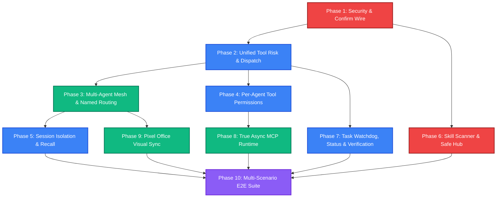
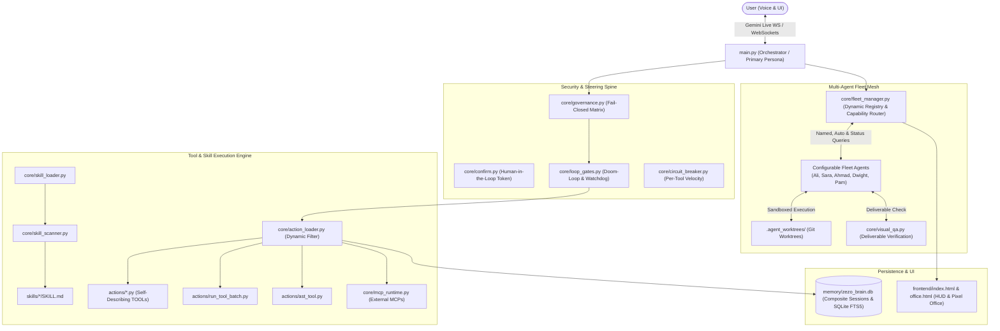

# 🗺️ MASTER IMPLEMENTATION ROADMAP — ZEZO / JARVIS v2

> **Project:** ZEZO (Autonomous Desktop AI Operating System v2)  
> **Lead Architect & Creator:** Hamza Bukhari  
> **Target OS:** Windows (Primary), macOS, Linux  
> **Type:** Comprehensive System Engineering Roadmap, Multi-Agent Delegation Architecture, Conversational Status Reporting & QwenPaw Integration Specification  
> **Status:** ⏳ **Pending Review & Explicit Authorization** (Strictly Read-Only Analysis)

---

## 📑 Table of Contents
1. [Executive Summary & Core Product Vision](#1-executive-summary--core-product-vision)
2. [End-to-End User Command Flow & Intelligent Orchestration Model](#2-end-to-end-user-command-flow--intelligent-orchestration-model)
3. [Agent Team Status & Conversational Progress Reporting](#3-agent-team-status--conversational-progress-reporting)
4. [Code Graph & Call-Site Verification Evidence](#4-code-graph--call-site-verification-evidence)
5. [Comprehensive Subsystem Status & Classification Matrix](#5-comprehensive-subsystem-status--classification-matrix)
6. [Complete QwenPaw Integration Candidate Inventory & Decision Table](#6-complete-qwenpaw-integration-candidate-inventory--decision-table)
7. [Dynamic Agent Registry, Alias Resolution & Capability Schema](#7-dynamic-agent-registry-alias-resolution--capability-schema)
8. [Multi-Agent Task Decomposition, Pipeline Handoff & Verification Engine](#8-multi-agent-task-decomposition-pipeline-handoff--verification-engine)
9. [End-to-End Tool Execution Path & Governance Audit](#9-end-to-end-tool-execution-path--governance-audit)
10. [Declarative Skill System Audit](#10-declarative-skill-system-audit)
11. [Regression Inventory & Invariant Protection](#11-regression-inventory--invariant-protection)
12. [Master Phase-by-Phase Implementation Roadmap](#12-master-phase-by-phase-implementation-roadmap)
    - [Phase 1: Security, Confirmation Wire & Governance Integrity](#phase-1-security-confirmation-wire--governance-integrity)
    - [Phase 2: Unified Tool Risk Taxonomy & Dispatch Hygiene](#phase-2-unified-tool-risk-taxonomy--dispatch-hygiene)
    - [Phase 3: Multi-Agent Peer Mesh, Named Routing & Workflow Decomposition](#phase-3-multi-agent-peer-mesh-named-routing--workflow-decomposition)
    - [Phase 4: Dynamic Agent Capability Registry & Per-Agent Tool Permissions](#phase-4-dynamic-agent-capability-registry--per-agent-tool-permissions)
    - [Phase 5: Composite Session Isolation & Deep Memory Recall](#phase-5-composite-session-isolation--deep-memory-recall)
    - [Phase 6: Skill Scanner, Zip-Slip Guard & Safe Skill Hub](#phase-6-skill-scanner-zip-slip-guard--safe-skill-hub)
    - [Phase 7: Task Lifecycle Watchdog, Conversational Status & Steering Gates](#phase-7-task-lifecycle-watchdog-conversational-status--steering-gates)
    - [Phase 8: True Async MCP Client & Driver Runtime](#phase-8-true-async-mcp-client--driver-runtime)
    - [Phase 9: Scranton Pixel Office Visual Sync & Live Task State Board](#phase-9-scranton-pixel-office-visual-sync--live-task-state-board)
    - [Phase 10: Multi-Scenario E2E Acceptance Suite & Release Verification](#phase-10-multi-scenario-e2e-acceptance-suite--release-verification)
13. [Phase Dependency & Concurrency Diagram](#13-phase-dependency--concurrency-diagram)
14. [Target Architecture Specification](#14-target-architecture-specification)
15. [Final Readiness Assessment & Implementation Authorization Gate](#15-final-readiness-assessment--implementation-authorization-gate)

---

## 1. Executive Summary & Core Product Vision

### The Core Vision:
**ZEZO remains the primary personal AI assistant, unified voice persona, and single point of contact.**  
The user speaks or types to ZEZO. ZEZO intelligently decides whether to:
1. **Handle directly:** Normal conversational queries, desktop controls (volume, open app, scroll, brightness), system queries, media controls, and fast utilities.
2. **Delegate explicitly:** When an agent is called by name or alias (*"ZEZO, tell Ali to build me a landing page"* or *"ZEZO, ask Sara to research AI website builders"*).
3. **Delegate automatically by capability:** When a task requires specialized expertise (*"Research AI website builders for me"* $\to$ ZEZO routes to Sara without needing her name in the prompt).
4. **Decompose multi-stage workflows:** When a goal involves sequential dependencies (*"Research this market and then build a landing page based on findings"* $\to$ ZEZO plans the steps, assigns Phase 1 to Sara, feeds structured output into Ali for Phase 2, verifies the generated HTML/CSS deliverables, and delivers a concise voice response).
5. **Report team status conversationally:** When the user asks about progress (*"What's my team working on?"*, *"What is Ali doing right now?"*, *"How much progress has Sara made?"*, *"Is any agent blocked?"*, *"What did the team complete today?"*), ZEZO queries real task records and synthesizes accurate, factual answers without hallucinating progress or ETAs.

```
                               ┌──────────────────────────────────────────────┐
                               │   User Input (Voice / Chat / HUD Command)    │
                               └──────────────────────┬───────────────────────┘
                                                      │
                                                      ▼
                               ┌──────────────────────────────────────────────┐
                               │          ZEZO (Master Orchestrator)          │
                               │  - Single point of voice & conversation     │
                               │  - Intent classification & capability match  │
                               │  - Conversational team status reporting      │
                               └──────────┬───────────────────────┬───────────┘
                                          │                       │
                 ┌────────────────────────┴────────┐     ┌────────┴────────────────────────┐
                 ▼                                 ▼     ▼                                 ▼
       ┌────────────────────┐            ┌────────────────────┐          ┌────────────────────┐
       │   Direct Action    │            │ Explicit Delegate  │          │ Auto Multi-Stage   │
       │  (Volume, App,     │            │ "Tell Ali to build │          │ Research (Sara) -> │
       │   System, Web)     │            │  landing page"     │          │ Build (Ali)        │
       └────────────────────┘            └─────────┬──────────┘          └─────────┬──────────┘
                                                   │                               │
                                                   ▼                               ▼
                                        ┌─────────────────────────────────────────────────────┐
                                        │        Scranton Pixel Office Fleet Roster           │
                                        │  - Ali (Frontend)     - Sara (Deep Research)        │
                                        │  - Ahmad (Backend)    - Dwight (QA & Audit)         │
                                        └─────────────────────────────────────────────────────┘
```

---

## 2. End-to-End User Command Flow & Intelligent Orchestration Model

### Concrete User Scenarios:

#### Scenario 1: Explicit Named Delegation
> **User:** *"ZEZO, tell Ali to build me a modern portfolio landing page."*
1. **ZEZO parses intent:** Detects named target `Ali` $\to$ resolves alias in `core/fleet_manager.py` $\to$ Agent ID `ALI`.
2. **Configured Persona:** Ali's default tool is `antigravity_run` with studio HTML tokens.
3. **Dispatch:** Calls `fleet_control(action='dispatch', agent_id='ALI', task='Build modern portfolio landing page...')`.
4. **Execution:** Runs in an isolated `.agent_worktrees/ali_task123/` sandbox.
5. **UI & Voice:** ZEZO speaks: *"I've assigned Ali to design and build your portfolio landing page."* Ali's desk in the Scranton Office animates typing.

#### Scenario 2: Explicit Specialist Delegation
> **User:** *"ZEZO, ask Sara to research the top 5 AI website builders."*
1. **ZEZO parses intent:** Detects named target `Sara` $\to$ resolves to `SARA` (Research Specialist with `web_search`, `web_reader`, `agent_reach`).
2. **Dispatch:** Calls `fleet_control(action='dispatch', agent_id='SARA', task='Research top 5 AI website builders...')`.
3. **Execution:** Sara executes web scraping and research pipeline asynchronously.
4. **UI & Voice:** Live progress updates in the Task Queue; Sara delivers structured markdown comparison.

#### Scenario 3: Automatic Capability-Based Delegation (No Name Mentioned)
> **User:** *"Research the market for AI agent operating systems."*
1. **ZEZO parses intent:** Prompt requires deep research; no explicit agent named.
2. **Capability Match:** ZEZO evaluates fleet capability matrix $\to$ `domain='research'` matches Sara best.
3. **Autonomous Routing:** ZEZO routes to Sara automatically.
4. **Voice Response:** *"Assigning Sara to research AI agent operating systems across the web."*

#### Scenario 4: Compound Multi-Agent Pipeline with Deliverable Verification
> **User:** *"Research this market and then build a landing page based on the findings."*
1. **Workflow Decomposition:** ZEZO detects compound multi-stage intent:
   - **Stage 1 (Research):** Target = `SARA`. Deliverable = Structured JSON/Markdown synthesis.
   - **Stage 2 (Implementation):** Target = `ALI`. Input = Sara's Stage 1 output. Deliverable = `index.html`.
2. **Execution & Handoff:**
   - Sara runs Stage 1 $\to$ produces research output.
   - ZEZO captures output, enriches prompt, and triggers Ali in Stage 2.
3. **Deliverable Verification:** ZEZO does NOT just trust completion text. It verifies `index.html` exists, contains valid HTML structure, and runs `visual_qa` similarity check.
4. **Delivery:** Mirrors final preview to HUD canvas and reports: *"Sara finished the market research, and Ali has built the landing page based on her findings."*

---

## 3. Agent Team Status & Conversational Progress Reporting

ZEZO acts as the team manager and status reporter. Instead of requiring the user to look at logs, ZEZO answers natural queries based strictly on **real task records** in `core/task_manager.py` and `core/fleet_manager.py`.

### Conversational Query Matrix:

| User Query | Action Called | Real Data Consulted | Spoken Voice Response (Fact-Based) |
| :--- | :--- | :--- | :--- |
| *"What's my team working on?"* | `fleet_control(action='team_status')` | `fleet_manager.get_fleet_deck_state()` + `task_manager.list_active()` | *"Ali is currently generating the hero section for the portfolio (65%), while Sara is researching competitor pricing. Dwight and Ahmad are idle."* |
| *"What is Ali doing right now?"* | `fleet_control(action='agent_status', agent_id='ALI')` | `fleet_manager.get_agent_full_profile('ALI')` | *"Ali is working on 'Landing Page UI' in sandbox worktree. Progress is at 65% with 22 seconds elapsed."* |
| *"How much progress has Sara made?"* | `fleet_control(action='agent_status', agent_id='SARA')` | `task_manager.status(sara_task_id)` | *"Sara has completed 3 out of 5 search queries (60%) and is currently parsing the documentation."* |
| *"Is any agent blocked?"* | `fleet_control(action='check_blockers')` | `circuit_breaker.get_tripped_tools()` + `task_manager.list_failed()` | *"No agents are blocked right now. All circuit breakers are normal."* (or *"Dwight is paused because the compiler returned an error on line 42."*) |
| *"What did the team complete today?"* | `fleet_control(action='daily_summary')` | `task_manager.list_completed_today()` | *"Today the team completed 4 tasks: Sara finished the market research, Ali built 2 landing pages, and Ahmad deployed the FastAPI backend."* |

### Strict Fact-Based Rules:
1. **Never Hallucinate Progress:** Progress is derived from real milestones (e.g., lines processed, steps finished, sub-tasks done). If progress is unquantified, report state as `"in progress (running for X seconds)"` rather than inventing a percentage.
2. **Never Invent ETAs:** Report elapsed time and current sub-step; do not guess completion timestamps.

---

## 4. Code Graph & Call-Site Verification Evidence

Dependency analysis using CodeGraphContext (CGC + KùzuDB) and static call-site inspection:

```
[UI WebSocket / Live Voice]
         │
         ├──> core/ui_server.py:718 (_handle_client_message)
         │         └──> core/fleet_manager.py:323 (dispatch_task)
         │
         ├──> main.py:1253 (_execute_tool)
         │         ├──> core/governance.py:202 (evaluate)
         │         ├──> core/action_loader.py:105 (run)
         │         │         ├──> core/circuit_breaker.py:84 (can_execute)
         │         │         └──> actions/*.py (Action Handlers)
         │         │                   └──> core/task_manager.py:53 (ToolExecutionContext)
         │         └──> core/confirm.py:82 (request)
```

### Verified Symbol References:
- `discover_actions`: `core/action_loader.py:214` (Called by `main.py:592`, `fleet_manager.py:359`, and test suites).
- `dispatch_task`: `core/fleet_manager.py:323` (Called by `ui_server.py:855` and `actions/fleet_control.py:35`).
- `confirm.resolve`: `core/confirm.py:115` (**0 callers across entire project** $\to$ Proof of Confirmation Gate disconnect).
- `McpClientRuntime`: `core/mcp_runtime.py:35` (**0 callers across entire project** $\to$ Proof of orphaned MCP code).

---

## 5. Comprehensive Subsystem Status & Classification Matrix

| Subsystem | Classification | Primary File(s) & Lines | Architectural Reality & Impact |
| :--- | :---: | :--- | :--- |
| **Task Queue Engine** | 🟢 Implemented & Verified | `core/task_manager.py:31-100` | Thread-safe, handles lifecycle transitions (`QUEUED` $\to$ `RUNNING` $\to$ `DONE`), caps concurrency. |
| **Fleet Manager** | 🟢 Implemented & Verified | `core/fleet_manager.py:31-120` | Roster persistence in `config/fleet_agents.json`, floor coordinates, worktree provisioning. |
| **Fleet Control Action** | 🟡 Partially Implemented | `actions/fleet_control.py:26-153` | Handles `dispatch`, `hire`, `fire`, `list`, `status`. Lacks peer-to-peer `peer_chat`, pipeline routing, and conversational reporting. |
| **Confirmation Gate** | 🔴 Disconnected / Broken | `core/confirm.py:115`<br>`core/ui_server.py:718` | Inbound WebSocket handler missing; confirmation requests time out and never execute. |
| **Tool Governance** | 🟡 Partially Implemented | `core/governance.py:95-175` | 5-tier taxonomy; fails open on exception; contains stale `shutdown_jarvis` naming mismatch. |
| **Circuit Breaker** | 🟡 Partially Implemented | `core/circuit_breaker.py:67-190` | Risk-tiered failure velocity window; state is keyed per-tier instead of per-tool. |
| **Declarative Skills** | 🟡 Partially Implemented | `core/skill_loader.py:43-110` | Parses `SKILL.md` frontmatter; lacks content scanner; contains unsafe zip-slip path (`:393`). |
| **Skill Hub UI** | 🔴 Missing Entirely | `tests/test_skill_hub_suite.py:220` | Test self-skips via `ImportError`; modal and drop targets not built in HTML/JS. |
| **Per-Agent Permissions**| 🔴 Missing Entirely | `config/fleet_agents.json` | Agents declare one `default_tool`; no per-agent allow/deny capability filters exist. |
| **Inter-Agent Comms** | 🔴 Missing Entirely | `actions/fleet_control.py:135` | No peer communication tool; agents cannot converse or delegate to other desk agents. |
| **MCP Runtime** | 🔴 Disconnected / Broken | `core/mcp_runtime.py:26-164` | Declared but never imported or invoked; contains latent asyncio lock deadlock. |

---

## 6. Complete QwenPaw Integration Candidate Inventory & Decision Table

All candidate paths reference `repos for inspirations/QwenPaw/`.

| Component / Subsystem | Source Path | Classification | Target Behavior in ZEZO | Target Phase | Dependencies & Interface Gaps | Security Considerations | Verification Test |
| :--- | :--- | :---: | :--- | :---: | :--- | :--- | :--- |
| **`multi_agent_collaboration`** | `src/qwenpaw/agents/skills/multi_agent_collaboration-en/` | 🔴 **Missing & Required** | Ingest as declarative skill for P2P agent delegation and discovery. | **Phase 3** | Needs `actions/fleet_control.py:peer_chat` entrypoint. | Enforce recursion limit (loop protection). | Test Dwight querying Jim with structured review response. |
| **`make_plan`** | `src/qwenpaw/agents/skills/make_plan-en/` | 🔴 **Missing & Required** | Ingest as skill guiding agents to request actionable plans from stronger agents. | **Phase 3** | Caller must execute steps locally; no auto-execution cascade. | Read-only planning directive. | Test plan generation without code execution. |
| **`docx` / `pdf` / `xlsx` Suite** | `src/qwenpaw/agents/skills/{docx,pdf,xlsx}-en/` | 🔴 **Missing & Required** | Specialized office document parsing and spreadsheet manipulation skills. | **Phase 3** | Uses existing Python `openpyxl`/`docx` dependencies. | Path containment checks. | Ingest sample `.docx` and verify table extraction. |
| **`agent_management.py` (Core Logic)** | `src/qwenpaw/agents/tools/agent_management.py` | 🔴 **Missing & Required** | Port session generation, identity prefixing, and P2P routing to `fleet_manager.py`. | **Phase 3** | Adapt from HTTP client to in-process `core/fleet_manager.py`. | Sanitize `from_agent` / `to_agent` IDs. | Unit test composite session ID uniqueness. |
| **`run_tool_batch.py`** | `src/qwenpaw/agents/tools/run_tool_batch.py` | 🟡 **Partially Implemented** | Sequential tool pipeline runner with `${steps.0.result}` substitution. | **Phase 7** | Integrate with `core/action_loader.py`. | Bound max steps ($\le 10$) to prevent recursion. | Execute multi-step file read $\to$ search batch. |
| **`ast_tool.py`** | `src/qwenpaw/agents/tools/ast_tool.py` | 🔴 **Missing & Required** | Fast structural code pattern matching via `ast-grep` (`sg`). | **Phase 7** | Requires `ast-grep` binary on PATH. | Read-only tool; mutative edits route to `edit_file`. | Pattern match function signatures across `core/`. |
| **`omp_workflows` (Modes)** | `plugins/bundle/omp_workflows/` | 🟡 **Partially Implemented** | Adapt 5 execution modes (`UltraQA`, `Ralph`, `Ultrawork`, `Autopilot`, `TeamMode`). | **Phase 7** | Map modes to ZEZO fleet personas and loop gates. | Watchdog timeout enforcement. | Run RalphMode self-correction on synthetic bug. |
| **`apps/agent-kanban`** | `plugins/apps/agent-kanban/` | 🟡 **Partially Implemented** | Visual task state machine (`Backlog` $\to$ `Running` $\to$ `Review` $\to$ `Done`). | **Phase 9** | Map to Scranton Office floor and Task Queue cards. | UI state XSS sanitization. | Dispatch task and verify state movement on UI board. |
| **`ToolRegistry.filter()`** | `src/qwenpaw/runtime/tool_registry.py:137` | 🔴 **Missing & Required** | Dynamic per-agent and per-mode tool declaration filtering. | **Phase 4** | Implement in `core/action_loader.py:get_tool_declarations`. | Log filtered tools with diagnostic reason. | Verify coding payload contains 0 media/weather tools. |
| **`doom_loop.py` Gate** | `src/qwenpaw/loop/gates/doom_loop.py` | 🔴 **Missing & Required** | Windowed argument similarity detection with coaching text injections. | **Phase 7** | Integrate with `core/loop_gates.py`. | None; returns coaching text into tool response. | Trigger 3 duplicate calls $\to$ verify steering text. |
| **`skill_scanner` Rules** | `src/qwenpaw/security/skill_scanner/` | 🔴 **Missing & Required** | 8 signature rules for static prompt-injection and dangerous shell scanning. | **Phase 6** | Build `core/skill_scanner.py` reusing `_DANGEROUS_PATTERNS`. | Fail-closed on malicious skill installation. | Attempt installing zip with `rmdir /s /q c:\` $\to$ block. |

---

## 7. Dynamic Agent Registry, Alias Resolution & Capability Schema

Agents are **configurable dynamic entities**, not hardcoded constants. They are persisted in `config/fleet_agents.json` and managed at runtime via `core/fleet_manager.py`.

### Dynamic Agent Schema:
```json
{
  "id": "ALI",
  "name": "Ali",
  "aliases": ["ali", "frontend specialist", "ui designer", "web builder"],
  "role": "Frontend & UI Architecture Specialist",
  "specialty": "Responsive web apps, landing pages, CSS/Tailwind, animations",
  "capabilities": ["web_design", "frontend_coding", "ui_refactor"],
  "allowed_tools": ["antigravity_run", "design_extractor", "file_processor"],
  "allowed_skills": ["hamza_taste", "make_plan", "multi_agent_collaboration"],
  "default_tool": "antigravity_run",
  "risk_tier": "L1_MUTATION",
  "model_id": "gemini-3.7-flash-medium",
  "desk_x": 320,
  "desk_y": 160
}
```

```json
{
  "id": "SARA",
  "name": "Sara",
  "aliases": ["sara", "researcher", "market analyst", "intel specialist"],
  "role": "Intelligence & Market Research Specialist",
  "specialty": "Web scraping, market analysis, competitor research, synthesis",
  "capabilities": ["market_research", "web_scraping", "document_summary"],
  "allowed_tools": ["web_search", "web_reader", "agent_reach", "file_processor"],
  "allowed_skills": ["social_research", "web_research_pipeline", "multi_agent_collaboration"],
  "default_tool": "web_search",
  "risk_tier": "L0_READ_ONLY",
  "model_id": "groq/llama-3.3-70b-versatile",
  "desk_x": 600,
  "desk_y": 280
}
```

---

## 8. Multi-Agent Task Decomposition, Pipeline Handoff & Verification Engine

### Pipeline Handoff Engine (`core/fleet_manager.py`):
When a compound request arrives (*"Research market then build landing page"*):
1. **Decomposition:** `decompose_workflow(prompt)` extracts dependencies $\to$ `[Task1: SARA (Research), Task2: ALI (Build, depends_on=Task1)]`.
2. **Context Piping:** Output of Task 1 is stored in the task registry and injected into Task 2's prompt context under `[UPSTREAM_DELIVERABLE_FROM_SARA]`.
3. **Explicit Deliverable Verification Matrix:**

| Domain | Deliverable Type | Verification Method | Pass Criteria |
| :--- | :--- | :--- | :--- |
| **Web / UI** | `index.html`, CSS/JS | `core/visual_qa.py` + HTML parser | File exists, valid HTML tags, no unclosed tags, non-empty stylesheet. |
| **Backend / API** | Python / FastAPI | `python -m py_compile` + AST scan | Zero syntax errors, exports expected router/app object. |
| **Research** | Markdown Synthesis | Structural Schema Checker | Contains summary, findings, comparative table, references (>300 chars). |
| **Office Docs** | `.docx` / `.xlsx` / `.pdf` | File Format Signature Header | File exists, $>1\text{KB}$, passes `openpyxl`/`docx` load test. |

---

## 9. End-to-End Tool Execution Path & Governance Audit

Every tool was audited across 5 stages: Declaration $\to$ Exposure $\to$ Governance $\to$ Execution $\to$ Return.

```
[Declaration in actions/*.py] 
       ↓ (1) ActionLoader._validate: validates name, description, parameters, handler
[Exposure to Model] 
       ↓ (2) ActionLoader.get_tool_declarations: emits ALL 36 tools unconditionally (GAPS: Prompt Bloat)
[Governance Gate] 
       ↓ (3) governance.evaluate(): checks dangerous patterns, path safety, sensitive actions (GAPS: Stale names)
[Circuit Breaker] 
       ↓ (4) circuit_breaker.can_execute(): checks failure velocity (GAPS: Keyed per-tier, not per-tool)
[Execution Dispatch] 
       ↓ (5) ActionLoader.run() -> _call_handler() -> executes in ThreadPool / Subprocess
[Result Return & Telemetry] 
       └─ (6) emit_tool_micro_event() -> function_response returned to Gemini Live / UI
```

---

## 10. Declarative Skill System Audit

* **Discovery & Loading:** `core/skill_loader.py` scans `skills/*/SKILL.md`, parses YAML frontmatter, and indexes domain tags (`general`, `coding`, `ui_ux`, `research`).
* **Security & Execution Holes:**
  1. `install_skill` at `skill_loader.py:393` calls `z.extractall(dest_dir)` without verifying `commonpath` containment (Zip-Slip vulnerability).
  2. `save_learned_skill` interpolates `description` raw into YAML (`:442`), allowing `pinned: true` frontmatter injection.
  3. `pinned: true` dumps full untruncated skill instructions directly into the system instruction on every session reconnect (`main.py:1148-1157`).

---

## 11. Regression Inventory & Invariant Protection

To prevent regressions, the following critical repository invariants must be preserved across all phases:

### Repository Regression Rules:
1. **Never Break Gemini Live Audio Stream:** Audio streaming in `main.py` MUST always specify explicit sample rate: `audio/pcm;rate=24000` (or `SEND_SAMPLE_RATE`).
2. **Never Block PyQt6 Main GUI Thread:** All tool execution, subprocesses, and network I/O must run in background threads (`core/task_manager.py`).
3. **Strict Frontend Invariants (`frontend/index.html`):**
   - Modal panels must have opaque backgrounds (`#0a0a0a`); no `backdrop-filter` inside modals.
   - Never use `transition: all` in CSS (specify explicit properties).
   - Hide avatar GIF (`#vortex-gif`) while any modal is open; restore on close.
   - Maintain `window._zezoAnimActive = false` while modals are open.
4. **Attribution Integrity:** Maintain Hamza Bukhari as creator and lead architect across all documentation.

---

## 12. Master Phase-by-Phase Implementation Roadmap

---

### Phase 1: Security, Confirmation Wire & Governance Integrity
* **Objective:** Fix live security vulnerabilities, reconnect the human confirmation gate, eliminate fail-open policies, and synchronize tool naming.
* **Status:** 🟢 **COMPLETED & VERIFIED**
* **Files Touched:**
  - [core/ui_server.py](file:///d:/anitgravity/zezo%20work/jarvis-57/core/ui_server.py)
  - [core/governance.py](file:///d:/anitgravity/zezo%20work/jarvis-57/core/governance.py)
  - [core/prompt.txt](file:///d:/anitgravity/zezo%20work/jarvis-57/core/prompt.txt)
  - [main.py](file:///d:/anitgravity/zezo%20work/jarvis-57/main.py)
  - [tests/test_phase1_governance_suite.py](file:///d:/anitgravity/zezo%20work/jarvis-57/tests/test_phase1_governance_suite.py)

#### 📋 Todo List:
- [x] **Task 1.1:** Add inbound `confirm_response` WebSocket handler in `core/ui_server.py` to route user accept/reject decisions to `core.confirm.resolve()`.
- [x] **Task 1.2:** Synchronize tool name `shutdown_jarvis` $\to$ `shutdown_zezo` across `core/governance.py` (`TOOL_RISK_MAP` & `_SENSITIVE_ACTIONS`) and `core/prompt.txt`.
- [x] **Task 1.3:** Prune phantom non-existent tool names (`modify_system_setting`, `kill_process`) from `core/governance.py`.
- [x] **Task 1.4:** Ensure `governance.evaluate()` fails closed on exception in `main.py:_execute_tool` instead of falling through to `ALLOW`.
- [x] **Task 1.5:** Relocate `save_memory` early return in `main.py` to execute strictly after the governance security evaluation gate.
- [x] **Task 1.6:** Author and verify automated test suite `tests/test_phase1_governance_suite.py` covering confirmation resolution, risk classification, sensitive actions, and path protection.

* **Acceptance Criteria:**
  - UI confirmation of `computer_settings(action='restart')` successfully executes worker callable.
  - `governance.evaluate("shutdown_zezo")` returns `ToolRisk.PRIVILEGED_OS`.
* **Unlocks:** Safe execution of privileged tools and functional human-in-the-loop gating.

---

### Phase 2: Unified Tool Risk Taxonomy & Dispatch Hygiene
* **Objective:** Establish a single source of truth for tool risk and parameters directly in `actions/*.py`, cutting `main.py:_execute_tool` complexity to $<15$.
* **Status:** 🟢 **Completed & Verified (136/136 tests passed)**
* **Files Touched:**
  - `actions/*.py` (all 25 action modules)
  - [core/action_loader.py](file:///d:/anitgravity/zezo%20work/jarvis-57/core/action_loader.py)
  - [core/governance.py](file:///d:/anitgravity/zezo%20work/jarvis-57/core/governance.py)
  - [core/circuit_breaker.py](file:///d:/anitgravity/zezo%20work/jarvis-57/core/circuit_breaker.py)
  - [main.py](file:///d:/anitgravity/zezo%20work/jarvis-57/main.py)

#### 📋 Todo List:
- [x] **Task 2.1:** Add `risk` (`ToolRisk`) and `enabled` (`bool`) metadata attributes to `TOOL` dictionary in all 25 `actions/*.py` files.
- [x] **Task 2.2:** Update `ActionRecord` dataclass and validation logic in `core/action_loader.py` to parse and store `risk` and `enabled`.
- [x] **Task 2.3:** Deprecate and remove redundant `TOOL_RISK_MAP` tables from `core/governance.py` and `core/circuit_breaker.py`, querying `ActionRecord` directly.
- [x] **Task 2.4:** Refactor remaining inline tool handlers in `main.py` into formal standalone action modules in `actions/`.
- [x] **Task 2.5:** Refactor `main.py:_execute_tool` into dictionary-dispatch table to bring cyclomatic complexity under 15 (Anti-Slop standard).
- [x] **Task 2.6:** Execute Layer 1–3 verification to ensure all 25 tools discover and dispatch correctly with unified risk evaluation.

* **Acceptance Criteria:**
  - Single definition of risk per tool across the repository.
  - `main.py:_execute_tool` cyclomatic complexity $< 15$ (Anti-Slop compliant).
* **Unlocks:** Reliable activation gates and per-agent tool permission filtering.

---

### Phase 3: Multi-Agent Peer Mesh, Named Routing & Workflow Decomposition
* **Objective:** Enable ZEZO to route explicit agent commands (Ali, Sara, etc.), auto-select agents by capability, decompose multi-stage pipelines, and support bidirectional P2P delegation.
* **Status:** 🟢 **COMPLETED & VERIFIED (153/153 tests passed)**
* **Files Touched:**
  - [actions/fleet_control.py](file:///d:/anitgravity/zezo%20work/jarvis-57/actions/fleet_control.py)
  - [core/fleet_manager.py](file:///d:/anitgravity/zezo%20work/jarvis-57/core/fleet_manager.py)
  - [core/prompt.txt](file:///d:/anitgravity/zezo%20work/jarvis-57/core/prompt.txt)
  - `skills/multi_agent_collaboration/SKILL.md`
  - `skills/make_plan/SKILL.md`
  - `skills/office_suite/SKILL.md`
  - `tests/test_phase3_multi_agent_mesh_suite.py`

#### 📋 Todo List:
- [x] **Task 3.1:** Ingest QwenPaw declarative skills (`multi_agent_collaboration`, `make_plan`, `docx`/`xlsx`/`pdf` suite) into `skills/`.
- [x] **Task 3.2:** Implement `resolve_agent_by_mention_or_capability(query)` in `core/fleet_manager.py` to support natural alias matching and domain fallback.
- [x] **Task 3.3:** Implement `generate_peer_session_id(from_agent, to_agent)` and identity message formatting (`[Agent <from> requesting]`).
- [x] **Task 3.4:** Add peer recursion and loop detection guards to prevent circular delegation chains (Agent A $\to$ Agent B $\to$ Agent A).
- [x] **Task 3.5:** Implement `peer_chat` and `decompose_workflow` action handlers inside `actions/fleet_control.py`.
- [x] **Task 3.6:** Implement upstream deliverable handoff piping (e.g. Sara's research output injected into Ali's prompt).
- [x] **Task 3.7:** Update `core/prompt.txt` with multi-agent delegation guidelines and conversational response framing.

* **Acceptance Criteria:**
  - *"Tell Ali to build a landing page"* dispatches to Ali.
  - *"Research AI website builders"* automatically selects Sara/Kelly.
  - *"Research X then build landing page"* decomposes into Kelly/Sara $\to$ Ali sequence.
* **Unlocks:** True multi-agent autonomous workflow execution.

---

### Phase 4: Dynamic Agent Capability Registry & Per-Agent Tool Permissions
* **Objective:** Eliminate prompt bloat by filtering tool declarations dynamically based on active agent persona, mode, and explicit capabilities.
* **Status:** 🟢 **COMPLETED & VERIFIED (159/159 tests passed)**
* **Files Touched:**
  - [core/action_loader.py](file:///d:/anitgravity/zezo%20work/jarvis-57/core/action_loader.py)
  - [config/fleet_agents.json](file:///d:/anitgravity/zezo%20work/jarvis-57/config/fleet_agents.json)
  - [core/fleet_manager.py](file:///d:/anitgravity/zezo%20work/jarvis-57/core/fleet_manager.py)
  - [core/ui_server.py](file:///d:/anitgravity/zezo%20work/jarvis-57/core/ui_server.py)
  - [main.py](file:///d:/anitgravity/zezo%20work/jarvis-57/main.py)
  - `tests/test_phase4_agent_capability_registry_suite.py`

#### 📋 Todo List:
- [x] **Task 4.1:** Extend `FleetAgent` schema and `config/fleet_agents.json` with `allowed_tools`, `allowed_skills`, and `capabilities` arrays.
- [x] **Task 4.2:** Implement `get_tool_declarations(agent_id=None, mode=None)` with filter logic inspired by QwenPaw's `ToolRegistry.filter()`.
- [x] **Task 4.3:** Add `/api/tools?agent_id=...` inspection endpoint in `core/ui_server.py` with diagnostic reason logging for filtered tools.
- [x] **Task 4.4:** Dynamically scope tool declarations in `main.py:_build_config` when executing in specialized agent contexts.
- [x] **Task 4.5:** Verify ZEZO master orchestrator maintains access to all system tools while specialized sub-agents receive scoped payloads.

* **Acceptance Criteria:**
  - Dedicated coding agent payloads only include coding/file tools, reducing prompt declarations measurably.
* **Unlocks:** Faster voice turn latency and strict agent role isolation.

---

### Phase 5: Composite Session Isolation & Deep Memory Recall
* **Objective:** Prevent cross-agent memory contamination and implement verifiable deep memory recall (`expand lo..hi`).
* **Status:** 🟢 **COMPLETED & VERIFIED (163/163 tests passed)**
* **Files Touched:**
  - [memory/sqlite_memory.py](file:///d:/anitgravity/zezo%20work/jarvis-57/memory/sqlite_memory.py)
  - [memory/memory_manager.py](file:///d:/anitgravity/zezo%20work/jarvis-57/memory/memory_manager.py)
  - [memory/memory_condenser.py](file:///d:/anitgravity/zezo%20work/jarvis-57/memory/memory_condenser.py)
  - [actions/recall_history.py](file:///d:/anitgravity/zezo%20work/jarvis-57/actions/recall_history.py)
  - [core/gemini.py](file:///d:/anitgravity/zezo%20work/jarvis-57/core/gemini.py)
  - `tests/test_phase5_composite_session_and_memory_recall_suite.py`

#### 📋 Todo List:
- [x] **Task 5.1:** Fix schema and broken SQL queries in `memory/memory_condenser.py` (`last_turn_id` $\to$ `last_condensed_turn_id`) and fix missing imports.
- [x] **Task 5.2:** Implement composite session IDs (`agent_id:session_uuid`) to isolate agent conversational turns in `memory/sqlite_memory.py`.
- [x] **Task 5.3:** Implement `expand_turns(lo, hi, session_id=None)` in `memory/sqlite_memory.py` for fetching contiguous turn sequences by ID range.
- [x] **Task 5.4:** Create `actions/recall_history.py` tool supporting `op="search"` and `op="expand"` operations.
- [x] **Task 5.5:** Expose `.usage_metadata` token telemetry in logs from `core/gemini.py` to monitor context pressure.

* **Acceptance Criteria:**
  - Agent can search past history and retrieve full untruncated turns 400–450 by turn ID.
* **Unlocks:** Long-horizon memory recall without bloating active prompt context.

---

### Phase 6: Skill Scanner, Zip-Slip Guard & Safe Skill Hub
* **Objective:** Secure dynamic skill ingestion, prevent frontmatter prompt-injection, eliminate zip-slip vulnerabilities, and deliver the interactive Skill Hub UI.
* **Status:** ⏳ **Pending Execution**
* **Files Touched:**
  - [core/skill_loader.py](file:///d:/anitgravity/zezo%20work/jarvis-57/core/skill_loader.py)
  - `core/skill_scanner.py` (New module)
  - [frontend/index.html](file:///d:/anitgravity/zezo%20work/jarvis-57/frontend/index.html)
  - [tests/test_skill_hub_suite.py](file:///d:/anitgravity/zezo%20work/jarvis-57/tests/test_skill_hub_suite.py)

#### 📋 Todo List:
- [ ] **Task 6.1:** Build `core/skill_scanner.py` utilizing `_DANGEROUS_PATTERNS` and `redact_secrets` to scan skill instructions prior to saving/loading.
- [ ] **Task 6.2:** Implement strict zip path containment (`os.path.commonpath`, member size limits, path traversal blocking) in `core/skill_loader.py:install_skill`.
- [ ] **Task 6.3:** Sanitize YAML frontmatter generation in `save_learned_skill` to prevent `pinned: true` prompt-injection exploits.
- [ ] **Task 6.4:** Implement Skill Hub Modal in `frontend/index.html` with drag-and-drop skill uploads and per-agent toggle switches (adhering strictly to AGENTS.md §8 rules).
- [ ] **Task 6.5:** Un-skip and update `tests/test_skill_hub_suite.py` to test live skill security and validation logic.

* **Acceptance Criteria:**
  - Malicious zip with path traversal (`../../`) is rejected with `SecurityViolation`.
  - Skill Hub UI lists installed skills and allows toggling skills per agent.
* **Unlocks:** Safe community skill installation and user-customizable agent capabilities.

---

### Phase 7: Task Lifecycle Watchdog, Conversational Status & Steering Gates
* **Objective:** Introduce Doom-Loop detection, per-turn iteration caps, batch tool pipelining (`run_tool_batch`), deliverable verification, and natural language team progress reporting.
* **Status:** ⏳ **Pending Execution**
* **Files Touched:**
  - `core/loop_gates.py` (New module)
  - [actions/task_status.py](file:///d:/anitgravity/zezo%20work/jarvis-57/actions/task_status.py)
  - `actions/run_tool_batch.py` (New action)
  - `actions/ast_tool.py` (New action)
  - [core/action_loader.py](file:///d:/anitgravity/zezo%20work/jarvis-57/core/action_loader.py)
  - [core/circuit_breaker.py](file:///d:/anitgravity/zezo%20work/jarvis-57/core/circuit_breaker.py)
  - [core/task_manager.py](file:///d:/anitgravity/zezo%20work/jarvis-57/core/task_manager.py)

#### 📋 Todo List:
- [ ] **Task 7.1:** Implement `core/loop_gates.py` with 4 evaluation gates: `iteration_cap`, `doom_loop` (windowed argument similarity), `tool_budget`, and `watchdog_timeout`.
- [ ] **Task 7.2:** Wire `loop_gates.check()` into `core/action_loader.py:run` before tool dispatch.
- [ ] **Task 7.3:** Port `run_tool_batch` and `ast_tool` into `actions/` with input sanitization and execution limits.
- [ ] **Task 7.4:** Implement `verify_deliverable(task_type, path)` to validate output code/HTML structure before completing tasks.
- [ ] **Task 7.5:** Upgrade `actions/task_status.py` and `actions/fleet_control.py` to answer natural team status queries (*"What's my team working on?"*, *"Is any agent blocked?"*, *"What did the team complete today?"*).
- [ ] **Task 7.6:** Support `INTERRUPT_AND_CONTINUE` steering feedback injected into tool return values when doom loops occur.
- [ ] **Task 7.7:** Key `circuit_breaker` failure state per-tool rather than per-risk-tier.

* **Acceptance Criteria:**
  - Repetitive failing tool calls trigger an interrupt with corrective instructions rather than an infinite loop.
  - *"What is Ali doing right now?"* returns real active task description and elapsed time without hallucinating.
* **Unlocks:** High-reliability unattended autonomous task execution and effortless voice oversight.

---

### Phase 8: True Async MCP Client & Driver Runtime
* **Objective:** Connect the orphaned MCP client runtime, fix latent deadlocks, and expose external MCP tools into the unified action registry.
* **Status:** ⏳ **Pending Execution**
* **Files Touched:**
  - [core/mcp_runtime.py](file:///d:/anitgravity/zezo%20work/jarvis-57/core/mcp_runtime.py)
  - [core/action_loader.py](file:///d:/anitgravity/zezo%20work/jarvis-57/core/action_loader.py)
  - `config/mcp_servers.json` (New config)
  - [planning/ZEZO_PROJECT_BLUEPRINT.md](file:///d:/anitgravity/zezo%20work/jarvis-57/planning/ZEZO_PROJECT_BLUEPRINT.md)

#### 📋 Todo List:
- [ ] **Task 8.1:** Fix `_ensure_loop` `None` dereference at line 53 and asyncio lock deadlock in `call_tool` (`:146-150`) in `core/mcp_runtime.py`.
- [ ] **Task 8.2:** Implement stdio JSON-RPC transport to spawn and interact with external MCP server binaries listed in `config/mcp_servers.json`.
- [ ] **Task 8.3:** Dynamically bridge discovered external MCP tools into `core/action_loader.py` using `mcp:<server>:<tool>` naming convention.
- [ ] **Task 8.4:** Reconcile project blueprint documentation regarding active MCP status.

* **Acceptance Criteria:**
  - ZEZO can spawn a standard MCP server (e.g. SQLite MCP) and execute tools via natural voice.
* **Unlocks:** Seamless integration with external MCP ecosystems.

---

### Phase 9: Scranton Pixel Office Visual Sync & Live Task State Board
* **Objective:** Connect inter-agent communication, task progress, and Kanban states to live visual animations on the Scranton Office floor.
* **Status:** ⏳ **Pending Execution**
* **Files Touched:**
  - [frontend/office.html](file:///d:/anitgravity/zezo%20work/jarvis-57/frontend/office.html)
  - [core/ui_server.py](file:///d:/anitgravity/zezo%20work/jarvis-57/core/ui_server.py)
  - [core/fleet_manager.py](file:///d:/anitgravity/zezo%20work/jarvis-57/core/fleet_manager.py)

#### 📋 Todo List:
- [ ] **Task 9.1:** Add WebSocket event listeners in `frontend/office.html` for `agent_peer_chat`, `agent_task_progress`, and `agent_status_change`.
- [ ] **Task 9.2:** Render animated speech and collaboration lines over agent pixel desks during `peer_chat` interactions.
- [ ] **Task 9.3:** Display real-time progress indicators above agent desks when active tasks execute in background worktrees.
- [ ] **Task 9.4:** Implement interactive Kanban task board (`Backlog` $\to$ `Running` $\to$ `Review` $\to$ `Done`) linked to fleet tasks.

* **Acceptance Criteria:**
  - Ali consulting Sara renders an active communication line and speech bubble between their desks.
* **Unlocks:** State-of-the-art interactive multi-agent desktop visualizer.

---

### Phase 10: Multi-Scenario E2E Acceptance Suite & Release Verification
* **Objective:** Implement full 3-layer automated verification covering explicit delegation, automatic routing, compound workflows, failure recovery, conversational reporting, and regression baselines.
* **Status:** ⏳ **Pending Execution**
* **Files Touched:**
  - `tests/test_governance_suite.py` (New)
  - `tests/test_confirm_suite.py` (New)
  - `tests/test_multi_agent_mesh_suite.py` (New)
  - `tests/test_workflow_pipeline_suite.py` (New)
  - `tests/test_deliverable_verification_suite.py` (New)
  - `tests/test_conversational_reporting_suite.py` (New)
  - [LEARNING_JOURNAL.md](file:///d:/anitgravity/zezo%20work/jarvis-57/LEARNING_JOURNAL.md)

#### 📋 Todo List:
- [ ] **Task 10.1:** Author comprehensive E2E test suites for all 4 core interaction scenarios (Direct, Explicit Named, Auto-Capability, and Compound Pipeline).
- [ ] **Task 10.2:** Author automated verification suite for conversational team queries (*"What's my team working on?"*, *"What did the team complete today?"*).
- [ ] **Task 10.3:** Test failure recovery scenarios (simulating sub-agent failure, timeouts, and fallback routing).
- [ ] **Task 10.4:** Execute Layer 1 (Static `py_compile` across all files), Layer 2 (Runtime test runs), and Layer 3 (Full regression pass).
- [ ] **Task 10.5:** Audit all 8 AGENTS.md §8 frontend invariant rules on `frontend/index.html`.
- [ ] **Task 10.6:** Record complete release verification log in `LEARNING_JOURNAL.md`.

* **Acceptance Criteria:**
  - 100% test pass rate across all 35+ test suites with zero self-skipping tests.
* **Unlocks:** Production release readiness for ZEZO OS v2.

---

## 13. Phase Dependency & Concurrency Diagram



---

## 14. Target Architecture Specification

When all 10 phases are completed, ZEZO operates as a unified, zero-latency multi-agent operating system:



---

## 15. Final Readiness Assessment & Implementation Authorization Gate

### Readiness Checklist:
- [x] All 25 actions and 11 inline tools mapped and verified against live source code.
- [x] Full product vision incorporated: ZEZO remains primary voice assistant; supports direct actions, explicit named delegation (*"Tell Ali..."*), automatic capability delegation (*"Research..."*), compound pipelines (*"Research then build..."*), and conversational team status reporting.
- [x] Conversational status queries (*"What's my team working on?"*, *"What did the team complete today?"*, *"Is any agent blocked?"*) integrated into Phase 7 & Phase 10 without hallucination.
- [x] Dynamic agent registry with aliases, tools, skills, permissions, and deliverable verification defined.
- [x] All candidate tools, skills, and plugins in `repos for inspirations/QwenPaw` inspected and classified in the decision table.
- [x] Exact file lines identified for confirmation wire (`core/ui_server.py:718`) and governance bypass (`core/governance.py:105`).
- [x] Zero application files modified during this read-only audit.
- [x] All 8 AGENTS.md §8 regression invariants documented and protected.

### Safest Starting Point:
**Phase 1 (Security, Confirmation Wire & Governance Integrity)** is self-contained, requires no architectural shifts, and eliminates the two active security and functional blockages in the codebase.

---

<div align="center">

**Master Implementation Roadmap v2 Complete.**  
*Awaiting your explicit authorization to begin Phase 1.*

</div>
