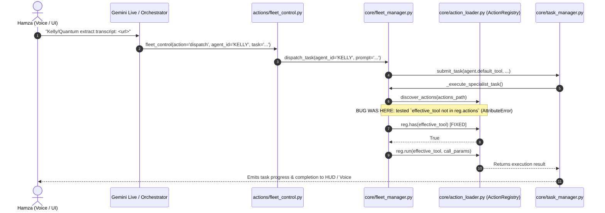

# 🚀 Technical Implementation Plan: Fleet Task Crash Fix & Role-Aware Tool Inference

> **Lead Architect:** Hamza Bukhari  
> **Target Subsystems:** `core/fleet_manager.py`, `actions/fleet_control.py`, `core/prompt.txt`, `tests/`  
> **Status:** Ready for Execution Approval  
> **Traceability Index:** `[REQ-F-001..005, TASK-001..004, RISK-001..002, TEST-001..003]`

---

## 🎯 1. Requirements & System Invariants

### Functional Requirements (FR)
- **[REQ-F-001]** **Fix Fatal Registry Crash in Specialist Task Execution:** In `core/fleet_manager.py:_execute_specialist_task`, replace invalid `reg.actions` check with `reg.has(effective_tool)`.
- **[REQ-F-002]** **Purge Stale `dev_agent` Fallbacks in Fleet Manager:** Replace all remaining fallback defaults of `"dev_agent"` in `core/fleet_manager.py` (`save_agent_profile` and `_execute_specialist_task`) with `opencode_run` or role-specific inference.
- **[REQ-F-003]** **Role-Aware Smart Tool & Capability Inference on Agent Hire:** When hiring a new agent via voice or API without an explicit `default_tool`, intelligently infer default tools, allowed tools, and capabilities from role/specialty keywords:
  - *Research / Web / Media* (`research`, `web`, `transcript`, `video`, `scrape`, `search`): `default_tool = "agent_reach"`, `allowed_tools = ["agent_reach", "web_search", "web_reader"]`.
  - *Frontend / UI* (`frontend`, `ui`, `design`, `css`, `tailwind`): `default_tool = "antigravity_run"`, `allowed_tools = ["antigravity_run", "extract_design_system", "browser_control"]`.
  - *Backend / Microservices* (`backend`, `fastapi`, `database`, `api`, `full-stack`): `default_tool = "opencode_run"`, `allowed_tools = ["opencode_run", "quick_snippet", "file_processor"]`.
  - *Refactoring / QA* (`refactor`, `qa`, `test`, `audit`): `default_tool = "kilo_run"`, `allowed_tools = ["kilo_run", "quick_snippet"]`.
- **[REQ-F-004]** **Add `update` / `edit` Action Handlers in `fleet_control.py`:** Support `action="update"` or `action="edit"` in `actions/fleet_control.py` to modify existing agent personas, roles, specialties, default tools, allowed tools, models, and capabilities live.
- **[REQ-F-005]** **Synchronize System Prompt Fleet Management Directives:** Update `core/prompt.txt` under `[FLEET MANAGEMENT]` to explicitly command Gemini Live to ALWAYS invoke `fleet_control(action='update', ...)` when the user requests agent role, tool, or capability updates, forbidding empty verbal confirmations.

### Non-Functional Requirements (NFR)
- **[REQ-NF-001]** **Zero Task Start Latency Penalty:** Execution validation and tool resolution must complete in $< 2\text{ms}$.
- **[REQ-NF-002]** **Zero Regressions:** 100% pass on all 210 existing pytest suites.

### Constraints & Invariants (CON / INV)
- **[CON-001]** Non-blocking execution: fleet tasks must run in background threads via `TaskManager`.
- **[INV-001]** `ActionRegistry` methods (`.has()`, `.get()`, `.names()`) must be used exclusively; never access private attributes or assume nonexistent `.actions`.
- **[INV-002]** Anti-Slop complexity score $< 15$ per function.

---

## 🏛️ 2. Architecture & Technical Decisions

### Root Cause & Sequence Flow



### Key Technical Decisions (ADR)
1. **Tool Resolution via `ActionRegistry.has()`:**
   - **Decision:** Use `reg.has(effective_tool)` instead of accessing `reg.actions`.
   - **Justification:** `ActionRegistry` stores records in `self._actions` and provides `has(name)` as public API.
2. **Dynamic Role Inference Engine:**
   - **Decision:** Implement a lightweight dictionary keyword matcher (`_infer_agent_tools_from_role`) in `core/fleet_manager.py`.
   - **Justification:** Voice commands frequently say *"hire an agent for web research"* without specifying exact tool IDs like `"agent_reach"`. Inferring tools prevents agents from being provisioned with coding tools for research tasks.

---

## 🔬 3. File Modification Matrix

| File Path | Action | Scope / Key Symbols Touched | Traceability |
| :--- | :--- | :--- | :--- |
| `core/fleet_manager.py` | Modify | `_execute_specialist_task`, `save_agent_profile`, `_infer_agent_defaults` | REQ-F-001, REQ-F-002, REQ-F-003 |
| `actions/fleet_control.py` | Modify | `_handle_update`, `_ACTION_DISPATCH`, `TOOL` schema | REQ-F-004 |
| `core/prompt.txt` | Modify | `[FLEET MANAGEMENT]` instruction block | REQ-F-005 |
| `tests/test_fleet_control_suite.py` | Modify | Add tests for `update` action and smart tool inference | REQ-F-003, REQ-F-004 |
| `tests/test_phase4_agent_capability_registry_suite.py` | Modify | Verify specialist task dispatch with `agent_reach` | REQ-F-001 |

---

## 🔌 4. Interface Contracts & Changes

### `actions/fleet_control.py` Action Contract Expansion
```python
_ACTION_DISPATCH: Dict[str, Callable[[Dict[str, Any]], str]] = {
    "dispatch": _handle_dispatch,
    "hire": _handle_hire,
    "fire": _handle_fire,
    "update": _handle_update,  # NEW
    "edit": _handle_update,    # NEW
    "list_agents": _handle_list,
    "list": _handle_list,
    "get_status": _handle_status,
    "status": _handle_status,
    "peer_chat": _handle_peer_chat,
    "delegate": _handle_peer_chat,
    "decompose_workflow": _handle_decompose,
    "decompose": _handle_decompose,
}
```

---

## 📋 5. Phased Implementation Roadmap

### 🔹 Phase 1: Core Engine & Registry Fixes
- [x] **[TASK-001]** Fix `_execute_specialist_task` in `core/fleet_manager.py`:
  - Change `effective_tool not in reg.actions` to `not reg.has(effective_tool)`.
  - Replace `dev_agent` fallback with `agent.default_tool` or `opencode_run`.
- [x] **[TASK-002]** Implement `_infer_agent_defaults(role, specialty)` in `core/fleet_manager.py`:
  - Default `default_tool` based on keywords (`research` -> `agent_reach`, `ui` -> `antigravity_run`, etc.).
  - Default `allowed_tools` and `capabilities` accordingly when empty.
  - Purge remaining `"dev_agent"` default strings from `save_agent_profile`.

### 🔹 Phase 2: Action Layer & System Prompt Sync
- [x] **[TASK-003]** Implement `_handle_update` in `actions/fleet_control.py`:
  - Allow updating `role`, `specialty`, `default_tool`, `allowed_tools`, `allowed_skills`, `capabilities`, `model_id`.
  - Broadcast `fleet_updated` UI event with updated profile.
  - Update `TOOL["parameters"]` enum to include `"update"` and `"edit"`.
- [x] **[TASK-004]** Update `core/prompt.txt`:
  - Add explicit rule under `[FLEET MANAGEMENT]` to mandate calling `fleet_control(action='update', ...)` on persona modifications.

---

## 🧪 6. Strict 3-Layer Verification Plan

### Layer 1: Static Verification
- **[TEST-L1-001]** `python -m py_compile core/fleet_manager.py actions/fleet_control.py`
- **[TEST-L1-002]** `python -c "from core.action_loader import discover_actions; from pathlib import Path; reg = discover_actions(Path('actions')); assert reg.has('fleet_control')"`

### Layer 2: Runtime Benchmarks
- **[TEST-L2-001]** Unit execution: Dispatch task with `agent_reach` and verify `_execute_specialist_task` does not raise `AttributeError`.
- **[TEST-L2-002]** Hire inference: Call `fleet_manager.save_agent_profile({"id": "QUANTUM", "role": "Detailed Web Researcher"})` and assert `agent.default_tool == "agent_reach"` and `allowed_tools` contains `agent_reach` and `web_search`.
- **[TEST-L2-003]** Update action: Call `fleet_control({"action": "update", "agent_id": "QUANTUM", "allowed_tools": ["agent_reach", "web_search"]})` and assert state is saved.

### Layer 3: Regression Test Suite
- **[TEST-L3-001]** `pytest tests/` (Pass 210+ tests with 0 failures).

---

## 🛡️ 7. Risk Register & Rollback Strategy

| Risk ID | Risk Description | Likelihood | Impact | Mitigation Strategy | Rollback Action |
| :--- | :--- | :--- | :--- | :--- | :--- |
| **RISK-001** | Existing agent configs overwritten with inferred tools | Low | Med | Only apply inference when fields are not provided in input dict | Check if `existing` profile exists before applying defaults |
| **RISK-002** | Voice agent prompt syntax regression | Low | Low | Keep prompt directives concise and scoped to `[FLEET MANAGEMENT]` | Revert `prompt.txt` changes |
