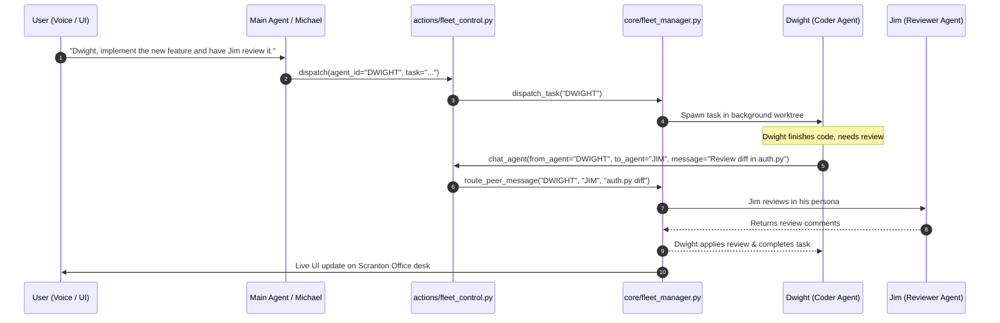
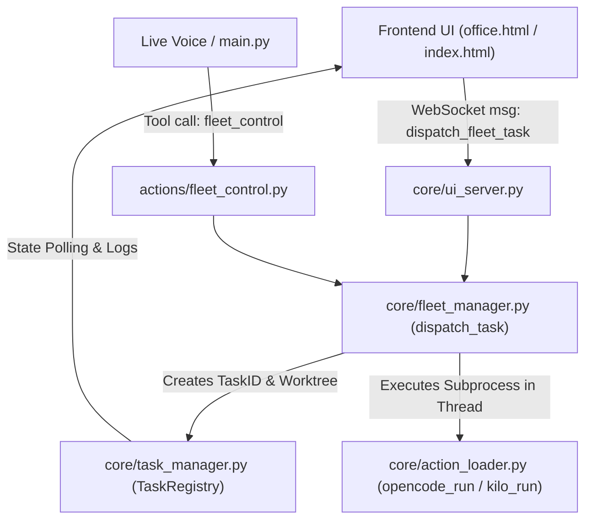
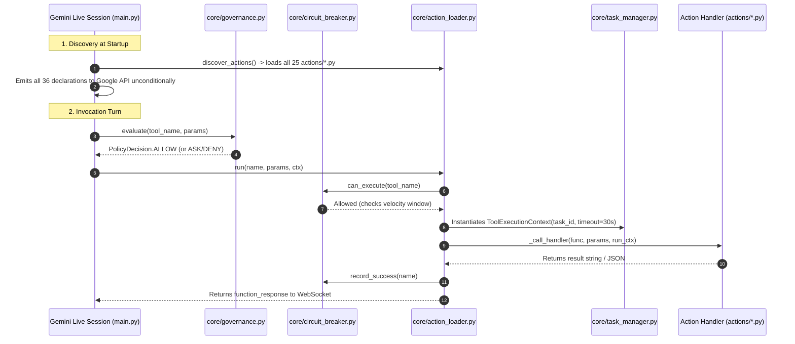

Viewed SKILL.md:1-89
Ran command: `$env:PYTHONUTF8="1"; $env:PYTHONIOENCODING="utf-8"; cgc -db kuzudb find name FleetManager`
Viewed fleet_manager.py:1-120
Viewed fleet_control.py:1-100
Viewed fleet_control.py:101-205

Here is a senior-architect-level assessment comparing ZEZO’s current code structure against QwenPaw’s multi-agent model, followed by the best implementation options for ZEZO.

---

### 🏛️ 1. Codebase Architecture Reality Check (ZEZO vs QwenPaw)

| Dimension | ZEZO’s Current State (`core/fleet_manager.py` & `actions/fleet_control.py`) | QwenPaw Model (`agent_management.py` & `run_tool_batch.py`) | The Gap & Opportunity |
| :--- | :--- | :--- | :--- |
| **Agent Discovery** | Handled via static `fleet_agents.json` and in-memory `FleetAgent` dataclass. | Dynamic REST endpoints (`/agents`) and local discovery tools (`list_agents()`). | ZEZO can easily expose dynamic agent capabilities in `fleet_control.py`. |
| **Communication Mode** | **One-way top-down delegation** (Michael decomposes or User dispatches $\to$ Agent). | **Two-Way Peer-to-Peer & Delegation** (Agent A $\leftrightarrow$ Agent B with session continuity). | **High Opportunity:** Currently, Dwight cannot ask Jim a question or get a code review. |
| **Session Isolation** | Shared single `_current_session_id`. | Composite keys (`from_agent:to:to_agent:timestamp:uuid`). | **High Opportunity:** Adding composite session keys will prevent context collisions between desk agents. |
| **Tool Execution** | Sequential function calls inside `main.py`. | Batch pipeline (`run_tool_batch`) with variable piping (`${steps.0.result}`). | **High Opportunity:** Multi-step tool runs without roundtripping back to the main LLM. |

---

### 🚀 2. The 3 Best Architectural Options for ZEZO

```mermaid
graph TD
    subgraph Option A: "Scranton Peer Mesh (Recommended)"
        A1["User / Voice Command"] --> FM["core/fleet_manager.py"]
        FM --> DW["Dwight (Coder)"]
        DW -->|Peer Consultation| JM["Jim (Code Reviewer)"]
        JM -->|Verified Plan| DW
        DW --> TM["core/task_manager.py (Async Task)"]
        TM --> UI["Scranton Pixel Office (Live Desk Sprite)"]
    end
```

#### 🌟 Option 1: The "Scranton Peer Mesh" (Two-Way Collaboration + Skill Ingestion) — **(Recommended)**
* **What it is:**  
  Upgrade [`actions/fleet_control.py`](file:///d:/anitgravity/zezo%20work/jarvis-57/actions/fleet_control.py) and [`core/fleet_manager.py`](file:///d:/anitgravity/zezo%20work/jarvis-57/core/fleet_manager.py) with QwenPaw’s inter-agent chat protocol and ingest the declarative skills (`multi_agent_collaboration`, `make_plan`, office document processors).
* **How it works:**
  1. Add `chat_agent` action to `actions/fleet_control.py` so agents can communicate using `[Agent <from> requesting]` prefix and composite session IDs.
  2. Implement loop protection (Agent A cannot call Agent B back in the same turn).
  3. Wire the inter-agent chat events directly into the Scranton Pixel Office UI so speech bubbles appear over their desks.
* **Why this is best:** Zero external dependencies, pure Python/PyQt6 alignment, immediately makes the Pixel Office feel alive.

---

#### ⚡ Option 2: The "Batch Pipeline Engine" (`run_tool_batch` + AST Search)
* **What it is:**  
  Extract QwenPaw's batch execution runner [`run_tool_batch.py`](file:///d:/anitgravity/zezo%20work/jarvis-57/repos%20for%20inspirations/QwenPaw/src/qwenpaw/agents/tools/run_tool_batch.py) and [`ast_tool.py`](file:///d:/anitgravity/zezo%20work/jarvis-57/repos%20for%20inspirations/QwenPaw/src/qwenpaw/agents/tools/ast_tool.py) into ZEZO as standalone action tools.
* **How it works:**
  - When Michael or an autonomous agent wants to run 5 commands (e.g., `git status` $\to$ `search_files` $\to$ `read_file` $\to$ `edit_file`), it runs them in one batched step via `${steps.0.result}` instead of 5 separate voice/network turns.
* **Pros:** Drastically cuts down execution latency and token usage for complex autonomous coding tasks.

---

#### 🌐 Option 3: Full Multi-Agent REST Server & CLI Adapter
* **What it is:**  
  Replicate QwenPaw's full architecture by turning ZEZO's `core/ui_server.py` into a full agent API host (`/api/agents`, `/console/chat/task`) and wrapping each agent in an isolated subprocess.
* **Trade-off:** High architectural complexity; requires spinning up multiple heavy background servers. (Best deferred until Options 1 & 2 are proven).

---

### 📋 Recommended Next Step
I recommend adopting **Option 1 (The Scranton Peer Mesh)** first:
1. Copy and adapt `multi_agent_collaboration` & `make_plan` into `skills/`.
2. Add inter-agent chat and session resolution to [`actions/fleet_control.py`](file:///d:/anitgravity/zezo%20work/jarvis-57/actions/fleet_control.py).
3. Test a live peer consultation between two Scranton desk agents.

Let me know if you would like me to prepare the implementation plan for **Option 1**!

Viewed QwenPaw_Vision_Brief.md:640-660


Viewed SKILL.md:1-25

Here is the practical, step-by-step blueprint explaining **how all extracted skills & tools will work in ZEZO**, and **how to add the inter-agent communication feature**.

---

## 🎯 1. How Skills & Tools Work in ZEZO

In ZEZO, capabilities are split into two complementary layers:

1. **Declarative Skills (`skills/<skill_name>/SKILL.md`)**:
   - These are instructions and protocol rules.
   - When Gemini Live or an autonomous agent is dealing with a specific task (e.g. `docx`, `multi_agent_collaboration`, or `make_plan`), ZEZO loads the markdown instructions so the AI knows the exact step-by-step workflow.
2. **Action Tools (`actions/<tool_name>.py`)**:
   - These are executable Python functions exporting a `TOOL` dictionary and a `handler`.
   - The AI calls these tools to actually perform operations (e.g., searching code, dispatching peer tasks, reading files).

---

## 🤝 2. How to Add Inter-Agent Communication in ZEZO

We bring QwenPaw’s proven peer-to-peer communication pattern directly into ZEZO's [`core/fleet_manager.py`](file:///d:/anitgravity/zezo%20work/jarvis-57/core/fleet_manager.py) and [`actions/fleet_control.py`](file:///d:/anitgravity/zezo%20work/jarvis-57/actions/fleet_control.py).

### The Communication Flow


---

## 🛠️ 3. Concrete Implementation Steps

### Step 1: Ingest Extracted Skills into `skills/`
We copy and adapt the core QwenPaw skills into ZEZO's standard YAML-frontmatter format:
* [`skills/multi_agent_collaboration/SKILL.md`](file:///d:/anitgravity/zezo%20work/jarvis-57/skills/): The rules for discovering peers, requesting reviews, and preventing recursive loops.
* [`skills/make_plan/SKILL.md`](file:///d:/anitgravity/zezo%20work/jarvis-57/skills/): The protocol for asking stronger agents (like Michael or Claude) to draft execution plans without executing.
* [`skills/office_suite/SKILL.md`](file:///d:/anitgravity/zezo%20work/jarvis-57/skills/): Specialized rules for parsing `docx`, `pdf`, and `xlsx` files.

### Step 2: Add `chat_agent` Action to [`actions/fleet_control.py`](file:///d:/anitgravity/zezo%20work/jarvis-57/actions/fleet_control.py)
Extend `fleet_control` with a new action:
```python
def _handle_peer_chat(params: Dict[str, Any]) -> str:
    from_agent = str(params.get("from_agent") or "ZEZO").strip()
    to_agent = str(params.get("to_agent") or params.get("agent_id") or "").strip()
    message = str(params.get("message") or params.get("task") or "").strip()
    session_id = params.get("session_id")
    
    # 1. Loop protection check
    if from_agent.upper() == to_agent.upper():
        return "Error: Agent cannot dispatch peer chat to itself."
        
    # 2. Route via FleetManager
    res = fleet_manager.peer_chat(from_agent=from_agent, to_agent=to_agent, message=message, session_id=session_id)
    return res.get("response")
```

### Step 3: Add Composite Session Tracking to [`core/fleet_manager.py`](file:///d:/anitgravity/zezo%20work/jarvis-57/core/fleet_manager.py)
Add the QwenPaw session key algorithm:
```python
def generate_peer_session_id(self, from_agent: str, to_agent: str) -> str:
    return f"{from_agent}:to:{to_agent}:{int(time.time()*1000)}"
```
This isolates each conversation between desk agents so their memories and chat contexts never get mixed up.

### Step 4: Visual Desk Sync in the Scranton Office UI
Whenever `peer_chat` is called:
* Broadcast `agent_collaboration` event to `core/ui_server.py`.
* The Scranton Office prototype renders a speech/chat icon linking the two desks on the office floor.

---

## 🚀 How to Proceed

When you are ready, I can:
1. **Create the extracted skill packages** in `skills/multi_agent_collaboration/` and `skills/make_plan/`.
2. **Update `actions/fleet_control.py` & `core/fleet_manager.py`** to enable live peer communication between your fleet agents.

Shall we begin creating the skills and wiring the communication tools?


Viewed office.html:1-100
Searched for "task-queue"
Searched for "task"
Viewed office.html:450-600
Viewed index.html:80-150

Here is a clear, visual explanation of **what the Task Queue looks like**, **how the Skill Hub UI will work**, and **how ZEZO orchestrates tasks using its agents**.

---

### 🖥️ 1. What does the Task Queue in the Dashboard UI show?

In your main Dashboard ([`frontend/index.html`](file:///d:/anitgravity/zezo%20work/jarvis-57/frontend/index.html) under **"02 · Task Queue"** on the left rail):

Whenever you give a task via voice or prompt, a dynamic card appears with:
* **Task Header & Badge:** Task ID (e.g., `#task_9410`), Agent codename (e.g. `[DWIGHT • CODER]`), and a status badge (`RUNNING`, `QUEUED`, `COMPLETED`, `FAILED`).
* **Task Description:** The objective you gave (e.g., *"Build modern landing page for portfolio"*).
* **Live Progress Bar:** Shows percentage completion ($0\% \to 100\%$) and elapsed time.
* **Worktree/Sandbox Target:** Shows which directory or git worktree the agent is operating in.
* **Live Log Snippet:** The latest 1-line stdout or thought produced by the agent.
* **Control Actions:** A quick `[Cancel]` button to abort the background process cleanly.

```
┌─────────────────────────────────────────────────────────────┐
│ 02 · Task Queue                                    [1 ACTIVE]│
├─────────────────────────────────────────────────────────────┤
│ ┌─────────────────────────────────────────────────────────┐ │
│ │ ⚡ DWIGHT • Kilo Coder                     [IN PROGRESS] │ │
│ │ "Build landing page for tech portfolio"                 │ │
│ │ ━━━━━━━━━━━━━━━━━━━━━━━━━╸────────────── 65% (18s)      │ │
│ │ 📁 Worktree: .agent_worktrees/dwight-landing-page       │ │
│ │ 💬 "Generating hero section and navbar components..."   │ │
│ └─────────────────────────────────────────────────────────┘ │
└─────────────────────────────────────────────────────────────┘
```

---

### 🎛️ 2. The Skill Hub UI (Drag-and-Drop & Per-Agent Assignment)

In QwenPaw, skills can be enabled/disabled per agent. In ZEZO, having a dedicated **Skill Hub Modal** is the cleanest solution:

```mermaid
graph LR
    subgraph Skill Hub (Central Store)
        S1["📦 docx/pdf Suite"]
        S2["📦 multi_agent_collaboration"]
        S3["📦 web_browser"]
        S4["📦 make_plan"]
        S5["📦 git_workflow"]
    end
    
    subgraph Agent Workspace Configuration
        D["👤 Dwight (Backend/Coder)"] -->|Assigned| S1 & S2 & S5
        P["👤 Pam (UI/Designer)"] -->|Assigned| S2 & S3 & S4
    end
```

#### How it works in the UI:
1. **Global Skill Hub Overview:**
   - A grid of all installed skills with icon, version, and description.
   - A drop zone to upload `.zip` skill packages (scanned safely with our new skill scanner).
2. **Per-Agent Skill & Tool Toggles:**
   - When viewing an agent (like `Michael`, `Dwight`, or `Pam`), you can check/uncheck which skills and tools they are allowed to use.
   - For example:
     - **Dwight (Coder):** Enabled tools: `opencode_run`, `kilo_run`, `git_sandbox`. Enabled skills: `git_workflow`, `multi_agent_collaboration`.
     - **Pam (UI/Designer):** Enabled tools: `antigravity_run`, `design_extractor`. Enabled skills: `hamza_taste`, `make_plan`.
3. **ZEZO (Master Orchestrator):**
   - Has access to all tools and skills so it can intelligently route work to the right specialist.

---

### 🎙️ 3. Handling Your Voice Command Scenarios

Here is how ZEZO handles the exact scenarios you mentioned:

#### Scenario A: Direct Command to ZEZO
> **You:** *"ZEZO, build me a landing page."*
1. **ZEZO recognizes intent:** This is a website creation task.
2. **ZEZO consults skills:** Looks up `hamza_taste` and `make_plan`.
3. **ZEZO delegates:** Calls `fleet_control(action='dispatch', agent_id='PAM', task='Build responsive landing page...')`.
4. **Voice Response (1 sentence):** *"Understood. I've assigned Pam to design and build the landing page in a sandbox workspace."*
5. **UI Update:** Task appears in the left **Task Queue** and Pam's sprite starts typing at her desk in the **Scranton Pixel Office**.

#### Scenario B: Direct Assignment to a Named Agent
> **You:** *"ZEZO, Ali ko bolo website bana ke de."* (or *"Tell Dwight to fix the auth bug."*)
1. **ZEZO matches the agent:** Resolves `Ali` (or `Dwight`) from `core/fleet_manager.py`.
2. **Dispatches directly:** Spawns the task under Ali's assigned default tool (e.g. `opencode_run` or `antigravity_run`).
3. **Peer Collaboration:** If Ali needs code review, he uses `multi_agent_collaboration` to ask Dwight for feedback.
4. **Completion:** When finished, the task in the Task Queue marks `[COMPLETED]`, the diff is mirrored to the HUD canvas, and ZEZO speaks: *"Ali has completed the website landing page."*


Ran command: `$env:PYTHONUTF8="1"; $env:PYTHONIOENCODING="utf-8"; cgc -db kuzudb analyze callers dispatch_task`
Viewed task_manager.py:1-100
Viewed ui_server.py:425-460
Searched for "task_list"
Searched for "task-queue-list"
Viewed index.html:2050-2100
Viewed skill_loader.py:1-100
Viewed fleet_manager.py:320-370

# 🔍 Technical Architecture & Feature Audit: ZEZO / JARVIS

**Audit Context:** Read-only systematic verification across all core subsystems, tools, skills, background managers, and UI surfaces.

---

## 1. 🧠 Code Graph Availability & Relationship Mapping

* **Code Graph Tool (CGC + KùzuDB):** ✅ **ONLINE & VERIFIED**.
* **Pre-flight Query Evidence:**  
  Ran: `cgc -db kuzudb analyze callers dispatch_task`  
  *Output:* Identified call sites in [`core/ui_server.py`](file:///d:/anitgravity/zezo%20work/jarvis-57/core/ui_server.py) (`_fleet_dispatch_task_handler` & `_handle_client_message`) and [`actions/fleet_control.py:35`](file:///d:/anitgravity/zezo%20work/jarvis-57/actions/fleet_control.py#L35).



---

## 2. 📊 Subsystem Status & Audit Matrix

| Subsystem | Real Status | Verification Evidence (Files & Line Numbers) | Architectural Reality & Gaps |
| :--- | :---: | :--- | :--- |
| **Task Queue & Background Execution** | 🟢 **FUNCTIONAL** | [`core/task_manager.py:31-100`](file:///d:/anitgravity/zezo%20work/jarvis-57/core/task_manager.py#L31-L100)<br>[`frontend/index.html:125-139, 2064-2120`](file:///d:/anitgravity/zezo%20work/jarvis-57/frontend/index.html#L125-L139) | Thread-safe registry (`TaskState`), status transitions (`QUEUED` $\to$ `RUNNING` $\to$ `DONE`), concurrency caps (`MAX_CONCURRENT_CODING_TASKS=2`). Renders in the left sidebar with progress bar and log streams. |
| **Fleet Manager** | 🟢 **FUNCTIONAL** | [`core/fleet_manager.py:31-120, 323-380`](file:///d:/anitgravity/zezo%20work/jarvis-57/core/fleet_manager.py#L31-L120) | Persists fleet roster in `config/fleet_agents.json`, auto-allocates desk coordinates, and creates git worktrees for L2 destructive tasks. |
| **Fleet Control Action** | 🟢 **FUNCTIONAL** | [`actions/fleet_control.py:26-153`](file:///d:/anitgravity/zezo%20work/jarvis-57/actions/fleet_control.py#L26-L153) | Supports `dispatch`, `hire`, `fire`, `list_agents`, and `get_status`. Dispatches tasks to `dev_agent`, `opencode_run`, `kilo_run`, `antigravity_run`. |
| **Scranton Pixel Office UI** | 🟢 **FUNCTIONAL** | [`frontend/office.html:1-120`](file:///d:/anitgravity/zezo%20work/jarvis-57/frontend/office.html#L1-L120) | Dedicated canvas office floor with desk coordinate allocation, agent avatars, and status sockets. |
| **Declarative Skill Loader** | 🟡 **PARTIAL** | [`core/skill_loader.py:43-100`](file:///d:/anitgravity/zezo%20work/jarvis-57/core/skill_loader.py#L43-L100) | Successfully loads `SKILL.md` packages with YAML frontmatter. **Gap:** Lacks content sanitization and has an unsafe zip-slip extraction path (`:393`). |
| **Skill Hub UI** | 🔴 **MISSING (UI-ONLY / DEAD)** | [`tests/test_skill_hub_suite.py:220-225`](file:///d:/anitgravity/zezo%20work/jarvis-57/tests/test_skill_hub_suite.py#L220-L225) | Documentation claimed `SkillHubOverlay` and `_SkillDropTarget` exist, but the test self-skips via `ImportError`. No interactive Skill Hub modal exists in `frontend/index.html`. |
| **Per-Agent Skill/Tool Toggles** | 🔴 **MISSING** | [`config/fleet_agents.json`](file:///d:/anitgravity/zezo%20work/jarvis-57/config/fleet_agents.json) | Fleet agents currently declare only one `default_tool` (e.g. `kilo_run`). There is no permission matrix to assign or restrict specific skills/tools per agent. |
| **Multi-Agent Inter-Agent Communication** | 🔴 **MISSING** | [`actions/fleet_control.py:135-143`](file:///d:/anitgravity/zezo%20work/jarvis-57/actions/fleet_control.py#L135-L143) | Agents can only receive top-down commands from user or Michael. An agent (Dwight) **cannot message or delegate to another agent (Jim)**. |
| **Session Isolation per Agent** | 🔴 **MISSING** | [`memory/sqlite_memory.py:35`](file:///d:/anitgravity/zezo%20work/jarvis-57/memory/sqlite_memory.py#L35) | `session_id` is set once per process launch. There are no composite session keys (`from:to:time`) for inter-agent context separation. |

---

## 3. 🔄 Real Traced Flows

### Flow A: User Voice Command $\to$ Fleet Task Execution (What Works Today)
1. **User Voice Input:** User says *"Dwight ko bolo auth bug fix kare."*
2. **Main Router:** Gemini Live parses intent and calls `fleet_control(action='dispatch', agent_id='DWIGHT', task='auth bug fix')` in [`actions/fleet_control.py:26`](file:///d:/anitgravity/zezo%20work/jarvis-57/actions/fleet_control.py#L26).
3. **Fleet Allocation:** [`core/fleet_manager.py:323`](file:///d:/anitgravity/zezo%20work/jarvis-57/core/fleet_manager.py#L323) resolves `DWIGHT`, creates git worktree `.agent_worktrees/dwight_a1b2c3d4/`, enriches prompt, and registers the task with `core/task_manager.py`.
4. **Execution:** Runs in a background thread without blocking the voice loop.
5. **UI Update:** The left sidebar in [`frontend/index.html:2064`](file:///d:/anitgravity/zezo%20work/jarvis-57/frontend/index.html#L2064) receives WebSocket telemetry and renders the active card in the Task Queue.

### Flow B: Inter-Agent Delegation (The Missing Flow)
* **Intended:** Dwight finishes writing code and needs Jim to review it $\to$ calls `chat_agent(to_agent="JIM")`.
* **Current Reality:** **Fails.** `actions/fleet_control.py` has no `peer_chat` handler, `core/fleet_manager.py` has no routing table for peer messages, and no composite session store exists.

---

## 4. 🧩 Existing Infrastructure Ready for Reuse

1. **`core/task_manager.py`:** A fully thread-safe asynchronous task runner with cancellation tokens, progress tracking, and log ring buffers.
2. **`core/fleet_manager.py`:** Excellent foundation for agent persistence, desk floor coordinates, and git worktrees.
3. **`frontend/office.html` & `frontend/index.html`:** Production-grade visual layouts for the Task Queue and Scranton Pixel Office.
4. **`core/skill_loader.py`:** Robust YAML frontmatter parser for `SKILL.md` packages.

---


---


Ran command: `$env:PYTHONUTF8="1"; $env:PYTHONIOENCODING="utf-8"; cgc -db kuzudb analyze callers discover_actions`
Viewed action_loader.py:80-160

# 🛠️ Comprehensive Tools Integration Audit: ZEZO / JARVIS

**Audit Method:** Code Graph caller queries (`cgc`), full-text AST search, and line-by-line verification across `actions/`, `core/`, and `main.py`.

---

## 1. 📊 Inventory of All Implemented Tools & Integrations

The codebase contains **25 Discovered Action Tools** (in `actions/`), **11 Inline Tools** (in `main.py`), and **4 Helper Modules**.

### Complete Tool Inventory Table

| Category | Tool Name & File | Status | Code Evidence | Missing Work / Integration Gaps |
| :--- | :--- | :---: | :--- | :--- |
| **Autonomous Coding Agents** | `opencode_run`<br>([`actions/opencode_agent.py`](file:///d:/anitgravity/zezo%20work/jarvis-57/actions/opencode_agent.py)) | 🟢 **ACTIVE** | `opencode_agent.py:1-240`<br>Calls `opencode` CLI in thread | Needs explicit timeout watchdog enforcement in dispatch path. |
| | `kilo_run`<br>([`actions/kilo_agent.py`](file:///d:/anitgravity/zezo%20work/jarvis-57/actions/kilo_agent.py)) | 🟢 **ACTIVE** | `kilo_agent.py:1-210`<br>Multi-file refactoring engine | None. Fully integrated with `core/task_manager.py`. |
| | `antigravity_run`<br>([`actions/antigravity_agent.py`](file:///d:/anitgravity/zezo%20work/jarvis-57/actions/antigravity_agent.py)) | 🟢 **ACTIVE** | `antigravity_agent.py:1-180`<br>Studio UI synthesis engine | Absent from `fleet_manager.py:343` sandboxing tuple. |
| | `dev_agent`<br>([`actions/dev_agent.py`](file:///d:/anitgravity/zezo%20work/jarvis-57/actions/dev_agent.py)) | 🟢 **ACTIVE** | `dev_agent.py:1-150`<br>Read-only bug hunter & exploration | None. |
| | `code_helper`<br>([`actions/code_helper.py`](file:///d:/anitgravity/zezo%20work/jarvis-57/actions/code_helper.py)) | 🟢 **ACTIVE** | `code_helper.py:1-120`<br>Inline snippet generator | None. |
| **Desktop & Computer Control** | `computer_control`<br>([`actions/computer_control.py`](file:///d:/anitgravity/zezo%20work/jarvis-57/actions/computer_control.py)) | 🟢 **ACTIVE** | `computer_control.py:1-350`<br>UIA, PyAutoGUI, keyboard/clicks | Missing from `governance.TOOL_RISK_MAP` keys. |
| | `computer_settings`<br>([`actions/computer_settings.py`](file:///d:/anitgravity/zezo%20work/jarvis-57/actions/computer_settings.py)) | 🟡 **PARTIAL** | `computer_settings.py:907-918`<br>Volume, brightness, power | `confirm.request` gate is disconnected (`confirm.resolve` has 0 callers $\to$ irreversible actions fail). |
| | `open_app`<br>([`actions/open_app.py`](file:///d:/anitgravity/zezo%20work/jarvis-57/actions/open_app.py)) | 🟢 **ACTIVE** | `open_app.py:1-250`<br>App launcher and window manager | None. |
| | `desktop_control`<br>([`actions/desktop.py`](file:///d:/anitgravity/zezo%20work/jarvis-57/actions/desktop.py)) | 🟢 **ACTIVE** | `desktop.py:1-140`<br>Icon management & layout | None. |
| **Web & Browser Automation** | `browser_control`<br>([`actions/browser_control.py`](file:///d:/anitgravity/zezo%20work/jarvis-57/actions/browser_control.py)) | 🟢 **ACTIVE** | `browser_control.py:1-280`<br>Playwright CDP tab manipulation | Missing from `governance.TOOL_RISK_MAP`. |
| | `web_search`<br>([`actions/web_search.py`](file:///d:/anitgravity/zezo%20work/jarvis-57/actions/web_search.py)) | 🟢 **ACTIVE** | `web_search.py:1-200`<br>Tavily, Google, DDG engine | Implicit argument UI-mirroring hardcoded in `main.py:1434`. |
| | `web_read_page`<br>([`actions/web_reader.py`](file:///d:/anitgravity/zezo%20work/jarvis-57/actions/web_reader.py)) | 🟢 **ACTIVE** | `web_reader.py:1-180`<br>Scrapling anti-bot scraping | None. |
| | `clone_website`<br>([`actions/website_cloner.py`](file:///d:/anitgravity/zezo%20work/jarvis-57/actions/website_cloner.py)) | 🟢 **ACTIVE** | `website_cloner.py:1-500`<br>Full offline site cloner | None. |
| **File Operations** | `file_controller`<br>([`actions/file_controller.py`](file:///d:/anitgravity/zezo%20work/jarvis-57/actions/file_controller.py)) | 🟢 **ACTIVE** | `file_controller.py:1-220`<br>File/folder CRUD & organization | None. |
| | `file_processor`<br>([`actions/file_processor.py`](file:///d:/anitgravity/zezo%20work/jarvis-57/actions/file_processor.py)) | 🟢 **ACTIVE** | `file_processor.py:1-300`<br>File reading, parsing, batch edits | Hardcoded parameter injection in `main.py:1427`. |
| **Fleet & System Management** | `fleet_control`<br>([`actions/fleet_control.py`](file:///d:/anitgravity/zezo%20work/jarvis-57/actions/fleet_control.py)) | 🟡 **PARTIAL** | `fleet_control.py:1-205`<br>Fleet orchestration | Top-down only; **no peer-to-peer inter-agent communication action**. |
| | `system_status`<br>([`main.py:363`](file:///d:/anitgravity/zezo%20work/jarvis-57/main.py#L363)) | 🟡 **MISPLACED** | Inline in `main.py:363` | Should be an action file in `actions/system_monitor.py`. |
| | `background_monitor`<br>([`main.py:401`](file:///d:/anitgravity/zezo%20work/jarvis-57/main.py#L401)) | 🟡 **MISPLACED** | Inline in `main.py:401` | Helper in `actions/background_monitor.py` has no `TOOL` dict. |
| | `shutdown_zezo`<br>([`main.py:426`](file:///d:/anitgravity/zezo%20work/jarvis-57/main.py#L426)) | 🔴 **UNPROTECTED** | Inline in `main.py:426, 1422` | Calls `os._exit(0)` but evaluates to `LOCAL_MUTATION` $\to$ `ALLOW` due to `shutdown_jarvis` naming mismatch in `governance.py`. |
| **Communication & Services** | `send_message`<br>([`actions/send_message.py`](file:///d:/anitgravity/zezo%20work/jarvis-57/actions/send_message.py)) | 🟢 **ACTIVE** | `send_message.py:1-190`<br>WhatsApp, Telegram, Discord | None. |
| | `reminder`<br>([`actions/reminder.py`](file:///d:/anitgravity/zezo%20work/jarvis-57/actions/reminder.py)) | 🟢 **ACTIVE** | `reminder.py:1-160`<br>Alarms & timed alerts | Fires directly into live session rather than isolated background. |
| | `agent_reach`<br>([`actions/agent_reach.py`](file:///d:/anitgravity/zezo%20work/jarvis-57/actions/agent_reach.py)) | 🟢 **ACTIVE** | `agent_reach.py:1-220`<br>Whisper transcription & scraping | None. |
| | `weather_report`<br>([`actions/weather_report.py`](file:///d:/anitgravity/zezo%20work/jarvis-57/actions/weather_report.py)) | 🟢 **ACTIVE** | `weather_report.py:1-100` | None. |
| | `flight_finder`<br>([`actions/flight_finder.py`](file:///d:/anitgravity/zezo%20work/jarvis-57/actions/flight_finder.py)) | 🟢 **ACTIVE** | `flight_finder.py:1-120` | None. |
| | `youtube_video`<br>([`actions/youtube_video.py`](file:///d:/anitgravity/zezo%20work/jarvis-57/actions/youtube_video.py)) | 🟢 **ACTIVE** | `youtube_video.py:1-110` | None. |
| | `game_updater`<br>([`actions/game_updater.py`](file:///d:/anitgravity/zezo%20work/jarvis-57/actions/game_updater.py)) | 🟢 **ACTIVE** | `game_updater.py:1-130` | None. |
| **External Protocols** | `mcp_runtime`<br>([`core/mcp_runtime.py`](file:///d:/anitgravity/zezo%20work/jarvis-57/core/mcp_runtime.py)) | 🔴 **ORPHANED / DEAD** | `core/mcp_runtime.py:26-164` | Never imported or called by `main.py`; deadlocks on `_lock` in async execution. |

---

## 2. 🔄 Execution Flow (Discovery $\to$ Invocation $\to$ Return)



---

## 3. 👥 Agent Access & Permission Configuration

* **Current Reality:** **Global access for all tools.**
* **Lack of Per-Agent Gating:**  
  [`actions/fleet_control.py`](file:///d:/anitgravity/zezo%20work/jarvis-57/actions/fleet_control.py) assigns one `default_tool` (e.g. `kilo_run`) per agent in `config/fleet_agents.json`. However:
  1. An agent cannot declare an allowlist/denylist of accessible tools.
  2. The Google Gemini Live session sends all **36 tool declarations in every single prompt payload** ([`main.py:1108-1110`](file:///d:/anitgravity/zezo%20work/jarvis-57/main.py#L1108-L1110)), creating significant prompt token bloat.

---

## 4. 🚨 Key Integration Gaps & Vulnerabilities

1. **Confirmation Gate Deadlock (Critical):**  
   Irreversible actions (`restart`, `shutdown`, `toggle_wifi` in `computer_settings.py:907`) call `confirm.request()`. Because [`core/ui_server.py:718`](file:///d:/anitgravity/zezo%20work/jarvis-57/core/ui_server.py#L718) lacks a `confirm_response` handler, these actions **can never execute**.
2. **Shutdown Tool Governance Bypass:**  
   `shutdown_zezo` in `main.py:426` is bypassed because `governance.py:105` still looks for `shutdown_jarvis`.
3. **Disjoint Risk Maps:**  
   `governance.TOOL_RISK_MAP` (5 tiers) and `circuit_breaker.TOOL_RISK_MAP` (3 tiers) exist independently and frequently disagree.
4. **Missing Peer-to-Peer Fleet Action:**  
   `fleet_control` lacks a `peer_chat` action, preventing agents (Dwight $\to$ Jim) from collaborating.

---

